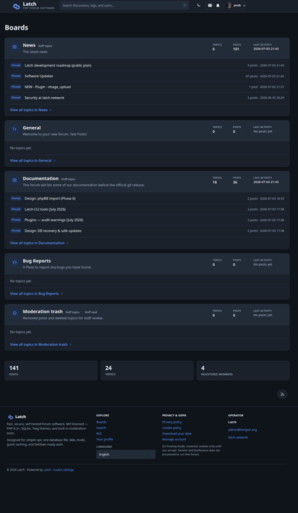
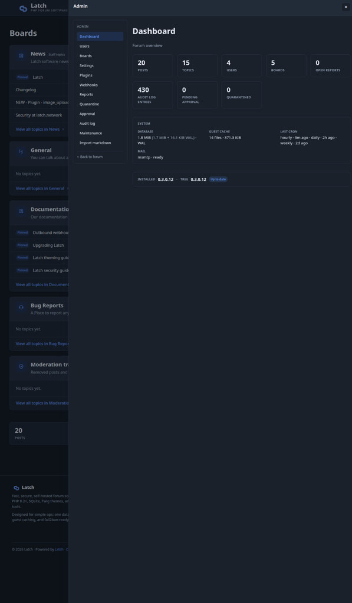

# Latch

A fast, secure, self-hosted PHP forum with SQLite, theming, plugins, and an OAuth API.

## Why Latch?

Most forums ask you to run a database server, a cache, a job queue, and a dozen moving parts before anyone can post. Latch is the opposite: **one PHP app, one SQLite file, Apache or nginx** — enough for a real community without turning your VPS into a small datacenter.

**You own the whole stack.** Your posts, users, and config live on your disk. No vendor lock-in, no surprise plan changes, no mining your members for ads. MIT licensed — fork it, theme it, extend it.

**Built for operators, not just visitors.** Install, migrate, backup, restore, health checks, and maintenance are first-class CLI commands (`bin/latch`), not wiki archaeology. Site lock quiesces the forum during upgrades; WAL-safe backups and `db-check` catch corruption before it spreads.

**Security is not an afterthought.** Mandatory admin 2FA, strict CSP, session registry, audit logging, board ACLs, report queue, and a `plugin-audit` gate before enable — hardened from Phase 1.5 onward, not bolted on years later.

**Modern forum features, modest footprint.** Full-text search, tags, reactions, DMs, notifications, reputation, OAuth API, webhooks, and a **28-hook plugin system** — without Redis, Elasticsearch, or a separate Node process.

**Good fit if you:** want a self-hosted community on a home server or small VPS; are comfortable with PHP and a Unix web stack; value data ownership and operator tooling over managed SaaS.

**Probably not yet if you:** need multi-million-post scale on clustered Postgres today (SQLite has limits); want a fully hosted, zero-ops solution.

### Screenshots

**Boards home** — board list with pinned topics, full-text search, stats, and footer navigation.



**Admin dashboard** — forum stats, system health (database, cache, cron, mail), version panel, and maintenance tools.



Try it in minutes — download a release tarball, run `php bin/latch install`, point your web server at `source/public/`. See [source/docs/INSTALL.md](source/docs/INSTALL.md).

- **License:** MIT (see [LICENSE](LICENSE))
- **Source:** all code under [`source/`](source/)

## Status

**Current release:** see [VERSION](VERSION) and [CHANGELOG.md](CHANGELOG.md). [GitHub Releases](https://github.com/YeOK/Latch/releases) ship tarballs; Fedora/RHEL operators can use [COPR](source/docs/INSTALL-FEDORA.md) (`dnf install latch`).

## Features (high level)

| Area | Highlights |
|------|------------|
| **Posting** | Markdown-style markup, fenced code blocks with highlight.js, live AJAX preview while composing, @mentions, reactions, spoilers |
| **Plugins** | 28 hooks (`post.format.link`, `post.format.after`, CSP, layout, lifecycle, …); static audit before enable; **[Latch-plugins](https://github.com/YeOK/Latch-plugins)** catalog |
| **Admin** | Dashboard, mod tools, board ACLs, **Plugins → Installed / Catalog** tabs with in-browser install from GitHub releases |
| **API** | OAuth 2.0 + PKCE, read/write REST API, webhooks |
| **Ops** | `bin/latch` CLI — install, migrate, backup, restore, `db-check`, `audit`, `fix-perms`, cron timers (RPM) |

Tier-1 catalog plugins (install separately): **image-upload** (R2/CDN), **link-preview** (onebox cards + lazy video embeds), **word-filter**, **forum-stats**, **spam-bridge**, **slack-notify**, and more. See [source/docs/PLUGINS.md](source/docs/PLUGINS.md).

## Quick paths

| Path | Purpose |
|------|---------|
| `source/public/` | Web root (only this should be exposed to HTTP) |
| `source/bin/` | CLI tools (`install`, `migrate`, `audit`, `plugin install`) |
| `source/docs/` | Installation and developer documentation |
| `source/storage/` | SQLite database and runtime files (keep private) |
| `source/plugins/` | Operator plugins (`md-import` ships in core; catalog plugins install here) |

## Install (release tarball)

```bash
# Replace VERSION with the latest from GitHub Releases
VERSION=0.4.4.2
tar -xzf latch-${VERSION}.tar.gz && cd latch-${VERSION}-stage
bash scripts/install.sh --url=https://forum.example.com --name="My Forum"
```

Download: [GitHub Releases](https://github.com/YeOK/Latch/releases) · Build locally: `./scripts/build-release.sh` → `dist/latch-<version>.tar.gz`

**Fedora/RHEL (RPM):** [source/docs/INSTALL-FEDORA.md](source/docs/INSTALL-FEDORA.md) — `dnf install latch`, config in `/etc/latch/local.php`, data in `/var/lib/latch/storage/`.

## Contributing

See [CONTRIBUTING.md](CONTRIBUTING.md). Security reports: [SECURITY.md](SECURITY.md). Maintainer release checklist: [docs/RELEASE.md](docs/RELEASE.md).