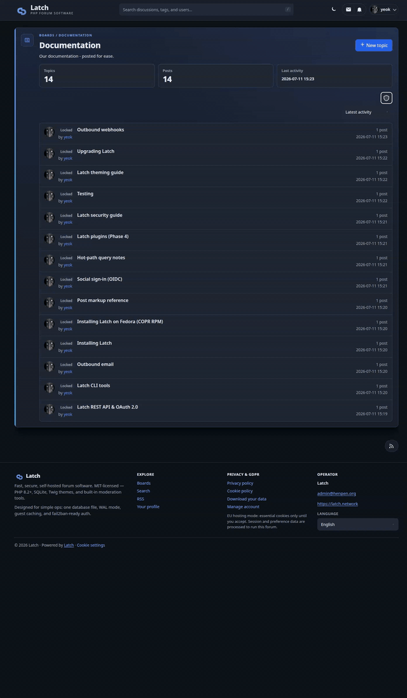

# Latch

A fast, secure, self-hosted PHP forum with SQLite, theming, a plugin catalog, and an OAuth API.

## Why Latch?

Most forums ask you to run a database server, a cache, a job queue, and a dozen moving parts before anyone can post. Latch is the opposite: **one PHP app, one SQLite file, Apache or nginx** — enough for a real community without turning your VPS into a small datacenter.

**You own the whole stack.** Your posts, users, and config live on your disk. No vendor lock-in, no surprise plan changes, no mining your members for ads. MIT licensed — fork it, theme it, extend it.

**Built for operators, not just visitors.** Install, migrate, backup, restore, health checks, and maintenance are first-class CLI commands (`bin/latch`), not wiki archaeology. Site lock quiesces the forum during upgrades; WAL-safe backups and `db-check` catch corruption before it spreads. Fedora/RHEL operators can `dnf install latch` from COPR. A live reference install runs at **[latch.network](https://latch.network)**.

**Security is not an afterthought.** Mandatory admin 2FA, strict CSP, session registry, audit logging, board ACLs, report queue, Cloudflare Turnstile on signup, fail2ban on login failures, and a **`plugin-audit` gate** before any plugin is enabled — hardened from Phase 1.5 onward, not bolted on years later. Admin **log viewer** tails `security.log` and optional server logs with filters and redaction.

**Modern forum features, modest footprint.** Full-text search, tags, reactions, DMs, notifications, reputation, OAuth API, webhooks, live AJAX preview while composing, fenced code blocks with syntax highlighting, and a **28-hook plugin system** with an official **[Latch-plugins](https://github.com/YeOK/Latch-plugins)** catalog — install from **Admin → Plugins**, update in place, audit before enable. No Redis, Elasticsearch, or a separate Node process.

**Good fit if you:** want a self-hosted community on a home server or small VPS; are comfortable with PHP and a Unix web stack; value data ownership and operator tooling over managed SaaS.

**Probably not yet if you:** need multi-million-post scale on clustered Postgres today (SQLite has limits); want a fully hosted, zero-ops solution.

## Features (high level)

| Area | Highlights |
|------|------------|
| **Posting** | Markup toolbar, @mentions, reactions, spoilers, link-preview cards, image upload to your own CDN (R2) |
| **Plugins** | Catalog install + updates; tier-1 plugins include forum-stats, word-filter, spam-bridge, slack-notify, link-preview, privacy analytics, git-release widget |
| **Admin** | Dashboard, mod tools, board ACLs, **site branding** (logo / favicon / OG), **theme packs** (default, modern, showcase), plugin settings UI |
| **API** | OAuth 2.0 + PKCE, read/write REST API, webhooks |
| **Ops** | `bin/latch` CLI — install, migrate, backup, restore, `db-check`, `audit`, `fix-perms`, `logs`, cron timers (RPM) |

### Screenshots

From the live install at **[latch.network](https://latch.network)**.

**Boards home** — pinned topics, full-text search, light/dark theme, and forum stats.


**Mod tools** — multi-topic selection on the board view.



**Admin dashboard** — site lock for safe upgrades, one-click backup, search rebuild, and moderation queues at a glance.


Try it in minutes — download a release tarball, run `php bin/latch install`, point your web server at `source/public/`. See [source/docs/INSTALL.md](source/docs/INSTALL.md).

- **License:** MIT (see [LICENSE](LICENSE))
- **Source:** [github.com/YeOK/Latch](https://github.com/YeOK/Latch)

## Status

**v0.4.8.0** — public release. Live demo: **[latch.network](https://latch.network)** · Release notes: [CHANGELOG.md](CHANGELOG.md) · Plugins: [Latch-plugins](https://github.com/YeOK/Latch-plugins) · Cloudflare: [source/docs/CLOUDFLARE.md](source/docs/CLOUDFLARE.md)

## Quick paths

| Path | Purpose |
|------|---------|
| `source/public/` | Web root (only this should be exposed to HTTP) |
| `source/bin/` | CLI tools (`install`, `migrate`, `audit`, `plugin install`) |
| `source/docs/` | Installation and developer documentation |
| `source/storage/` | SQLite database and runtime files (keep private) |
| `source/plugins/` | Installed plugins (catalog zips land here) |

## Install (release tarball)

```bash
VERSION=0.4.6.1
tar -xzf latch-${VERSION}.tar.gz && cd latch-${VERSION}-stage
bash scripts/install.sh --url=https://forum.example.com --name="My Forum"
```

Download: [GitHub Releases](https://github.com/YeOK/Latch/releases) · Build locally: `./scripts/build-release.sh` → `dist/latch-<version>.tar.gz`

**Fedora/RHEL:** `dnf install latch` from [COPR](https://copr.fedorainfracloud.org/coprs/yeok/latch/) — see [source/docs/INSTALL-FEDORA.md](source/docs/INSTALL-FEDORA.md).

See [source/docs/INSTALL.md](source/docs/INSTALL.md) and [source/docs/UPGRADE.md](source/docs/UPGRADE.md).

## Contributing

See [CONTRIBUTING.md](CONTRIBUTING.md). Security reports: [SECURITY.md](SECURITY.md). Maintainer release checklist: [docs/RELEASE.md](docs/RELEASE.md).