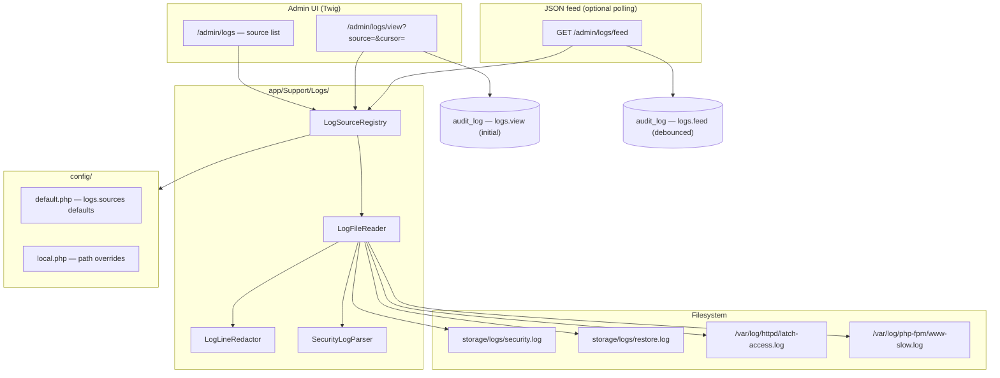
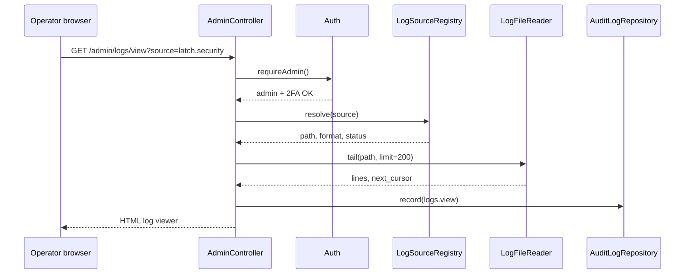

# Admin Log Viewer

| Field | Value |
|-------|-------|
| **Author** | TBD |
| **Date** | 2026-07-12 |
| **Status** | Draft |
| **Repo** | `/home/yeok/Documents/Latch-Git/source` (application tree) |
| **Monorepo** | Packaging lives at `../packaging/` relative to `source/` (repo root: `/home/yeok/Documents/Latch-Git/`) |
| **Target version** | 0.4.5.x (proposed) |

---

## Overview

Operators today diagnose production issues by SSH-ing into the host and running `tail -f` on disparate log files (`storage/logs/security.log`, Apache access/error logs, PHP-FPM slowlog). Latch already maintains rich **application** logs (`Latch\Core\SecurityLog` → `storage/logs/security.log`) and a **SQLite audit trail** (`audit_log` table, admin UI at `GET /admin/audit`), but there is no unified way to inspect file-based logs from the admin panel.

This design introduces a new **Admin → Logs** section (`GET /admin/logs`) that:

1. **Always exposes** Latch-owned logs under `storage/logs/` (security JSON-lines, restore break-glass log).
2. **Optionally exposes** operator-configured server log paths (Apache/nginx, PHP-FPM) via `config/local.php`.
3. Uses a **bounded reverse-read** tail engine (no full-file loads) with filter/search for structured security events and substring search for text logs.
4. Mirrors the same reader in **`php bin/latch logs tail`** for SSH workflows.

The existing **Audit log** page remains unchanged — it answers “what did staff do in the app?” while **Logs** answers “what is the runtime emitting?”

---

## Background & Motivation

### Current logging landscape

| Source | Location | Format | Admin UI today |
|--------|----------|--------|----------------|
| Application security events | `storage/logs/security.log` | JSON lines (`SecurityLog::log()`) | None — documented in `docs/OIDC.md`, `docs/SECURITY.md` |
| Break-glass restore | `storage/logs/restore.log` | Plain text | None |
| Staff actions | SQLite `audit_log` | Structured rows | `GET /admin/audit` → `AdminController::auditLog()` |
| OAuth API traffic | SQLite `api_audit_log` | Structured rows | None (pruned by cron) |
| Apache access/error | `/var/log/httpd/latch-*.log` (RPM default) | Combined / error format | None |
| PHP-FPM | `/var/log/php-fpm/www-slow.log`, pool error log | Text | None |

`SecurityLog` writes entries like:

```json
{"ts":"2026-07-12T10:00:00+00:00","event":"login_fail","ip":"203.0.113.5","user_id":null,"username":"admin","target_type":null,"target_id":null,"meta":null}
```

Events include `login_fail`, `login_success`, `login_banned`, `oidc_fail`, `ban`, `password_reset_*`, `founder_block`, etc. (see grep hits across `AuthController`, `AdminController`, `OidcController`, `ProfileController`).

### Pain points

1. **SSH dependency** — Small self-hosted operators may not have persistent shell access or may be uncomfortable on production boxes.
2. **Log fragmentation** — Routing issues need Apache/nginx logs; auth abuse needs both `security.log` and access logs (fail2ban reads access log per `packaging/fail2ban/latch-login.local`).
3. **No discoverability** — Dashboard shows audit log count (`admin/index.html.twig`) but not security log activity or server log health.
4. **Environment variance** — Paths differ (Fedora `httpd` vs Debian `apache2` vs nginx). Hardcoding is unacceptable; `packaging/latch-httpd.conf` documents one layout only.

### Existing admin patterns to follow

- Routes registered in `Application.php` under `/admin/*`, handlers on `AdminController`.
- Layout: `themes/default/layouts/admin.html.twig` sidebar; new link alongside “Audit log”.
- Auth gate: `Auth::requireAdmin()` — login + admin role + mandatory TOTP (`totp_enabled_at` non-null).
- JSON endpoints for polling: `AdminController::reportQueueFeed()` pattern (`Response::json`, `requireMod`/`requireAdmin`).
- Config: `config/default.php` defaults + `config/local.php` overrides via `Config::array_replace_recursive`.
- Strict CSP (`SecurityHeaders`) — prefer server-rendered Twig; any live-tail JS must use CSP nonce (already wired in `Application`).

---

## Goals & Non-Goals

### Goals (v1)

| ID | Goal |
|----|------|
| G1 | New `/admin/logs` UI listing configured log sources with readability status (readable / missing / permission denied). |
| G2 | Tail view: most recent N lines (default 200), “Load older” pagination via byte-offset cursor. |
| G3 | **Security log** structured filters: `event`, `ip`, `username`, ISO time range. |
| G4 | **Text logs** substring filter (case-insensitive), max scan budget per request. |
| G5 | Secret/PII redaction before render (passwords, tokens, cookies, `Authorization` headers). |
| G6 | Config schema in `config/default.php`; operators enable server logs in `local.php`. |
| G7 | Audit log access to SQLite `audit_log`: `logs.view` on initial HTML viewer load; debounced `logs.feed` for live refresh and JSON poll. |
| G8 | CLI parity: `php bin/latch logs tail [--source=ID] [--lines=N] [--follow]`. |
| G9 | Packaging docs for granting `apache` read access to `/var/log/httpd/*`. |

### Non-Goals (v1)

| ID | Non-Goal | Rationale |
|----|----------|-----------|
| NG1 | Log ingestion / centralized store | No background job infra beyond `cron` CLI; avoids SQLite bloat and duplicate retention policy. |
| NG2 | Full-text index across GB logs | Bounded reverse scan only; operators use CLI + `grep` for deep history. |
| NG3 | Mod-level access | Raw file logs expose infrastructure data (cookies, full URLs, stack traces) beyond what mods need; **admin-only** (same role gate as Audit log, but mods must not access server logs). |
| NG4 | Merging audit_log + file logs in one table | Different semantics; cross-link from Logs UI instead. |
| NG5 | API audit log UI | Separate follow-up; out of scope for file-log viewer. |
| NG6 | Log rotation management / deletion | Read-only viewer; rotation is OS/logrotate responsibility. |
| NG7 | Real-time WebSocket streaming | CSP + stack simplicity; v1 uses manual refresh or optional feed-based live poll (`?live=1`). |

---

## Proposed Design

### Architecture



### Component responsibilities

#### `LogSourceRegistry` (`app/Support/Logs/LogSourceRegistry.php`)

- Loads `logs.sources` and `logs.allowed_roots` from config.
- Merges **built-in** Latch sources (not removable) with configured server sources.
- Resolves effective allowed roots via `effectiveAllowedRoots()` (see below).
- Resolves each source’s absolute path; validates against allowlist/denylist; checks readability.
- Returns metadata: `id`, `label`, `group`, `format` (`json_lines` | `text`), `path`, `status`, `size_bytes`, `mtime`, `fingerprint`.

**Path resolution algorithm:**

1. Compute **intended path** from config or built-in rule (e.g. `{paths.storage}/logs/security.log`).
2. If `is_file($path)` → `realpath($path)` for canonical resolved path; else use intended path as-is (no `realpath()` failure).
3. Run allowlist/denylist checks on the path used for reads (resolved when file exists, intended otherwise).
4. Set `status`:
   - `readable` — file exists and `is_readable()`
   - `missing` — file does not exist (built-in sources still appear; viewer shows empty state)
   - `denied` — path failed allowlist/denylist validation
   - `permission_denied` — file exists but not readable by PHP process

Built-in `latch.security` may be `missing` on fresh installs until the first `SecurityLog::log()` call (`SecurityLog` creates the directory in its constructor but does not pre-touch the file). Index and viewer still render; empty state explains “no events yet.”

**Allowed roots merge** (`LogSourceRegistry::effectiveAllowedRoots()`):

```php
// Pseudocode
$roots = self::DEFAULT_ALLOWED_ROOTS; // ['/var/log', '{storage}/logs']
foreach (validated(config('logs.allowed_roots')) as $root) {
    $roots[] = $root;
}
return array_unique($roots); // operator count capped by max_allowed_roots
```

Built-in `latch.*` sources bypass allowlist checks (hardcoded safe paths). Server sources must resolve under at least one effective root **and** not match any `DENIED_PREFIXES` entry.

Built-in sources (always present):

| ID | Label | Path resolution | Format |
|----|-------|-----------------|--------|
| `latch.security` | Security events | `{paths.storage}/logs/security.log` | `json_lines` |
| `latch.restore` | Restore (break-glass) | `{paths.storage}/logs/restore.log` | `text` |

#### `LogFileReader` (`app/Support/Logs/LogFileReader.php`)

Bounded reverse line reader. Core algorithm:

1. `fopen($path, 'rb')` — refuse if not a regular file (not dir, not FIFO).
2. Start at `min(filesize, max_tail_window)` bytes from EOF (default window **2 MiB** per request).
3. Read backwards in **64 KiB** chunks, split on `\n`, collect lines until `limit` reached or `max_bytes_scanned` (default **512 KiB** for search/filter requests).
4. Return lines in chronological order (oldest→newest within page), plus pagination metadata.

**Cursor semantics (single name everywhere):** `next_cursor` is the byte offset *before which* older content exists — pass it as the HTTP query param `cursor` on “Load older” to continue scanning backward. When `next_cursor` is `null`, no older content remains within the scan budget (or start of file reached).

```php
/**
 * @return array{
 *   lines: list<string>,
 *   next_cursor: ?int,
 *   fingerprint: array{size: int, mtime: int},
 *   rotated: bool,
 *   scan_budget_exhausted: bool,
 *   matches_exhausted: bool,
 *   bytes_scanned: int
 * }
 */
public function tail(string $path, int $limit = 200, ?int $cursor = null, ?array $cursorFingerprint = null): array;
```

**Filtered tail (multi-pass):** When `event`, `ip`, `username`, `since`/`until`, or text `q` is set, `LogViewer` delegates to `SecurityLogParser` or a text matcher:

1. Start from EOF (or from validated `cursor` offset).
2. Read backward in chunks up to `search_scan_bytes` per request.
3. Apply predicates to each complete line; accumulate matches until `limit` reached **or** scan budget exhausted.
4. If budget exhausted with `< limit` matches, set `scan_budget_exhausted=true` and `matches_exhausted=false` — UI shows banner: *“Showing N matches within scan window; older matches may exist — Load older.”*
5. If `next_cursor` is `null` and budget not exhausted, set `matches_exhausted=true`.
6. Preserve all filter query params on “Load older” links.

Unfiltered tail sets `matches_exhausted` / `scan_budget_exhausted` to `false`; only `next_cursor` governs pagination.

**Log rotation / truncation:** Byte cursors are invalid after `logrotate` truncates or recreates a file. Each response includes `fingerprint: {size, mtime}` from `stat()`. Clients pass `fp_size` / `fp_mtime` query params echoing the fingerprint from the page that issued the cursor. On mismatch:

- Set `rotated=true`, ignore supplied `cursor`, reset to latest tail.
- UI banner: *“Log rotated — showing latest entries.”*
- Signed opaque cursor tokens are **not** used in v1 (keeps debugging simple); fingerprint pair is sufficient.

CLI `--follow` re-stat’s each poll; on size shrink or mtime change, print `# log rotated` and continue from EOF.

**Performance targets:**

| Metric | Target |
|--------|--------|
| Default page load | ≤ 50 ms reader CPU for 200 lines from 100 MB file (reverse read ≤ 2 MiB) |
| Memory peak | ≤ 4 MiB per request (chunk buffers + line array) |
| Max lines per HTTP request | 500 (hard cap) |
| Max file size readable | 1 GiB (larger files: reader still works but warns in UI) |

#### `SecurityLogParser` (`app/Support/Logs/SecurityLogParser.php`)

- `json_decode` each line; invalid JSON → render as escaped text with `parse_error` badge.
- Expose filterable fields: `ts`, `event`, `ip`, `username`, `user_id`, `meta`.
- Filter implementation: apply predicates while scanning backwards (same byte budget as text search).

#### `LogLineRedactor` (`app/Support/Logs/LogLineRedactor.php`)

Applied to every line before HTML/JSON output:

| Pattern | Replacement |
|---------|-------------|
| `password=…`, `"password":"…"` | `[REDACTED]` |
| `Authorization: Bearer …` | `Authorization: Bearer [REDACTED]` |
| `Cookie: …` (access logs) | `Cookie: [REDACTED]` |
| `token=…`, `reset_token`, `client_secret` | `[REDACTED]` |
| Email addresses in access logs (optional) | Partial mask `u***@domain` (config flag, default **off** to preserve debugging) |

### Configuration schema

Add to `config/default.php`:

```php
'logs' => [
    // Master switch for server log sources (built-in latch.* sources always on).
    'server_logs_enabled' => false,

    // Max lines returned per admin/CLI request.
    'max_lines_per_request' => 200,

    // Reverse-read limits (bytes).
    'tail_window_bytes' => 2_097_152,      // 2 MiB
    'search_scan_bytes' => 524_288,        // 512 KiB

    // Optional: mask emails in text logs.
    'mask_emails' => false,

    // Curated event types for security log <select> (exact match filter).
    'security_event_types' => [
        'login_fail', 'login_success', 'login_banned', 'login_deleted',
        'login_totp_fail', 'login_totp_challenge', 'login_totp_setup_required',
        'oidc_fail', 'logout', 'ban', 'unban', 'founder_block',
        'password_reset_request', 'password_reset_complete',
        'password_change', 'email_change_request', 'email_change_complete',
        'oauth_app_revoke', 'account_delete', 'report', 'quarantine_lift',
        'quarantine_apply', 'spam_honeypot', 'registration_blocked',
        'vote_rate_limit', 'mail_send_failed',
        'totp_enabled', 'totp_disabled', 'totp_recovery_regenerated',
    ],

    // Max operator-defined roots (prevents allowlist bypass via `/` or `/var`).
    'max_allowed_roots' => 5,

    // Additional allowed path roots for server log sources (merged with registry defaults).
    // Empty = defaults only. See LogSourceRegistry::DEFAULT_ALLOWED_ROOTS.
    'allowed_roots' => [],

    // Operator-defined sources. Built-in latch.* sources are implicit.
    'sources' => [
        // Example entries (disabled until server_logs_enabled + paths exist):
        // [
        //     'id' => 'httpd.access',
        //     'label' => 'Apache access',
        //     'group' => 'Web server',
        //     'path' => '/var/log/httpd/latch-access.log',
        //     'format' => 'text',
        // ],
    ],
],
```

**`local.php` example** (Fedora COPR layout per `packaging/latch-httpd.conf`):

```php
'logs' => [
    'server_logs_enabled' => true,
    'sources' => [
        [
            'id' => 'httpd.access',
            'label' => 'Apache access',
            'group' => 'Web server',
            'path' => '/var/log/httpd/latch-access.log',
            'format' => 'text',
        ],
        [
            'id' => 'httpd.error',
            'label' => 'Apache error',
            'group' => 'Web server',
            'path' => '/var/log/httpd/latch-error.log',
            'format' => 'text',
        ],
        [
            'id' => 'php-fpm.slow',
            'label' => 'PHP-FPM slowlog',
            'group' => 'PHP',
            'path' => '/var/log/php-fpm/www-slow.log',
            'format' => 'text',
        ],
    ],
],
```

**Validation rules** (`LogSourceRegistry::validateSource()`):

| Rule | Behavior |
|------|----------|
| `id` | `/^[a-z][a-z0-9._-]{1,63}$/`, unique; reserved prefix `latch.` for built-ins only |
| `path` | Absolute path only; `realpath()` must succeed when file exists |
| Symlink escape | Resolved path must not escape allowed roots (see Security) |
| `format` | `text` or `json_lines` only |
| Duplicate IDs | Config load error logged; duplicate skipped |

When `server_logs_enabled` is `false`, custom `sources` are ignored (not shown, not readable).

**`logs.allowed_roots` validation** (at config load in `LogSourceRegistry`):

| Rule | Behavior |
|------|----------|
| Must be absolute path | Reject relative paths |
| Must not be `/`, `/var`, `/home`, `/usr`, `/root` | Reject overly broad roots; log `error_log` warning |
| Max count | `logs.max_allowed_roots` (default 5) |
| Trailing slash | Normalized via `rtrim($root, '/')` |
| Overlap with denylist | Reject root if `str_starts_with(denied_prefix, $root)` or root is parent of a denied prefix |

Safe examples: `/var/log/nginx/`, `/srv/latch/logs/`. Unsafe: `/`, `/var`, `/home/operator`.

### Admin UI

#### Sidebar (`themes/default/layouts/admin.html.twig`)

Add after “Audit log”:

```twig
<a class="admin-sidebar-link is-active"
   href="/admin/logs">Logs</a>
```

Keep **Audit log** as separate link — do not merge pages.

**User menu** (`themes/default/partials/user_menu.html.twig`): add `/admin/logs` link adjacent to the existing `/admin/audit` entry (same admin-only block). Add `user_menu.logs` string to `lang/en.php` (English-only v1, matching other admin strings).

#### `GET /admin/logs` — source index

`AdminController::logsIndex()` → `themes/default/admin/logs/index.html.twig`

- Groups: **Latch application**, **Web server**, **PHP**, **Other** (from `group` field).
- Per source: label, path (truncated), size (`SiteRestore::formatBytes()`), mtime (`format_datetime`), status badge.
- Link to view: `/admin/logs/view?source=latch.security`
- Cross-link: “Staff actions → Audit log”
- If server sources configured but unreadable: show `doctor`-style hint box linking to packaging docs and `sudo setfacl` snippet.

#### `GET /admin/logs/view` — tail viewer

`AdminController::logsView()` → `themes/default/admin/logs/view.html.twig`

Query params:

| Param | Purpose |
|-------|---------|
| `source` | Required source ID |
| `cursor` | Byte offset for older page |
| `limit` | Lines (default 200, max 500) |
| `q` | Substring filter (text logs); case-insensitive |
| `event` | Security log: exact event type (see Event filter UX below) |
| `ip` | Security log: exact IP match |
| `username` | Security log: case-insensitive exact match on `username` field |
| `since` / `until` | ISO-8601 time bounds (security log `ts`) |
| `fp_size` / `fp_mtime` | Fingerprint echo for cursor validation (rotation detection) |

**Event filter UX (v1):** `<select name="event">` populated from a **curated static list** in `config/default.php` under `logs.security_event_types` (covers all events emitted today: `login_fail`, `login_success`, `login_banned`, `login_totp_fail`, `login_totp_challenge`, `login_totp_setup_required`, `oidc_fail`, `ban`, `unban`, `founder_block`, `password_reset_request`, `password_reset_complete`, `oauth_app_revoke`, `report`, `quarantine_lift`, `mail_send_failed`, etc.). Include empty “All events” option. Matching is **exact** on `event` field (no partial/substring — avoids silent misses). Link to `docs/SECURITY.md` for event descriptions. Do not query distinct values from the log file at runtime (avoids scan on every page load).

**Maintenance:** `tests/SecurityEventTypesTest.php` (PR 1) greps `app/` for `securityLog()->log('…')` / `$this->securityLog->log('…')` emitters and fails if any event string is missing from `logs.security_event_types` in `config/default.php`. Run in default PHPUnit suite so new emitters force a config update.

UI elements:

- Monospace `<pre class="log-viewer">` or table for JSON security events.
- “Load older” link preserving filters **and** `fp_size`/`fp_mtime`.
- Banners for `rotated`, `scan_budget_exhausted`, and `matches_exhausted` states.
- “Refresh” button (same URL, no JS required; records `logs.view`).
- **Live mode (`?live=1`):** Does **not** use `<meta http-equiv="refresh">` (that would re-render HTML and flood `audit_log`). Instead, a small CSP-nonce script (`themes/default/assets/js/admin-logs-live.js`) polls `GET /admin/logs/feed` every 30s with the current `source`, filters, and fingerprint params. Feed responses inherit debounced `logs.feed` audit (5 min) and `logs_feed:{user_id}` rate limit (30/min). Initial page load still records one `logs.view`; subsequent live ticks audit as `logs.feed` only. Toggle link: “Live · 30s” / “Stop live”.

**Security log table columns:** Time | Event | IP | User | Details (collapsed `meta` JSON).

### HTTP routes

Register in `Application.php` (near existing `/admin/audit`):

```php
$this->router->get('/admin/logs', $this->bind($admin, 'logsIndex'));
$this->router->get('/admin/logs/view', $this->bind($admin, 'logsView'));
$this->router->get('/admin/logs/feed', $this->bind($admin, 'logsFeed'));
```

#### `GET /admin/logs/feed` — JSON

Used by `?live=1` polling and external tooling. Accepts the same query params as `logsView` (`source`, `cursor`, `limit`, filters, `fp_size`, `fp_mtime`).

```json
{
  "ok": true,
  "source": "latch.security",
  "lines": [{"raw": "...", "parsed": {"ts": "...", "event": "login_fail", ...}}],
  "next_cursor": 1048576,
  "fingerprint": {"size": 524288, "mtime": 1720780800},
  "rotated": false,
  "scan_budget_exhausted": false,
  "matches_exhausted": false,
  "bytes_scanned": 131072
}
```

Same auth as page routes. `Cache-Control: no-store`.

### CLI

Add to `bin/latch` match block:

```
'logs' => run_logs($argv),
```

```
php bin/latch logs list
php bin/latch logs tail --source=latch.security [--lines=200] [--follow] \
  [--event=login_fail] [--ip=203.0.113.5] [--username=admin] \
  [--since=2026-07-11T00:00:00Z] [--until=2026-07-12T23:59:59Z] \
  [--q=error] [--cursor=1048576]
```

- Uses `LogViewer::fromConfig($config)` (see Service wiring below).
- Filter flags share validation with HTTP query params via `LogViewer::parseFilters($argvOrRequest)`.
- `--follow`: poll every 2s (like `tail -f`), SIGINT to stop; only in CLI (not web).
- Exit codes: `0` success, `1` unknown source, `2` not readable.

Document in `docs/CLI.md`.

### Path security model

**Threat:** Admin UI becomes arbitrary file read gadget if paths are attacker-controlled.

**Mitigations:**

1. **No user-supplied paths** — only configured `id` → resolved path mapping.
2. **`realpath()` + root allowlist** when `server_logs_enabled`:
   - Registry constant `LogSourceRegistry::DEFAULT_ALLOWED_ROOTS`: `['/var/log', rtrim({paths.storage}, '/') . '/logs']`
   - Merge order in `effectiveAllowedRoots()`: defaults first, then validated `logs.allowed_roots` from config, deduped, capped by `max_allowed_roots` (operator entries only count toward cap; defaults always included).
   - Extend via `logs.allowed_roots` in `local.php` for custom layouts (e.g. `/srv/latch/logs/`).
3. **Reject** non-regular files (directories, sockets, FIFOs, device nodes).
4. **Explicit denylist** — prefix match via `str_starts_with($resolvedOrIntended, $prefix)` (see table below). Checked at **config load** for operator-defined sources (reject source, log warning) and again at **read time** (belt-and-suspenders).
5. **Rate limit** `/admin/logs/feed` only (see Rate limiting below). HTML `logsView` is not rate-limited.
6. **Audit** per policy below (not every feed poll).

#### Denylist (`LogSourceRegistry::DENIED_PREFIXES`)

Prefixes use `LATCH_ROOT` = parent of `public/` (application root). `{storage}` = resolved `paths.storage`.

| Prefix | Rationale |
|--------|-----------|
| `/etc/` | System credentials, shadow, ssl keys |
| `/proc/` | Kernel/process introspection |
| `/sys/` | Device/kernel interfaces |
| `/dev/` | Device nodes |
| `/root/` | Operator home |
| `/run/secrets/` | Container secrets (common layout) |
| `{LATCH_ROOT}/config/` | `local.php`, secrets |
| `{LATCH_ROOT}/vendor/` | Dependencies |
| `{LATCH_ROOT}/storage/database/` | SQLite DB + WAL |
| `{LATCH_ROOT}/storage/backups/` | Backup tarballs + `local.php` |
| `{storage}/database/` | Symlinked RPM layout (`/var/lib/latch/storage/database/`) |
| `{storage}/backups/` | Off-root backup dir |
| `{storage}/cache/` | Guest page cache, plugin audit cache, compiled Twig |
| `{storage}/uploads/` | User-uploaded attachments |
| `{storage}/plugins/` | Plugin settings JSON, plugin SQLite (`settings.json` may hold secrets) |
| `{LATCH_ROOT}/storage/cache/` | Same as above when storage is not symlinked off-root |
| `{LATCH_ROOT}/storage/uploads/` | User uploads |
| `{LATCH_ROOT}/storage/plugins/` | Plugin state |

**Overlap behavior:** If an operator configures `path: /var/log/latch/../latch/config/local.php` and `realpath()` resolves into a denied prefix → source `status=denied`, never readable. Built-in `latch.*` paths are hardcoded and pre-validated (cannot be misconfigured). A broad `allowed_roots` entry (e.g. `/var/lib/latch/storage/`) does **not** override denylist — any resolved path under `cache/`, `plugins/`, `database/`, etc. remains `status=denied`.

**Unit tests (PR 1):** denylist blocks `/etc/passwd`, `{LATCH_ROOT}/config/local.php`, symlink escape into `storage/database/`, `storage/plugins/{slug}/settings.json` even when `allowed_roots` includes parent storage dir, and allows `/var/log/httpd/latch-access.log`.

#### Rate limiting (`/admin/logs/feed` only)

`RateLimiter` today has no generic session throttle (`tooManyLoginAttempts`, `tooManyApiRequests`, etc. — see `app/Core/RateLimiter.php`). Use the existing **`api_rate_attempts`** table with a dedicated bucket:

```php
$bucket = 'logs_feed:' . $userId;
if ($rateLimiter->tooManyApiRequests($bucket, 30, 1)) {
    Response::json(['ok' => false, 'message' => 'Too many requests.'], 429);
}
$rateLimiter->recordApiRequest($bucket);
```

- **Limit:** 30 requests per minute per admin `user_id`.
- **Prune:** Reuse `RateLimiter::pruneApiRateAttempts(120)` in existing hourly cron (no new table).
- **HTML `logsView`:** Not rate-limited (normal page navigation).
- **`?live=1` polling:** Hits `/admin/logs/feed` every 30s — subject to feed rate limit and debounced audit.

### Audit logging policy

| Action | `audit_log.action` | When recorded | Metadata |
|--------|-------------------|---------------|----------|
| Open log viewer (HTML) | `logs.view` | Initial `logsView` page load and manual “Refresh” button | `{source, lines, filters}` |
| Poll JSON feed (`/feed`, incl. `?live=1`) | `logs.feed` | **Debounced:** at most once per `(actor_id, source)` per 5 minutes | `{source, lines}` only |
| Open source index | — | **Not audited** (no file content read) |

Implementation: `LogViewer` accepts optional `AuditLogRepository`; `logsFeed()` checks session key `logs_feed_audit:{source}` timestamp before recording. Live mode (`?live=1`) polls the feed endpoint — **not** HTML — so 30s refresh produces debounced `logs.feed` rows (~12/hour max per source) instead of ~120 `logs.view` rows. Manual “Refresh” remains a deliberate `logs.view`.

**No `<meta http-equiv="refresh">` in v1** — live mode requires the feed poller script.

`audit_log.record(actor, 'logs.view', 'log_source', null, ip, {source, lines, filters})` — `filters` includes `event`, `ip`, `username`, `since`, `until`, `q` when set.

### RPM / permissions packaging

PHP-FPM on Fedora runs as `apache`. Default perms on `/var/log/httpd/*` are root-owned, group `apache`, mode `0640` — **readable** by FPM in standard COPR install.

For PHP-FPM slowlog or nginx logs, operators may need:

```bash
# Option A: ACL (preferred — no group membership change)
sudo setfacl -m u:apache:r /var/log/php-fpm/www-slow.log

# Option B: supplementary group (less ideal)
# usermod -aG adm apache
```

Add section to `packaging/README.md` and `docs/INSTALL-FEDORA.md`:

- Document default log paths from `packaging/latch-httpd.conf` lines 27–28.
- `bin/latch doctor` extension (v1.1): optional warning when `server_logs_enabled` but sources unreadable.

Extend `bin/latch audit` / `Doctor` (optional PR 6): report unreadable configured log sources.

### Integration with existing systems

| System | Integration |
|--------|-------------|
| `audit_log` | New `logs.view` actions; existing page untouched |
| `SecurityLog` | No write-path changes; reader only |
| fail2ban | No change; still reads Apache access log on disk |
| Dashboard | Optional stat card on `latch.security` only (PR 7, stretch) — see PR 7 scope |
| `api_audit_log` | Link placeholder “API audit (coming soon)” on logs index |

### Sequence: admin views security log



### Service wiring

`LogViewer` is the single entry point for controller and CLI. **No `Application::logViewer()` accessor in v1** — matches lightweight `app/Support/` usage (`SystemInfo::snapshot()`, `Doctor::permissionIssuesForAudit()`).

```php
// app/Support/Logs/LogViewer.php
final class LogViewer
{
    public static function fromConfig(Config $config): self { /* ... */ }

    /**
     * Normalize HTTP query params or CLI argv into tail() inputs.
     *
     * @param array<string, mixed>|list<string> $input $_GET from Request, or $argv slice
     * @return array{
     *   filters: array{event?: string, ip?: string, username?: string, since?: string, until?: string, q?: string},
     *   cursor: ?int,
     *   fingerprint: ?array{size: int, mtime: int},
     *   limit: int,
     *   source: string
     * }
     * @throws LogViewerException on invalid source, bad ISO dates, limit out of range
     */
    public static function parseFilters(array $input): array;

    /** @return list<array<string, mixed>> */
    public function listSources(): array;

    /** @param array<string, mixed> $filters */
    public function tail(string $sourceId, int $limit, ?int $cursor, ?array $fingerprint, array $filters): array;
}
```

**`parseFilters()` mapping:**

| HTTP param | CLI flag | Validation |
|------------|----------|------------|
| `source` | `--source=` | Required; must match known source ID |
| `cursor` | `--cursor=` | Optional int ≥ 0 |
| `fp_size` + `fp_mtime` | `--fp-size=` + `--fp-mtime=` | Optional pair; both required if either set |
| `limit` | `--lines=` | Default 200, max 500 |
| `event` | `--event=` | Optional; must be in `security_event_types` when source is `json_lines` |
| `ip` | `--ip=` | Optional string, max 45 chars |
| `username` | `--username=` | Optional; trimmed, max 32 chars, case-insensitive match at read time |
| `since` / `until` | `--since=` / `--until=` | Optional ISO-8601; `since <= until` |
| `q` | `--q=` | Optional; max 200 chars |

Output `filters` contains only set keys. `LogViewerException` messages are safe for JSON (`logsFeed` returns 400) and CLI stderr.

`AdminController::logsView()` and `logsFeed()` both call `LogViewer::parseFilters()` then `tail(...)`. `bin/latch` `run_logs()` parses argv the same way. Dependencies constructed inside `fromConfig()`: `LogSourceRegistry`, `LogFileReader`, `LogLineRedactor`, `SecurityLogParser`.

---

## API / Interface Changes

### New PHP classes

| Class | Namespace | Responsibility |
|-------|-----------|----------------|
| `LogSourceRegistry` | `Latch\Support\Logs` | Config → validated source list |
| `LogFileReader` | `Latch\Support\Logs` | Bounded reverse tail |
| `LogLineRedactor` | `Latch\Support\Logs` | Secret scrubbing |
| `SecurityLogParser` | `Latch\Support\Logs` | JSON line parse + filter |
| `LogViewer` | `Latch\Support\Logs` | Facade used by controller + CLI |

### `AdminController` methods

```php
public function logsIndex(array $params = []): void;
public function logsView(array $params = []): void;
public function logsFeed(array $params = []): void;
```

### `LogSourceRegistry` constants

```php
/** @var list<string> Always included; not counted toward max_allowed_roots */
public const DEFAULT_ALLOWED_ROOTS = ['/var/log', /* + {paths.storage}/logs at runtime */];

/** @var list<string> Prefix denylist; checked before allowlist */
public const DENIED_PREFIXES = [/* see denylist table */];
```

### `LogViewer::parseFilters()`

Shared HTTP/CLI input normalization (see Service wiring for full signature and param table). Throws `LogViewerException` on validation failure.

### Config keys (new)

`logs.server_logs_enabled`, `logs.sources[]`, `logs.max_lines_per_request`, `logs.tail_window_bytes`, `logs.search_scan_bytes`, `logs.mask_emails`, `logs.allowed_roots[]`, `logs.max_allowed_roots`, `logs.security_event_types[]`.

### CLI

New `logs` subcommand group on `bin/latch`.

---

## Data Model Changes

**None for v1.** All data is read from existing files at request time.

Optional **v2** consideration: materialized `security_log` table synced by cron — explicitly deferred (see Alternatives).

---

## Alternatives Considered

### 1. Extend `/admin/audit` with tabs

| Pros | Cons |
|------|------|
| Single “logging” nav entry | Conflates staff accountability (DB) with infrastructure logs (files) |
| Less sidebar clutter | Audit page is simple table; log viewer needs monospace tail UX, cursors, very different interaction |

**Decision:** Separate `/admin/logs` section with cross-links.

### 2. Ingest server logs into SQLite via cron

| Pros | Cons |
|------|------|
| Fast search, unified SQL | Storage growth, retention policy, parsing complexity (Apache/Nginx/FPM formats differ) |
| Works without file permissions | Needs reliable cron, duplicate of fail2ban/OS logrotate |

**Decision:** Defer ingestion; read-through tail only in v1.

### 3. Parse Apache/nginx into structured fields

| Pros | Cons |
|------|------|
| Column filters (status code, path) | Combined log format varies; Cloudflare adds fields; brittle parsers |

**Decision:** Raw line display for server logs in v1; substring `q` filter only. Optional regex presets in v2 (`filter_preset=apache_5xx`).

### 4. Mod-accessible security log

| Pros | Cons |
|------|------|
| Helps mods investigate abuse | Exposes IPs, usernames, OIDC failures; broader attack surface |

**Decision:** Admin-only, matching sensitivity of raw access logs.

---

## Security & Privacy Considerations

### Threat model

| Threat | Severity | Mitigation |
|--------|----------|------------|
| Arbitrary file read via `source` param | **Critical** | ID allowlist only; no path parameter |
| Symlink escape (`/var/log/foo → /etc/passwd`) | **High** | `realpath()` + root allowlist + denylist |
| XSS from log line content | **High** | Twig auto-escape; JSON rendered as text nodes |
| Secret leakage in access logs | **High** | `LogLineRedactor` |
| DoS via huge file / expensive search | **Medium** | Byte caps, rate limit on `/feed` via `api_rate_attempts` |
| Unauthorized access | **High** | `requireAdmin()` + mandatory admin 2FA |
| Audit trail gap / flood | **Low** | `logs.view` on initial HTML load; live mode uses debounced `logs.feed` via feed endpoint |
| Misconfigured allowlist roots | **Medium** | Reject `/`, `/var`, `/home`; max 5 roots |

### PII note

Security log contains usernames and IPs (same as `audit_log`). Display is acceptable for admin troubleshooting; do not export to non-admin APIs.

### CSP

Live mode (`?live=1`) uses one external script (`admin-logs-live.js`) loaded with CSP nonce (existing `Application` pattern). No other inline JS in v1 templates.

---

## Observability

### Logging (meta)

- **Do not** write viewed log lines to `security.log` (recursive noise).
- **Do** write `audit_log` entries per [Audit logging policy](#audit-logging-policy) (`logs.view` / debounced `logs.feed`).
- **Do** log reader errors at `error_log` (PHP) with source ID, not full path, when `status=denied`.

### Metrics (optional, v1 manual)

Operators can correlate:

- Spike in `login_fail` events in `latch.security` viewer
- Matching `POST /login` 200 lines in `httpd.access` (fail2ban pattern from `packaging/fail2ban/latch-login.conf`)

### Alerts

Out of scope for v1. PR 6 (stretch) dashboard card uses last-K-lines count with disclaimer, not calendar-window thresholds.

---

## Rollout Plan

| Phase | Audience | Flags |
|-------|----------|-------|
| 1 | Dev | Built-in `latch.*` sources only; no `server_logs_enabled` |
| 2 | Staging | Enable `server_logs_enabled` in `local.php`, verify ACL |
| 3 | Production | Enable server sources one at a time; verify `logs.view` audit entries |

**Rollback:** Remove routes (or hide sidebar link); config `server_logs_enabled=false` instantly disables server paths. No migrations to revert.

**Feature flag:** `logs.server_logs_enabled` (default `false`) — built-in Latch logs ship enabled without the flag.

---

## Open Questions

| # | Question | Proposed default |
|---|----------|------------------|
| 1 | Should `api_audit_log` get a tab on Logs index in v1? | No — defer to v2; show “planned” stub |
| 2 | Auto-refresh interval in web UI? | Off by default; `?live=1` → 30s feed poll via `admin-logs-live.js` (debounced audit) |
| 3 | Include cron marker files (`storage/logs/cron-*`)? | No — low value; add if operators request |
| 4 | `doctor` warnings for unreadable sources in v1 or v1.1? | PR 5 (parallel with PR 4 docs) |
| 5 | i18n for admin strings? | English only in v1 (matches existing admin pages) |
| 6 | User menu link for Logs? | Yes — v1, adjacent to Audit in `user_menu.html.twig` |

---

## References

Paths below are relative to **`source/`** unless noted. Packaging files live in the **monorepo root** (`../packaging/` from `source/`).

| Resource | Path |
|----------|------|
| Security log writer | `app/Core/SecurityLog.php` |
| Audit log UI | `themes/default/admin/audit.html.twig`, `AdminController::auditLog()` |
| Admin routes | `app/Core/Application.php` (~line 568) |
| Apache log paths (RPM) | `../packaging/latch-httpd.conf` (monorepo) |
| fail2ban filter | `../packaging/fail2ban/latch-login.conf`, `latch-login.local` (monorepo) |
| Packaging docs | `../packaging/README.md` (monorepo) |
| Security docs | `docs/SECURITY.md` |
| OIDC tail example | `docs/OIDC.md` |
| CLI patterns | `bin/latch`, `docs/CLI.md` |
| Config merge | `app/Core/Config.php` |
| Admin auth + 2FA | `app/Core/Auth.php::requireAdmin()` |
| Rate limiter | `app/Core/RateLimiter.php` (`api_rate_attempts` bucket) |
| Admin styles | `themes/default/assets/css/theme.css` (`.admin-*` classes ~line 3548+) |
| User menu | `themes/default/partials/user_menu.html.twig` |
| Prior design doc style | `docs/design/site-branding.md` |

---

## Key Decisions

| Decision | Rationale |
|----------|-----------|
| **Separate `/admin/logs` from `/admin/audit`** | Different data semantics (runtime files vs staff DB actions), different UX (tail vs table), avoids overloading audit page. |
| **Read-through tail, no ingestion** | Respects “no background infra beyond cron”; avoids SQLite growth and log-format parser maintenance. |
| **Built-in Latch logs always on; server logs opt-in** | App logs are always readable by PHP; server paths need explicit config + permissions. |
| **Reverse-read with byte cursors, not `tail -n` shell** | Portable across hosts; bounded memory; no `shell_exec`. |
| **Admin-only (no mod access)** | Same role gate as Audit log, but raw server logs expose cookies/URLs mods don't need. |
| **JSON-aware viewer for `security.log` only** | Leverages existing `SecurityLog` schema; server logs stay raw text in v1. |
| **`LogLineRedactor` on all output** | Access/error logs routinely contain secrets; defense in depth beyond Twig escape. |
| **CLI mirror (`bin/latch logs`)** | Power users keep SSH workflow; shared reader ensures consistent redaction. |
| **`logs.view` / debounced `logs.feed` audit** | Accountability without flooding `audit_log`; live mode polls feed, not HTML. |
| **`?live=1` via feed poller, not meta refresh** | Avoids ~120 `logs.view`/hour; inherits feed debounce + rate limit. |
| **Explicit denylist + `allowed_roots` caps** | Primary defense against misconfiguration; implementable without guesswork. |
| **`next_cursor` naming everywhere** | HTTP param stays `cursor`; PHP/JSON use `next_cursor` = offset for older content. |
| **Curated `event` select, exact match** | Avoids partial-match pitfalls; no runtime distinct-value scan. |

---

## PR Plan

### PR 1 — Core log reader and configuration

**Title:** `feat(logs): add LogFileReader, registry, and config schema`

**Files/components:**
- `app/Support/Logs/LogFileReader.php` (new)
- `app/Support/Logs/LogSourceRegistry.php` (new) — denylist, allowlist, missing-file handling
- `app/Support/Logs/LogLineRedactor.php` (new)
- `app/Support/Logs/SecurityLogParser.php` (new) — filters incl. `username`
- `app/Support/Logs/LogViewer.php` (new) — `fromConfig()` factory
- `config/default.php` — `logs` section incl. `security_event_types`
- `tests/LogFileReaderTest.php` (new) — tail, rotation fingerprint, filtered pagination
- `tests/LogSourceRegistryTest.php` (new) — denylist, missing built-in, symlink escape
- `tests/LogLineRedactorTest.php` (new) — pattern matrix from redaction table
- `tests/SecurityLogParserTest.php` (new) — JSON parse, filters, time bounds
- `tests/SecurityEventTypesTest.php` (new) — grep emitters vs `logs.security_event_types` diff

**Dependencies:** None

**Description:** Implement bounded reverse tail with `next_cursor`, rotation detection, filtered multi-pass scan (`scan_budget_exhausted` / `matches_exhausted`), path validation, `DEFAULT_ALLOWED_ROOTS` + denylist (incl. `cache/`, `uploads/`, `plugins/`), `parseFilters()`, built-in sources. Full unit coverage for security-critical parser, redactor, and event-type sync.

---

### PR 2 — Admin logs index + tail viewer (single deliverable)

**Title:** `feat(admin): add /admin/logs index and tail viewer`

**Files/components:**
- `app/Core/Application.php` — routes (`/admin/logs`, `/admin/logs/view`, `/admin/logs/feed`)
- `app/Controllers/AdminController.php` — `logsIndex()`, `logsView()`, `logsFeed()`
- `themes/default/admin/logs/index.html.twig` (new)
- `themes/default/admin/logs/view.html.twig` (new)
- `themes/default/layouts/admin.html.twig` — sidebar link
- `themes/default/partials/user_menu.html.twig` — Logs link
- `themes/default/assets/css/theme.css` — `.log-viewer`, status badges (extend existing `.admin-*` section)
- `themes/default/assets/js/admin-logs-live.js` (new) — `?live=1` feed poller (CSP nonce)
- `lang/en.php` — `user_menu.logs`
- `app/Core/RateLimiter.php` — no change; use existing `tooManyApiRequests` / `recordApiRequest`
- `app/Models/AuditLogRepository.php` — no schema change; `logs.view` / debounced `logs.feed`
- `tests/AdminLogsTest.php` (new) — auth gates, feed 429, missing source, empty state

**Dependencies:** PR 1

**Description:** Ship index **and** viewer together to avoid 404s on index links. Tail view with `next_cursor` pagination, rotation banners, security filters (`event`, `ip`, `username`, `since`/`until`), event `<select>`, text `q` filter. Live mode (`?live=1`) polls feed every 30s via nonce script — no HTML meta refresh. Feed rate-limited via `logs_feed:{user_id}` bucket. Audit per policy (`logs.view` on load/refresh; debounced `logs.feed` for live). **AdminLogsTest:** non-admin → 403, mod → 403, admin without 2FA → redirect, admin+2FA → 200, unknown source → 404, `status=missing` → empty state, feed → 429 after 31 requests/min.

**Do not merge PR 2 without PR 1;** this PR is the minimum shippable admin feature.

---

### PR 3 — CLI `logs` command

**Title:** `feat(cli): add bin/latch logs list|tail`

**Files/components:**
- `bin/latch` — `run_logs()`, help text
- `docs/CLI.md` — documentation
- `tests/LogsCliTest.php` (optional, or shell-based smoke)

**Dependencies:** PR 1

**Description:** `logs list` and `logs tail` via `LogViewer::fromConfig()`. Full filter parity (`--event`, `--ip`, `--username`, `--since`/`--until`, `--q`, `--cursor`). `--follow` with rotation detection.

---

### PR 4 — Packaging docs and example local.php

**Title:** `docs(logs): server log permissions and local.php examples`

**Files/components:**
- `../packaging/README.md` (monorepo root)
- `docs/INSTALL-FEDORA.md`
- `docs/SECURITY.md` — new “Admin log viewer” subsection
- `docs/INSTALL.md` — `local.php` snippet

**Dependencies:** PR 2 (can merge in parallel with PR 3)

**Description:** Document `setfacl`, default COPR paths from `../packaging/latch-httpd.conf`, `server_logs_enabled` setup, fail2ban correlation note. Clarify monorepo paths for contributors.

---

### PR 5 — Doctor / audit warnings for unreadable sources

**Title:** `feat(doctor): warn when configured log sources are unreadable`

**Files/components:**
- `app/Support/Doctor.php`
- `bin/latch` — `collect_audit_issues()` optional extension
- `tests/DoctorTest.php`

**Dependencies:** PR 1 only

**Description:** When `logs.server_logs_enabled` and a source path is not readable by current process, surface warning in `bin/latch doctor` with `setfacl` hint. Cross-link to docs added in PR 4 when available.

---

### PR 6 (stretch) — Dashboard security event summary

**Title:** `feat(admin): dashboard card for recent security log activity`

**Files/components:**
- `app/Controllers/AdminController.php` — `index()`
- `themes/default/admin/index.html.twig`
- `LogViewer` — `countRecentLines(source, event, maxLines)` on **`latch.security` only**

**Dependencies:** PR 1, PR 2

**Description:** Stat card based on **last-K lines** (e.g. 500) of `latch.security`, not a calendar 24h window — avoids under-counting on quiet forums. Show disclaimer: *“Count from last N lines, not full history.”* Link to filtered log view. Do **not** scan server logs for this card.

---

## Revision Summary

| Date | Changes |
|------|---------|
| 2026-07-12 | Initial draft |
| 2026-07-12 | Review pass 1: denylist table, rate-limit via `api_rate_attempts`, filtered pagination + rotation semantics, `username` filter, audit debounce policy, missing-file handling, monorepo path clarity, `next_cursor` naming, merged PR 2+3, test/redactor/parser coverage, `LogViewer::fromConfig`, user menu link, `allowed_roots` validation, event select UX, NG3 reword, PR renumber |
| 2026-07-12 | Review pass 2: `?live=1` feed poller (no meta refresh), extended storage denylist, `DEFAULT_ALLOWED_ROOTS` + `allowed_roots` config, `parseFilters()` API, `AdminLogsTest`, `SecurityEventTypesTest` |