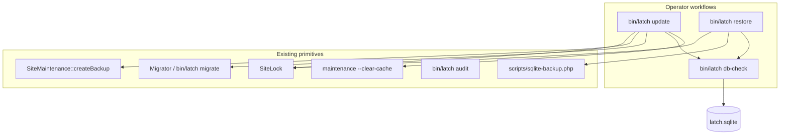
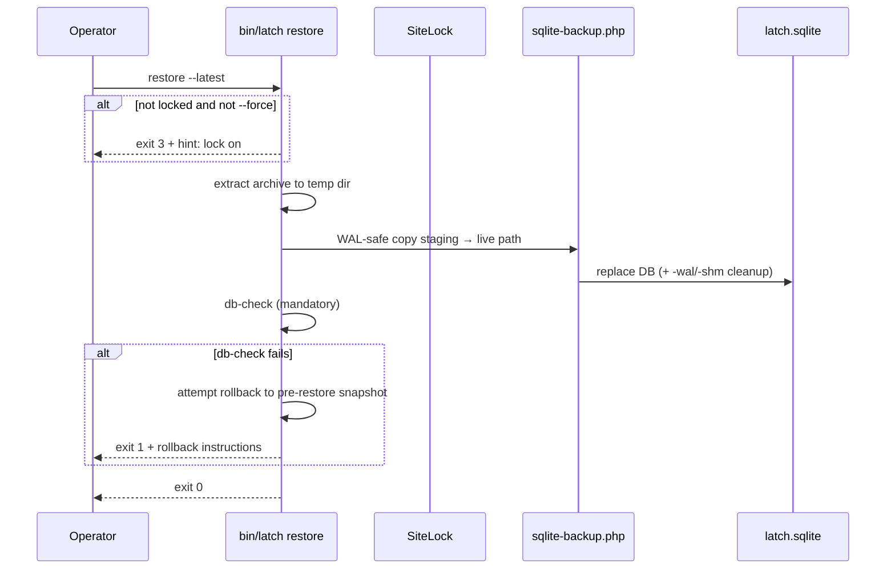
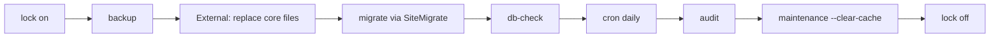

# Design: SQLite Integrity, Restore, and Update Orchestration CLI

| Field | Value |
|-------|-------|
| **Status** | Proposed (plan only — no implementation in this phase) |
| **Authors** | Systems architecture (future Phase 5b / ops hardening) |
| **Date** | 2026-07-03 (rev. 2 — post-review) |
| **Scope** | `bin/latch db-check`, `bin/latch restore`, `bin/latch update` |
| **Related** | PLAN.md Phase 5 (`doctor`, `update.sh`), latch.network corruption incidents |

---

## Overview

Self-hosted Latch operators need **deterministic, non-AI tooling** to detect SQLite corruption, restore from known-good backups, and run a safe upgrade sequence. Today the codebase has strong primitives — site lock, tarball backup, WAL-safe copy script, migrate, security audit — but they are **disconnected** and restore is undocumented manual tar extraction.

This design adds three CLI commands that compose existing pieces into operator-grade workflows suitable for latch.network-style production and OSS self-hosters without expert support.



---

## Background & Motivation

### Production context

- **latch.network** experienced SQLite corruption fixed manually (WAL checkpoint, integrity verification, restore from backup). Operators without SSH expertise or AI assistance had no first-class CLI path.
- **Site lock** is deployed (`app/Support/SiteLock.php`, `storage/site-lock.json`, checked in `public/index.php` before `Application` boot). Cron skips when locked (`bin/latch` `run_cron`).
- **Backup** exists (`SiteMaintenance::createBackup()`, `bin/latch backup`, admin dashboard button) but copies the **live** DB file into a tarball via `tar` — not WAL-safe. WAL-safe patterns live only in `scripts/sqlite-backup.php` and operator scripts (`migrate-latch-db.sh`, `post-forum-updates.sh`).
- **`bin/latch audit`** is a **security** self-check (file permissions, `encryption_key`, fail2ban template, mail config). It does **not** run SQLite integrity pragmas today (`bin/latch` `run_audit`, lines 211–284).
- **`scripts/update.sh`** already orchestrates backup → migrate → cron daily → audit → optional cache clear, but **does not** enable site lock, run `db-check`, or define rollback semantics. PLAN.md Phase 5 calls for `bin/latch update` as the thin PHP orchestrator.

### Operator pain points

| Pain | Today | After this design |
|------|-------|-------------------|
| “Is my DB corrupt?” | Manual `sqlite3 … PRAGMA integrity_check` | `bin/latch db-check` |
| “Restore last night’s backup” | Extract tar, copy files, hope | `bin/latch restore --latest` with lock + verify |
| “Safe upgrade sequence” | Remember 6 commands + lock | `bin/latch update` (+ external file replace) |
| Live traffic during restore | Risk of torn reads/writes | Site lock gate (or `--force` with warnings) |

---

## Goals

1. **`bin/latch db-check`** — Run `PRAGMA integrity_check`, optional `quick_check`, and `foreign_key_check`; human + `--json` output; exit **0** = healthy, **1** = problems found or check failed to run.
2. **`bin/latch restore`** — List and restore from `storage/backups/latch-backup-*.tar.gz`; require site lock or `--force`; WAL-safe DB placement; **mandatory** post-restore `db-check` before success exit.
3. **`bin/latch update`** — Orchestrate lock → backup → (external core replace) → migrate → db-check → cron daily → audit → cache clear → unlock; support `--skip-lock`, `--skip-backup`, `--assume-files-ready`, `--dry-run`; document exit codes and rollback via restore.

## Non-Goals (explicit)

- Full SQLite “rebuilder” reconstructing forum data from scratch.
- Automatic corruption repair (`.recover`, `sqlite3 .recover` magic) in v1 — document as **manual last resort** only.
- Online restore while site serves traffic (restore always requires quiesce).
- Replacing `scripts/update.sh` — shell script remains the tarball/Composer entry point; `bin/latch update` is the PHP orchestrator both can invoke.
- Changing `bin/latch search-reindex` scope — FTS rebuild is derived data only, not a DB integrity tool.
- Integrating `db-check` into every `audit` run by default (see Alternatives).

---

## Proposed Design

### Shared module: `Latch\Support\SqliteIntegrity`

Extract integrity logic into a reusable class (used by `db-check`, `restore`, and `update`):

**File:** `source/app/Support/SqliteIntegrity.php`

```php
final class SqliteIntegrity
{
    /**
     * @return array{
     *   ok: bool,
     *   checks: list<array{name: string, ok: bool, detail: string|list<array<string,mixed>>}>,
     *   duration_ms: int
     * }
     */
    public static function run(string $dbPath, SqliteIntegrityOptions $options): array;
}
```

**Options:**

| Flag | Default | Maps to |
|------|---------|---------|
| `quickOnly` | false | Skip full `integrity_check`; use `quick_check` only |
| `skipForeignKeys` | false | Skip `PRAGMA foreign_keys = ON` and `foreign_key_check` |

**Check semantics:**

| Check | SQL | Pass condition | Notes |
|-------|-----|----------------|-------|
| `integrity_check` | `PRAGMA integrity_check` | Single row `'ok'` | Full scan; can take minutes on large DBs |
| `quick_check` | `PRAGMA quick_check` | Single row `'ok'` | Faster; optional via `--quick` on `db-check` |
| `foreign_key_check` | `PRAGMA foreign_key_check` | Zero rows | Violations return `(table, rowid, parent, fkid)` rows |

**Connection:** Open read-only PDO (`sqlite:` + `PDO::ATTR_ERRMODE_EXCEPTION`). Do **not** reuse `Latch\Core\Database` for checks — that constructor always sets `journal_mode=WAL` and may fail on read-only copies during restore staging.

**Foreign keys on check connection:** Before `foreign_key_check`, execute `PRAGMA foreign_keys = ON` on the read-only PDO (unless `skipForeignKeys` / `--no-fk`). SQLite only reports FK violations when enforcement is enabled on that connection — matching `Database.php` and migration expectations. `--no-fk` skips both the pragma and the check.

**Timeout (`--timeout=SECONDS`):** Deferred to **v1.1**. SQLite has no server-side pragma timeout; a PHP-only flag would be misleading without a subprocess kill model. For v1, rely on operator scheduling (site lock + off-peak). If added later: run `integrity_check` in a child PHP process via `proc_open`, kill on expiry, report `timeout` as a failed check.

**JSON schema** (stable for CI/monitoring):

```json
{
  "ok": false,
  "database": "/var/www/latch/source/storage/database/latch.sqlite",
  "checks": [
    {"name": "integrity_check", "ok": false, "detail": "row 12345: btree..."},
    {"name": "foreign_key_check", "ok": true, "detail": []}
  ],
  "duration_ms": 8421
}
```

**Human output** (mirror `PluginAuditReport::toHuman()` style):

```
db-check: FAILED — 1 problem(s)
  [integrity_check] row 12345: btree...
  [foreign_key_check] ok
```

---

### 1. `bin/latch db-check`

#### CLI interface

```bash
php bin/latch db-check [--json] [--quick] [--no-fk] [--db=PATH]
```

| Option | Description |
|--------|-------------|
| `--json` | Machine-readable report on stdout |
| `--quick` | Run `quick_check` instead of full `integrity_check` |
| `--no-fk` | Skip `PRAGMA foreign_keys = ON` and `foreign_key_check` |
| `--db=PATH` | Override `database.path` (for checking staging copies) |

#### Behavior

1. `require_pdo()` (existing helper in `bin/latch`).
2. Resolve DB path from `--db` or `Config::get('database.path')`.
3. If file missing → stderr message, exit **2** (distinct from “corrupt”).
4. Run `SqliteIntegrity::run()`.
5. Exit **0** if `ok`, **1** if any check fails.

#### Integration with `audit` — keep separate (default)

**Recommendation: separate commands; optional future bridge.**

| Dimension | `audit` | `db-check` |
|-----------|---------|------------|
| Purpose | Host security posture | SQLite structural integrity |
| Opens DB | Yes (settings/mail checks only) | Yes (read-only pragmas) |
| Typical cost | Sub-second | Seconds to minutes |
| Safe under corruption | Partially (may error on queries) | Designed for diagnosis |
| CI use | Pre-deploy security gate | Post-migrate / weekly health |

**Optional later:** `php bin/latch audit --with-db-check` delegates to `SqliteIntegrity` after existing checks. **Not in v1** — avoids slowing every audit and blurring exit semantics (security vs data). Document cross-reference in `docs/CLI.md`: “run `db-check` after migrate, restore, or suspected corruption.”

`update` and `restore` call `db-check` internally — operators do not need to remember a separate step in those flows.

---

### 2. `bin/latch restore`

#### CLI interface

```bash
php bin/latch restore list [--json]
php bin/latch restore --latest [--with-config] [--json]
php bin/latch restore --archive=PATH [--with-config] [--json]
php bin/latch restore --name=latch-backup-20260703-120000.tar.gz [--with-config]
```

| Option | Description |
|--------|-------------|
| `list` | Enumerate `storage/backups/latch-backup-*.tar.gz` sorted newest-first |
| `--latest` | Restore newest archive |
| `--archive=PATH` | Explicit path (need not be under `backups/`) |
| `--name=FILENAME` | Basename under `storage/backups/` |
| `--with-config` | Also restore `config/local.php` from archive |
| `--force` | Skip site-lock requirement (**dangerous**) |
| `--json` | Structured output |
| `--dry-run` | List actions without writing |

#### Preconditions (hard gates)



1. **Site lock required** unless `--force`:
   - If `!SiteLock::isLocked($storagePath) && !--force` → exit **3** with message:
     ```
     Refusing restore: site is not locked.
     Run: php bin/latch lock on
     Or:  php bin/latch restore --latest --force   # dangerous
     ```
2. **Never restore over live site without lock** — documented in help, `docs/CLI.md`, `docs/SECURITY.md`.

#### Restore targets

| Artifact | Default | `--with-config` |
|----------|---------|-----------------|
| `storage/database/latch.sqlite` | **Always** | — |
| `config/local.php` | **Never** (preserve current secrets/URL) | Restore from archive |

**Trade-offs for `config/local.php`:**

| Restore config? | When to use | Risk |
|-----------------|-------------|------|
| **No (default)** | DB corruption only; current `site.url`, `encryption_key`, plugin creds must stay | Restored DB may reference settings that differ from current `local.php` — rare for Latch (most config in DB `settings` table) |
| **Yes (`--with-config`)** | Total site disaster; restoring to blank VM | **Overwrites** `encryption_key` → TOTP secrets encrypted with old key may break unless keys match; OIDC/R2 plugin secrets reverted; operator must verify mail/OIDC/R2 after restore |

**Recommendation:** Default DB-only restore. Print warning when archive contains `config/local.php` but flag not set: “Archive includes local.php; pass --with-config to restore it.”

#### WAL-safe copy pattern

Mirror `scripts/migrate-latch-db.sh` and `scripts/sqlite-backup.php`:

1. Extract tarball to temp dir (`sys_get_temp_dir()/latch-restore-{random}/`).
2. Locate `storage/database/latch.sqlite` inside extracted tree (validate relative paths — reject path traversal).
3. **Pre-restore safety snapshot:** WAL-safe copy of **current** live DB via `sqlite-backup.php` (enables rollback). Write to `storage/backups/.pre-restore-{timestamp}.sqlite` and update symlink `storage/backups/.pre-restore-latest.sqlite` → that file. **Retention:** keep the latest snapshot plus at most **3** timestamped snapshots; prune older `.pre-restore-*.sqlite` on each restore attempt. Document manual cleanup in `SECURITY.md`.
4. Publish restored DB:
   - `php scripts/sqlite-backup.php {extracted_db} {live_db}` — same as migrate publish path; includes integrity_check on copy per `sqlite-backup.php` lines 71–77.
5. Remove stale `-wal` / `-shm` siblings of previous live DB before copy (or rename aside as `latch.sqlite.corrupt-{ts}`).
6. `chown`/`chmod` hint: if live DB owned by `apache`, print `sudo -u apache` guidance (reuse `latch_cli_database` error hints).

#### Post-restore mandatory `db-check`

- Invoke `SqliteIntegrity` on live path.
- **Success exit only if `db-check` passes.**
- On failure: attempt rollback from `.pre-restore-{timestamp}.sqlite` via another WAL-safe copy; leave site locked; exit **1** with explicit manual recovery steps.

#### `list` subcommand output

Human:

```
storage/backups/
  latch-backup-20260703-120000.tar.gz  2026-07-03T12:00:00Z  4.2 MiB  [db, local.php]
  latch-backup-20260702-031500.tar.gz  2026-07-02T03:15:00Z  4.1 MiB  [db]
```

JSON: `{ "backups": [{ "name", "path", "size_bytes", "mtime_iso", "contents": ["storage/database/latch.sqlite", "config/local.php"] }] }`

Parse tarball with `tar -tzf` (or PHP `PharData`) without full extract for `list`.

#### New helper: `Latch\Support\SiteRestore`

**File:** `source/app/Support/SiteRestore.php`

Encapsulates list/extract/validate/publish/rollback; keeps `bin/latch` thin like `SiteMaintenance` / `SiteLock`.

**Operator accountability (`--force`):** On `--force` restore, attempt `audit_log` entry `restore.forced` with CLI actor when DB is writable. If DB is corrupt or insert fails, append a line to `storage/logs/restore.log` instead. Never block restore on logging failure.

#### Operator deploy path (out of v1 scope)

`scripts/publish-latch-server.sh` (used by `sync-latch.sh` on latch.network) backs up/restores live `latch.sqlite` via `cp -a` — the same WAL-unsafe pattern PR-2 fixes for `createBackup()`. v1 does not change operator deploy scripts. **Future hardening:** wire `sync-latch.sh` to `lock on` → `backup` → file publish → `bin/latch update --skip-lock --skip-backup` (or equivalent). Document in PLAN.md that private deploy and public `update.sh` are separate paths until then.

#### Shared helper: `Latch\Support\Scripts`

Repo-root operator scripts live at **`{repo}/scripts/`** (sibling of `source/`), not under `source/scripts/`. PHP callers resolve paths via:

```php
// app/Support/Scripts.php
final class Scripts
{
    public static function repoRoot(): string
    {
        return dirname(LATCH_ROOT); // LATCH_ROOT = source/
    }

    public static function sqliteBackupPath(): string
    {
        return self::repoRoot() . '/scripts/sqlite-backup.php';
    }

    public static function assertExists(string $path): void
    {
        if (!is_file($path)) {
            throw new \RuntimeException("Required script missing: {$path}");
        }
    }
}
```

Used by `SiteMaintenance` (backup staging), `SiteRestore` (publish/rollback), and `SiteMigrate` (migrate publish). Fail with a clear error if the script is absent (e.g. trimmed public tarball — document that `scripts/sqlite-backup.php` must ship in release artifacts).

#### Privilege-aware DB publish: `Latch\Support\SiteMigrate`

Production SQLite is often owned by the web server (`apache`). Plain `run_migrate()` on the live path fails; `scripts/migrate-latch-db.sh` already WAL-copies to a writable work dir, migrates via `LATCH_DB_PATH`, then publishes back.

**New class:** `app/Support/SiteMigrate.php`

```php
final class SiteMigrate
{
    /**
     * @return array{applied: int, mode: 'direct'|'workdir'}
     */
    public static function migrate(Config $config, ?string $webUser = null): array;
}
```

**Algorithm (mirrors `migrate-latch-db.sh`):**

1. Resolve live `database.path` and test writability (file + `storage/database/` for WAL sidecars).
2. **If writable by current user:** `Migrator::migrate()` directly (mode `direct`).
3. **If not writable:** WAL-safe copy live → work DB (`sys_get_temp_dir()/latch-migrate-{random}.sqlite` or `$WORK_DIR`), migrate via `LATCH_DB_PATH` override, then publish with `sqlite-backup.php` (not raw `rsync`/`cp` — stronger than today's migrate script).
4. When publishing as a different user, subprocess `sudo -u {webUser}` if available; else print `sudo -u apache php bin/latch migrate` hint (reuse `latch_cli_database()` messaging).
5. `WEB_USER` env var (default `apache`) matches `scripts/update.sh`.

`bin/latch update` step 4 calls `SiteMigrate::migrate()`, not bare `run_migrate()`. `bin/latch restore` publish uses the same `sqlite-backup.php` path.

**Follow-up (PR-6, non-blocking):** align `scripts/migrate-latch-db.sh` publish step to `php sqlite-backup.php "${WORK_DB}" "${DB_PATH}"` instead of `rsync`/`cp` for consistency with restore/update.

---

### 3. `bin/latch update` (orchestrator)

#### Role

Thin orchestrator per PLAN.md Phase 5 — **not** a git pull or file downloader. Operator (or `scripts/update.sh`, Docker entrypoint, `sync-latch.sh`) supplies new core files; `update` runs safe steps **after files land**.

#### CLI interface

```bash
php bin/latch update [--dry-run] [--skip-lock] [--skip-backup] [--skip-cache] [--skip-audit] [--skip-cron] [--assume-files-ready] [--json]
```

| Flag | Default | Behavior |
|------|---------|----------|
| `--dry-run` | off | Print planned steps; no mutations |
| `--skip-lock` | off | Do not enable/disable site lock (operator manages lock manually) |
| `--skip-backup` | off | Skip backup (discouraged; for CI/containers with volume snapshots) |
| `--skip-cache` | off | Skip `maintenance --clear-cache` |
| `--skip-audit` | off | Skip security `audit` (discouraged) |
| `--skip-cron` | off | Skip `cron daily` smoke (discouraged; keeps parity with today's `update.sh`) |
| `--assume-files-ready` | on when stdout is not a TTY; off when interactive | Skip "Press Enter" pause before migrate; `update.sh` passes this unconditionally |
| `--json` | off | Emit structured step log |

#### Recommended sequence



| Step | Implementation | On failure |
|------|----------------|------------|
| 1. Lock | `SiteLock::enable($storagePath, 'Latch update in progress', 'cli')` unless `--skip-lock` or already locked | Exit **10**; site unchanged |
| 2. Backup | `SiteMaintenance::createBackup()` unless `--skip-backup` | Exit **11**; unlock if we locked |
| 3. Core replace | **External** — print reminder in `--dry-run` and at step boundary | Operator responsibility |
| 4. Migrate | `SiteMigrate::migrate()` (workdir + `sqlite-backup.php` publish when DB not writable) | Exit **12**; **keep locked**; rollback guidance |
| 5. DB check | `SqliteIntegrity::run()` full checks | Exit **13**; **keep locked**; restore guidance |
| 6. Cron daily | `build_cron_service($db)->runDaily()` unless `--skip-cron` | Exit **16**; warn; continue to audit (non-blocking prunes) |
| 7. Audit | `run_audit()` security checks unless `--skip-audit` | Exit **17**; **keep locked**; fix config/permissions before unlock |
| 8. Cache clear | `SiteMaintenance::clearCaches()` unless `--skip-cache` | Exit **14**; DB migrated — warn, still try unlock |
| 9. Unlock | `SiteLock::disable()` if we enabled lock in step 1 | Exit **15**; warn “site still locked” |
| — | Version report | Print old/new `app.version` from config (PLAN.md parity; core checksum deferred) |

**Note on step 3:** `update` prints:

```
==> Core files
    Replace app/, bin/, public/, database/migrations/, vendor/ before continuing.
    Press Enter when ready (or re-run update after deploy sync).
```

For non-interactive CI: **`update` assumes files already replaced** when invoked from `scripts/update.sh` after rsync/tar extract. `--assume-files-ready` skips the prompt (default **on** when stdout is not a TTY; **off** when interactive).

#### PLAN.md Phase 5 alignment

`PLAN.md` (lines 945–1016) lists migrate → maintenance → **audit** → core checksum → version report. This design **keeps that shape** while inserting lock, backup, and **db-check** (integrity before security audit so a corrupt DB does not masquerade as a permissions failure):

| PLAN.md item | v1 `update` | Notes |
|--------------|-------------|-------|
| Lock + backup | Steps 1–2 | Adds quiesce missing from PLAN prose |
| Migrate | Step 4 via `SiteMigrate` | Privilege-aware |
| db-check | Step 5 | New; not a replacement for `audit` |
| `cron daily` | Step 6 | Preserves today's `scripts/update.sh` behavior |
| `audit` | Step 7 | Security self-check; separate from db-check |
| Cache clear | Step 8 | Same as `maintenance --clear-cache` |
| Core checksum | Deferred | PLAN item; follow-up when `RELEASE_MANIFEST.json` ships |
| `doctor` | Out of band | Run manually pre/post update; not in `update` v1 |
| Version report | End of success path | Print `app.version` before unlock |

**Deliberate slim-down vs PLAN:** only **core checksum** and **`doctor`** are deferred from the automated tail; `audit` and `cron daily` remain in v1.

#### Relationship to `scripts/update.sh`

Refactor `scripts/update.sh` to:

```bash
run_latch lock on --message="Latch update"
run_latch backup
# … composer install, file overlay …
run_latch update --skip-lock --skip-backup --assume-files-ready
# update runs: migrate → db-check → cron daily → audit → cache clear → lock off
```

Shell script owns **file/composer** steps; PHP `update` owns **DB/cache/audit/cron/lock-off** tail. Avoid duplicating migrate/cron/audit in both places.

#### Site lock vs CLI during update/restore

Site lock blocks **web and API** only (`public/index.php`). CLI commands (`migrate`, `backup`, `restore`, `db-check`, `lock off`) **intentionally still run** while locked — required for these workflows. Operators should not assume lock freezes all filesystem or CLI activity.

#### `/health` during lock

`SiteLock::isExemptWebPath()` does **not** exempt `/health` today (`SiteLockTest::testExemptPaths`). While locked, monitors see **503** — same as maintenance. Document in `docs/CLI.md` and `docs/SECURITY.md`. Optional v1.1: exempt `/health` with a read-only JSON `{status: "maintenance", locked: true}` response (no SQLite). Not in v1 scope unless operators request it.

#### Exit codes

| Code | Meaning | Rollback guidance |
|------|---------|-------------------|
| 0 | Success | — |
| 1 | Generic failure | See stderr |
| 10 | Lock failed | Fix `storage/` permissions |
| 11 | Backup failed | Abort update; do not replace files |
| 12 | Migrate failed | `php bin/latch restore --latest` (site should still be locked) |
| 13 | db-check failed after migrate | `restore --latest`; if restore fails, use `.pre-restore-latest.sqlite`; manual `.recover` last resort |
| 14 | Cache clear failed | Site usable; run `maintenance --clear-cache` manually |
| 15 | Unlock failed | `php bin/latch lock off` or token URL |
| 16 | Cron daily failed | Warn; prunes may be stale — re-run `cron daily` manually |
| 17 | Audit failed | Fix reported issues; site stays locked until resolved or `--skip-audit` used intentionally |

Stderr always prints **Rollback playbook** on codes 12–13:

```
Rollback:
  1. Site should still be locked (verify: php bin/latch lock status)
  2. php bin/latch restore --latest
  3. php bin/latch lock off
  4. If restore fails: see docs/CLI.md § Manual recovery
```

#### Optional hooks (v1.1, not blocking)

- Core checksum against `RELEASE_MANIFEST.json` (PLAN.md).
- Plugin compatibility: if `app.version` bumped, `plugin-audit` enabled slugs (PLAN.md line 1016).
- Exempt `/health` during site lock for lock-aware monitoring.

---

### Backup improvement (prerequisite for trustworthy restore)

**Current gap:** `SiteMaintenance::createBackup()` tars the **live** `latch.sqlite` without WAL checkpoint (`app/Support/SiteMaintenance.php` lines 75–81). Backups taken under write load can be inconsistent.

**Required change (same PR series or prerequisite):**

1. Before tar, WAL-safe copy live DB to a **temp file** via `Scripts::sqliteBackupPath()` (e.g. `sys_get_temp_dir()/latch-backup-staging-{random}.sqlite`).
2. Build tar member list with path **`storage/database/latch.sqlite`** (relative to `source/` root) pointing at the **staging file**, not the live path. Use `tar --transform` or a transient directory layout:
   ```bash
   # Example: stage tree preserves archive member paths
   STAGE="${TMPDIR}/latch-backup-tree-${TS}"
   mkdir -p "${STAGE}/storage/database"
   php scripts/sqlite-backup.php "${LIVE_DB}" "${STAGE}/storage/database/latch.sqlite"
   tar -czf "${ARCHIVE}" -C "${STAGE}" storage/database/latch.sqlite -C "${SOURCE_ROOT}" config/local.php
   rm -rf "${STAGE}"
   ```
3. Delete staging temp after successful tar.

**Invariant:** `tar -tzf` on new archives must still list `storage/database/latch.sqlite` and `config/local.php` — verified by integration test in PR-2 (existing backups on latch.network use this layout).

This makes `restore --latest` trustworthy and aligns backup with migrate/restore semantics.

---

## API / Interface Changes

### `bin/latch` command table

| Command | New? | Exit codes |
|---------|------|------------|
| `db-check` | Yes | 0 ok, 1 problems, 2 missing DB |
| `restore list` | Yes | 0 |
| `restore --latest\|--archive\|--name` | Yes | 0 ok, 1 restore/check failed, 3 lock required |
| `update` | Yes | 0, 10–17 per above |

### New PHP classes

| File | Responsibility |
|------|----------------|
| `app/Support/SqliteIntegrity.php` | PRAGMA checks + report DTO |
| `app/Support/Scripts.php` | Repo-root script path resolution (`sqlite-backup.php`) |
| `app/Support/SiteMigrate.php` | Privilege-aware migrate (workdir + WAL-safe publish) |
| `app/Support/SiteRestore.php` | List/restore/rollback |
| `app/Support/UpdateOrchestrator.php` | Step runner with dry-run + JSON log (optional; or procedural functions in `bin/latch` initially) |

### Environment variables (existing, reused)

| Variable | Use |
|----------|-----|
| `LATCH_DB_PATH` | Override DB for migrate-style tooling (`Config` already supports) |
| `LATCH_ROOT` | Implicit via `bin/latch` |

### Admin UI

No admin UI changes in v1. Future: dashboard link “Run integrity check” calling same `SqliteIntegrity` class (read-only).

### Docs updates (implementation phase)

- `source/docs/CLI.md` — full sections for three commands
- `source/docs/SECURITY.md` — restore + corruption playbook
- `source/docs/INSTALL.md` § Upgrading — reference `update` sequence with lock
- `PLAN.md` — mark checklist items done

---

## Alternatives Considered

### A. Merge `db-check` into `audit`

**Rejected as default.** Security audit is fast and permission-focused; integrity check is I/O-heavy and semantically different. Combining would confuse CI gates (“audit failed” vs “database corrupt”). Optional `--with-db-check` deferred.

### B. Implement restore as shell-only script

**Rejected.** PHP already has `Config`, `SiteLock`, and shares patterns with `bin/latch`. Shell would duplicate path resolution and JSON output. Keep `scripts/sqlite-backup.php` as subprocess for WAL copy only.

### C. Online restore without lock

**Rejected.** Non-goal. WAL mode + active web requests during file replace risks torn state. `--force` exists for break-glass with scary warnings.

### D. `update` includes `composer install`

**Rejected for PHP orchestrator.** Composer belongs in `scripts/update.sh` / Docker entrypoint (PLAN.md). Keeps `bin/latch update` runnable where Composer is not in PATH or files are pre-vendored in tarball.

### E. Automatic `sqlite3 .recover`

**Rejected for v1.** Unpredictable data loss; requires sqlite3 CLI; out of scope per non-goals. Document manual procedure in `docs/CLI.md` appendix.

### F. Full DB rebuild from FTS/search index

**Rejected.** `search-reindex` rebuilds derived FTS tables only — cannot reconstruct canonical forum rows.

---

## Security

| Concern | Mitigation |
|---------|------------|
| Restore over live traffic | Site lock gate; API/web return 503 (`SiteLock::respondLocked`) |
| `--force` abuse | stderr warnings; best-effort `audit_log` entry `restore.forced` when DB writable; on failure or corrupt DB, append to `storage/logs/restore.log` (never block restore) |
| Archive path traversal | Validate extracted paths stay under temp root; reject `..` components |
| Secret leakage in JSON | Reports include paths, not file contents |
| `local.php` restore | Opt-in only; warn about `encryption_key` / plugin secrets |
| Backup confidentiality | Existing `storage/backups/` perms `0750`; document in SECURITY.md |
| Privilege mismatch | Document `sudo -u apache` for migrate/restore publish when DB owned by web user |
| Denial of service | Run `db-check` off-peak with site lock; `--timeout` deferred to v1.1 (subprocess kill) |

---

## Rollout Plan

### Phase 1 — Foundation (1 PR)

- `SqliteIntegrity` + `db-check` command + unit tests (temp SQLite files; mock corrupt via truncated file test)
- Docs stub in `CLI.md`

### Phase 2 — Backup hardening (1 PR)

- `SiteMaintenance::createBackup()` uses `sqlite-backup.php` staging copy
- PHPUnit or integration test: backup → verify integrity on extracted DB

### Phase 3 — Restore (1 PR)

- `SiteRestore` + `restore list|…` + tests with fake tar archives
- SECURITY.md corruption playbook

### Phase 4 — Update orchestrator (1 PR)

- `SiteMigrate` + `bin/latch update` + refactor `scripts/update.sh` to delegate
- Update `docs/CLI.md` “Recommended update sequence” (replaces lock-only snippet at lines 166–175)
- **Hard dependency on PR-3** — rollback paths reference `restore --latest`

### Phase 5 — Production validation

- Staging: corrupt copy → `db-check` fails → `restore --latest` succeeds
- latch.network: dry-run `update --dry-run` during low-traffic window
- Forum documentation post via `post-documentation.php`

### Backward compatibility

- No schema migrations required.
- Existing backup archives remain restorable (paths `storage/database/latch.sqlite`, `config/local.php` unchanged).

---

## Manual recovery appendix (documentation only)

When `db-check` fails and no valid backup exists:

1. `php bin/latch lock on`
2. Copy corrupt DB aside: `mv latch.sqlite latch.sqlite.corrupt`
3. If `sqlite3` CLI available: `sqlite3 latch.sqlite.corrupt ".recover" | sqlite3 latch-recovered.sqlite`
4. `php bin/latch db-check --db=latch-recovered.sqlite`
5. If ok, publish via `sqlite-backup.php` pattern; else seek support / backup tapes

**Not automated in v1.**

---

## Resolved Questions (post-review)

1. **Two-tier quick → full check?** v1: default full `integrity_check`; `--quick` for cron. Two-tier auto-escalation deferred to v1.1.
2. **`update` interactive pause?** `--assume-files-ready` default **on** when non-TTY; prompt only in interactive TTY. `update.sh` always passes `--assume-files-ready`.
3. **audit_log for restore/update?** Yes when DB writable; **file fallback** (`storage/logs/restore.log`, `storage/logs/update.log`) on failure — never block the operation.
4. **Include `-wal`/`-shm` in backup?** No — WAL-safe staging copy makes sidecars unnecessary.
5. **Exit code 3 scope?** Per-command tables documented in `docs/CLI.md` § Exit codes (restore **3**, db-check **2**).
6. **`--timeout` on db-check?** Deferred to v1.1 with subprocess kill semantics.
7. **`/health` during lock?** Document 503; optional exempt path in v1.1.

---

## References

| Path | Relevance |
|------|-----------|
| `source/bin/latch` | CLI entry; `run_audit`, `run_backup`, `run_lock`, `run_migrate`, `run_maintenance` |
| `source/app/Support/SiteLock.php` | File-based quiesce |
| `source/app/Support/SiteMaintenance.php` | `createBackup()`, `clearCaches()` |
| `scripts/sqlite-backup.php` | WAL-safe copy + integrity on backup (repo root `scripts/`; `Scripts::sqliteBackupPath()`) |
| `scripts/migrate-latch-db.sh` | Publish pattern after temp migrate (follow-up PR-6: use `sqlite-backup.php` for publish) |
| `scripts/publish-latch-server.sh` | Operator deploy uses WAL-unsafe `cp -a` today — future hardening out of v1 scope |
| `scripts/post-forum-updates.sh` | Pre-publish integrity gate (lines 137–145) |
| `scripts/update.sh` | Current shell orchestration to refactor |
| `source/public/index.php` | Site lock before app boot |
| `source/app/Core/Database.php` | WAL + FK pragmas on normal connections |
| `source/app/Core/Migrator.php` | Schema migrations |
| `source/docs/CLI.md` | Operator docs; update sequence at lines 162–175 |
| `source/docs/SECURITY.md` | Backup section |
| `source/tests/SiteLockTest.php` | Test patterns for lock |
| `PLAN.md` | Phase 5 `doctor`, `update`, `update.sh` checklist (lines 945–1018) |

---

## Key Decisions

1. **Keep `db-check` separate from `audit`** — different purpose, cost, and failure meaning; cross-reference in docs; optional `--with-db-check` deferred.
2. **Restore requires site lock by default** — `--force` is break-glass only; never restore over live traffic without quiesce.
3. **Default restore is DB-only** — `--with-config` opt-in because `encryption_key` and plugin secrets in `local.php` make blind config restore dangerous.
4. **WAL-safe copy via `sqlite-backup.php` for all DB publish paths** — restore, improved backup, and migrate-publish share one implementation.
5. **Post-restore and post-migrate `db-check` is mandatory** in `restore` and `update` — command does not exit 0 until integrity passes.
6. **`bin/latch update` does not replace core files or run Composer** — external deploy step; orchestrates lock/backup/migrate/db-check/cron/audit/cache/unlock.
7. **Harden `SiteMaintenance::createBackup()` before trusting `restore --latest`** — prerequisite in same release train; tar member paths unchanged.
8. **No automatic `.recover`** — document manual last resort; keeps v1 scope bounded and predictable.
9. **`SiteMigrate` + `sqlite-backup.php` publish** for non-writable production DBs — not bare `run_migrate()`.
10. **PR-4 depends on PR-3** — rollback playbook requires `restore`.
11. **`audit` stays in v1 `update` tail** (after db-check); separate commands, separate failure semantics.
12. **`Scripts::sqliteBackupPath()`** — single resolution for repo-root `scripts/sqlite-backup.php`.

---

## PR Plan

| PR | Title | Files (primary) | Depends on |
|----|-------|-----------------|------------|
| **PR-1** | `feat(cli): add SqliteIntegrity and bin/latch db-check` | `app/Support/SqliteIntegrity.php`, `bin/latch`, `tests/SqliteIntegrityTest.php`, `docs/CLI.md` | — |
| **PR-2** | `fix(backup): WAL-safe consistent backups via sqlite-backup.php` | `app/Support/SiteMaintenance.php`, `tests/SiteMaintenanceBackupTest.php` | — |
| **PR-3** | `feat(cli): add bin/latch restore with lock gate and rollback` | `app/Support/SiteRestore.php`, `bin/latch`, `tests/SiteRestoreTest.php`, `docs/CLI.md`, `docs/SECURITY.md` | PR-1, PR-2 |
| **PR-4** | `feat(cli): add SiteMigrate and bin/latch update orchestrator` | `app/Support/SiteMigrate.php`, `bin/latch`, optional `app/Support/UpdateOrchestrator.php`, `scripts/update.sh`, `docs/CLI.md`, `docs/INSTALL.md` | **PR-1, PR-2, PR-3** |
| **PR-5** | `docs: forum documentation + PLAN.md checklist` | `data/documentation-posts.json`, `PLAN.md` | PR-1–4 |
| **PR-6** | `chore(scripts): WAL-safe publish in migrate-latch-db.sh` | `scripts/migrate-latch-db.sh` | PR-1 (follow-up, non-blocking) |

**Suggested review order:** PR-1 → PR-2 (parallel OK) → PR-3 → PR-4 → PR-5. **Do not merge PR-4 until PR-3 ships** (rollback references `restore --latest`). PR-6 optional follow-up.

**Test gate before merge:** `./vendor/bin/phpunit` + manual scenario: backup → corrupt copy → `db-check` fails → `restore --latest` → `db-check` passes → `lock off`.