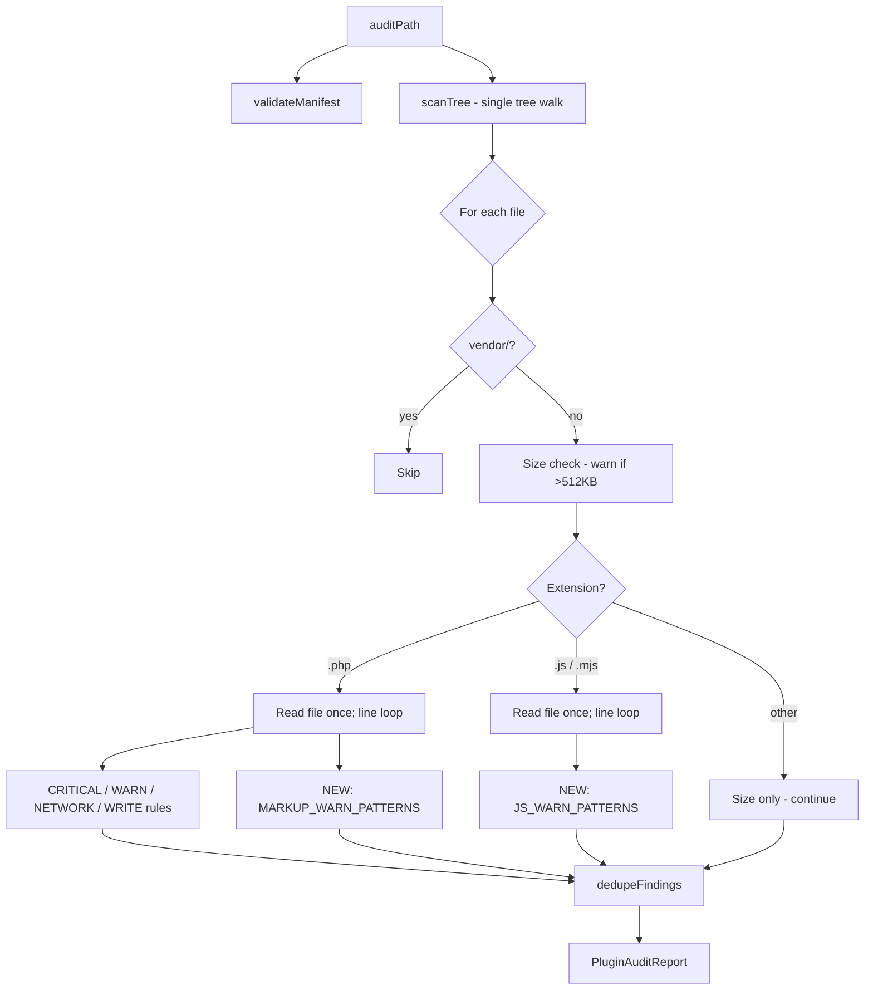

# Design: Plugin-Audit Markup & JavaScript Static Scanning

| Field | Value |
|-------|-------|
| **Author** | (TBD) |
| **Date** | 2026-07-03 |
| **Status** | Draft |
| **Scope** | `PluginAuditor` extension — PHP markup warnings + JS asset warnings |

---

## Overview

Latch's `plugin-audit` static scanner (`app/Core/Plugins/PluginAuditor.php`) walks each plugin directory, validates `plugin.json`, and pattern-matches **`.php` files only** (plus size checks on all non-`vendor/` files). Critical findings block enable via CLI and Admin UI; warnings are surfaced for human review only.

This design extends the scanner with two **warning-only** capabilities:

1. **PHP markup warnings** — detect XSS-prone HTML/script patterns in plugin PHP source (especially strings returned from collect hooks that themes render via Twig `|raw`).
2. **JavaScript asset warnings** — scan `.js` / `.mjs` files under the plugin tree (excluding `vendor/`) for suspicious client-side patterns.

Neither extension changes the pass/fail gate: `PluginAuditReport::passed()` remains `criticalCount() === 0`.

---

## Background & Motivation

### Current audit behavior

`PluginAuditor::scanTree()` (lines 189–307) iterates all files, skips `vendor/`, warns on files >512 KB, then **continues early** for non-`.php` extensions:

```233:235:app/Core/Plugins/PluginAuditor.php
            if (!str_ends_with(strtolower($relative), '.php')) {
                continue;
            }
```

Bundled plugins ship client assets that are never statically reviewed:

| Plugin | Asset | Served via |
|--------|-------|------------|
| `image-upload` | `assets/upload.js` | `theme.scripts` → `<script src="…" defer>` in `base.html.twig` |
| `forum-stats` | `assets/stats.css` only | `theme.assets` |
| `image-upload` | `assets/upload.css` | `theme.assets` |

`image-upload/assets/upload.js` uses `fetch`, `document.createElement`, `addEventListener` — all legitimate — but a malicious plugin could ship obfuscated exfiltration or DOM XSS primitives in JS with no audit visibility today.

### HTML injection surface

Collect hooks feed Twig globals that use **`|raw`** (unescaped output):

| Hook | Twig global | Template |
|------|-------------|----------|
| `layout.footer` | `plugin_footer_html` | `themes/default/partials/footer.html.twig:50-51` |
| `home.after_boards` | `plugin_home_after_boards_html` | `themes/default/home/index.html.twig:103-104` |
| `editor.compose` | `plugin_composer_toolbar` | `themes/default/partials/composer.twig:21-22` |

Example legitimate HTML from bundled plugins:

- `example`: `<p class="footer-plugin-note muted">…<a href="…">…</a></p>` (`plugins/example/src/Plugin.php:31-33`)
- `image-upload`: `<button type="button" class="composer-btn" data-action="image-upload" …>` (`plugins/image-upload/src/Plugin.php:58-61`)
- `forum-stats`: `<section>…<div>…<span>…` heredoc in `plugins/forum-stats/src/StatsPanel.php:15-30`

Plugins are **operator-trusted** code; the audit gate targets supply-chain mistakes and overtly dangerous PHP (RCE, undeclared network, forbidden writes). Markup/JS scanning adds **defense-in-depth visibility** without treating every `<div>` as a violation.

### CSP context

`SecurityHeaders::apply()` sets:

```56:58:app/Core/SecurityHeaders.php
        header(
            'Content-Security-Policy: default-src \'self\'; '
            . "script-src {$scriptSrc} https://challenges.cloudflare.com; "
```

- No `'unsafe-inline'` or `'unsafe-eval'` in `script-src`.
- Plugin scripts load via **URL** (`theme.scripts`), not inline blocks.
- Inline event handlers in injected HTML (`onclick=`) and injected `<script>` tags are **blocked by Latch's current CSP** in modern browsers (`script-src 'self'` without `'unsafe-inline'`). Markup warnings still matter for: (a) operator review before enable, (b) future CSP relaxations, (c) non-browser contexts (RSS, email previews if ever added).

---

## Goals & Non-Goals

### Goals

- Add **warn-severity** findings for suspicious markup patterns in `.php` files.
- Add **warn-severity** findings for suspicious patterns in `.js` / `.mjs` files (excluding `vendor/`).
- Preserve **zero critical findings** for bundled good plugins: `example`, `forum-stats`, `image-upload`.
- Preserve **≥3 critical findings** for `badexample` (unchanged PHP traps).
- Reuse existing `PluginAuditFinding` / `PluginAuditReport` JSON shape.
- Document new rules in `docs/PLUGINS.md` and `docs/CLI.md`.
- PHPUnit coverage via temp plugin fixtures (existing `makeTempPlugin()` pattern).

### Non-Goals

- Executing plugin code or parsing PHP AST (stay regex/line-based like today).
- Scanning `.css`, `.html`, `.twig`, images, or minified vendor bundles.
- Blocking enable on markup/JS warnings.
- Auto-fix or sanitization of plugin source.
- Distinguishing "inside comment" vs "live code" (accepted limitation of line scanner).
- CSP nonce coordination or runtime HTML sanitization.

---

## Proposed Design

### High-level flow



### Implementation location

Extend `PluginAuditor` with two new private constant arrays and helper methods. No new public API on `PluginAuditor`; `auditPath()` / `auditTarget()` signatures unchanged.

Suggested structure (all within `PluginAuditor.php` for v1 — class is ~460 lines today, ~120 lines added):

```php
/** @var list<array{pattern: string, code: string, message: string}> */
private const MARKUP_WARN_PATTERNS = [ /* … */ ];

/** @var list<array{pattern: string, code: string, message: string}> */
private const JS_WARN_PATTERNS = [ /* … */ ];

/** @return list<string> */
private static function scannableJsExtensions(): array
{
    return ['.js', '.mjs'];
}

private function scanLineForPatterns(
    string $line,
    int $lineNo,
    string $relative,
    array $rules,
    string $severity,
): array { /* shared by PHP markup + JS */ }
```

**Required in the same PR as scanner changes:** extract `scanLineForPatterns()` and route **pattern-only** rule sets (CRITICAL, WARN, NETWORK, MARKUP, JS) through it. Keep **WRITE** (`WRITE_PATTERNS` + `checkWriteLine()`) and **path_traversal** bespoke — they need `$allowedWriteRoots` and multi-step logic. Deferring the refactor while adding two new rule loops invites duplicated iteration logic and review churn.

#### `scanTree()` control flow (single tree walk)

Markup scanning shares the **same file-read and line loop** as existing PHP rules — not a second tree walk. Replace the early `continue` for non-`.php` files (current lines 233–235) with extension dispatch:

```text
foreach ($iterator as $fileInfo) {
    if (!$fileInfo->isFile()) continue;

    $absolute = $fileInfo->getPathname();
    $relative = ltrim(str_replace($pluginDir, '', $absolute), '/\\');

    if (str_starts_with($relative, 'vendor/')) continue;

    // Size warn (all non-vendor files)
    if ($fileInfo->getSize() > MAX_FILE_BYTES) { append large_file warn; }

    $lower = strtolower($relative);
    $isPhp = str_ends_with($lower, '.php');
    $isJs  = str_ends_with($lower, '.js') || str_ends_with($lower, '.mjs');

    if (!$isPhp && !$isJs) continue;   // replaces old "non-.php → continue"

    $contents = file_get_contents($absolute);
    if (!is_string($contents) || $contents === '') continue;  // same empty skip for PHP and JS

    $lines = preg_split('/\R/', $contents) ?: [];
    foreach ($lines as $lineNumber => $line) {
        $lineNo = $lineNumber + 1;

        if ($isPhp) {
            // Existing: CRITICAL_PATTERNS, WARN_PATTERNS
            // Existing: NETWORK_PATTERNS (if !networkDeclared)
            // Existing: WRITE_PATTERNS + checkWriteLine + path_traversal
            // NEW: MARKUP_WARN_PATTERNS (SEVERITY_WARN)
            // All via scanLineForPatterns() where pattern-only; WRITE/path_traversal stay bespoke
        }

        if ($isJs) {
            // NEW: JS_WARN_PATTERNS (SEVERITY_WARN) via scanLineForPatterns()
        }
    }
}

return dedupeFindings($findings);
```

**Notes for implementers:**

- A file is either `.php` or `.js`/`.mjs`, never both — the inner `if ($isPhp)` / `if ($isJs)` branches are mutually exclusive.
- `scanLineForPatterns()` returns `list<PluginAuditFinding>`; caller merges with `array_merge`.
- Empty JS files are skipped the same way as empty PHP files (no findings).
- `dedupeFindings()` key is `severity|code|message|file|line` — identical rule+line matches dedupe; distinct codes on the same line remain separate findings.

### 1. PHP markup warnings

#### Pattern philosophy

Flag **XSS-capable / script-execution primitives**, not structural HTML. Benign tags (`<button>`, `<section>`, `<a href="/…">`) must not trigger findings.

#### Proposed `MARKUP_WARN_PATTERNS`

| Code | Regex (PCRE, per line) | Message |
|------|------------------------|---------|
| `markup_script_tag` | `/<script\b/i` | `<script>` tag in PHP source — review hook HTML injection |
| `markup_javascript_url` | `/javascript\s*:/i` | `javascript:` URL scheme — review hook HTML |
| `markup_inline_event_handler` | `/\bon[a-z][a-z0-9]*\s*=/i` | Inline event handler (`onclick=`, `onerror=`, …) in string |
| `markup_iframe` | `/<iframe\b/i` | `<iframe>` — review embedding |
| `markup_object_tag` | `/<object\b/i` | `<object>` — review embedding |
| `markup_embed_tag` | `/<embed\b/i` | `<embed>` — review embedding |
| `markup_srcdoc` | `/\bsrcdoc\s*=/i` | `srcdoc=` attribute — inline HTML document |
| `markup_meta_refresh` | `/<meta\b[^>]*http-equiv\s*=\s*[\'"]?refresh/i` | Meta refresh redirect |
| `markup_base_tag` | `/<base\b/i` | `<base href>` can hijack relative URLs |
| `markup_data_html` | `/data\s*:\s*text\/html/i` | `data:text/html` URI |

**Explicitly excluded** from markup rules (would cause false positives on bundled plugins):

- Generic tags: `<div`, `<span`, `<p`, `<button`, `<section`, `<a`
- `on` substring in non-handler contexts (handled by requiring `\bon[a-z]…\s*=`)
- `HookName::…` constant references (no HTML)

#### Scan scope: whole PHP file vs hook-proximity

| Approach | Pros | Cons |
|----------|------|------|
| **Whole `.php` file** (recommended) | Simple; matches existing line scanner; high-confidence patterns rarely appear in non-hook code | Theoretical FP in comments/docs |
| **Hook-proximity only** | Narrower context | Fragile heuristics (`HookName::` multiline callbacks, heredocs in separate classes like `StatsPanel`); misses traps in non-hook files |
| **Heredoc-only** | Very precise for `forum-stats` | Misses single-quoted hook returns (`image-upload` button string) |

**Decision: whole-file scanning** for `MARKUP_WARN_PATTERNS`. Rationale:

1. Patterns are **high-specificity** — bundled plugins verified clean (see table above).
2. `StatsPanel.php` heredoc is scanned automatically without hook-registration heuristics.
3. A malicious `<script>` in an unused PHP file is still worth flagging.
4. Aligns with existing CRITICAL/WARN scan of entire `.php` tree.

Optional **future** enhancement: downgrade certain patterns to `info` when matched only inside `//` or `/*` comments (not in v1).

#### Severity

Always `PluginAuditFinding::SEVERITY_WARN`. Never blocks `passed()`.

#### Interaction with existing PHP critical rules

Markup rules are **warn-only**, but the existing PHP line scanner still runs on the same lines. Dangerous PHP tokens inside HTML strings remain subject to **critical** rules in `CRITICAL_PATTERNS`. Example: a hook return like `'<script>eval(x)</script>'` emits:

| Code | Severity | Source |
|------|----------|--------|
| `dangerous_eval` | **critical** | `CRITICAL_PATTERNS` — `/\beval\s*\(/i` matches inside the string |
| `markup_script_tag` | warn | `MARKUP_WARN_PATTERNS` — `/<script\b/i` |

Result: `passed() === false` (critical blocks enable); operator sees both findings. This is intentional — server-side `eval` in source is a harder gate than markup shape. Document in `docs/PLUGINS.md` that markup warnings supplement, not replace, PHP critical rules.

---

### 2. JavaScript asset scanning

#### File scope

| Extension | Include? | Rationale |
|-----------|----------|-----------|
| `.js` | **Yes** | All current plugin JS (`image-upload/assets/upload.js`) |
| `.mjs` | **Yes** | No bundled usage today; zero-cost forward compatibility for ESM plugins |
| `.min.js` | **Yes** (via `.js`) | Treated same as `.js`; patterns apply to minified code |
| `vendor/**` | **No** | Already skipped in `scanTree()` |
| `.ts`, `.jsx` | **No** | Not shipped by any bundled plugin; avoid scanning source that isn't served |

Detection:

```php
$lower = strtolower($relative);
$isJs = str_ends_with($lower, '.js') || str_ends_with($lower, '.mjs');
```

#### Proposed `JS_WARN_PATTERNS`

| Code | Regex | Message |
|------|-------|---------|
| `js_eval` | `/\beval\s*\(/` | `eval()` in plugin JavaScript |
| `js_function_constructor` | `/\bnew\s+Function\s*\(/` | `new Function()` dynamic code |
| `js_document_write` | `/\bdocument\.write\s*\(/` | `document.write()` |
| `js_inner_html` | `/\.innerHTML\s*=/` | `innerHTML` assignment |
| `js_outer_html` | `/\.outerHTML\s*=/` | `outerHTML` assignment |
| `js_insert_adjacent_html` | `/\.insertAdjacentHTML\s*\(/` | `insertAdjacentHTML()` |
| `js_javascript_url` | `/javascript\s*:/i` | `javascript:` URL in JS string |
| `js_inline_event_handler` | `/\bon[a-z][a-z0-9]*\s*=/i` | Inline handler in HTML string built from JS |
| `js_document_cookie` | `/\bdocument\.cookie\b/` | `document.cookie` access |
| `js_postmessage_wildcard` | `/postMessage\s*\([^)]*['"]\*['"]/` | `postMessage(…, '*')` — overly permissive target |
| `js_dynamic_import_external` | `/\bimport\s*\(\s*['"]https?:\/\//i` | Dynamic `import()` of external URL only (not bare `import()`) |
| `js_external_script_injection` | `/(?:createElement|\.innerHTML)\s*[^(]*\([^)]*<script/i` | Script tag injection via DOM APIs (coarse) |
| `js_fetch_external` | `/\bfetch\s*\(\s*['"]https?:\/\//i` | `fetch()` to absolute external URL |
| `js_xhr_external` | `/\.open\s*\(\s*['"][A-Z]+['"]\s*,\s*['"]https?:\/\//i` | XHR to absolute external URL |

**Bundled `upload.js` check** (no expected warnings):

- `fetch(PRESIGN_URL)` — relative `/plugin/…` → **no match** on `js_fetch_external`
- `fetch(payload.upload_url)` — variable, not string literal → **no match**
- `document.createElement('input')` — not `<script` → **no match**
- No `eval`, `innerHTML`, `document.cookie` → **clean**

#### Should any JS patterns be critical?

**Recommendation: No — all JS findings are `warn` in v1.**

| Factor | Implication |
|--------|-------------|
| CSP `script-src 'self'` | Blocks `eval()`, inline handlers, and third-party script URLs at runtime |
| `theme.scripts` wiring | Only same-origin URLs emitted in layout (`base.html.twig:72-74` uses `src="{{ script }}"`, not inline) |
| Trust model | Plugins are installed by the forum operator; JS is part of that trust bundle |
| False positives | `fetch('https://…')` may be declared via `csp.connect_src` — blocking would require manifest correlation not present today |
| Consistency | Task specifies warnings for markup; PHP critical rules target server-side RCE/exfil/write |

**Revisit candidates** (future, if manifest gains `permissions.script_external`):

- `js_fetch_external` / `js_xhr_external` → critical when URL host not in declared `csp.connect_src` hosts. Out of scope for v1.

**Not recommended as critical even if tempting:**

- `js_eval` — CSP blocks runtime execution in browsers; warn severity (analogous to PHP `base64_decode`, which is warn). **PHP `eval()` remains critical** via `dangerous_eval` — server-side RCE, not comparable to client-side `eval`.
- Crypto-miner strings — high false positive in comments; use warn + specific pattern if added later.

---

### 3. False-positive mitigation

| Risk | Mitigation |
|------|------------|
| Legitimate `<button>` in `editor.compose` | Patterns target script/embed/handlers only, not buttons |
| `forum-stats` heredoc HTML | Structural tags only; no script/handlers |
| `example` footer `<a href>` | Safe — no `javascript:` or handlers |
| PHP comment mentions `onclick=` | Accepted v1 limitation; rare in plugins; document in PLUGINS.md |
| `image-upload` `fetch` to R2 URL | Variable URL — literal pattern doesn't fire; dynamic URL not flagged (intentional) |
| Minified JS `.innerHTML=` | Warn is appropriate — operator should review |
| `import()` in ESM `.mjs` | **Resolved:** `js_dynamic_import_external` matches only `import('https://…')` literals, not relative/module `import()`. Legitimate ESM code-splitting does not warn. |

**Regression gate:** CI must assert bundled `example`, `forum-stats`, `image-upload` have `passed() === true`, `criticalCount() === 0`, and **`warnCount() === 0`**. The gate applies to these three plugins specifically — future bundled plugins using patterns we intentionally warn on (e.g. external `fetch` with declared `csp.connect_src`) may carry warnings without failing this gate.

---

### 4. JSON report shape

**No schema change.** New findings use existing `PluginAuditFinding::toArray()`:

```json
{
  "severity": "warn",
  "code": "markup_script_tag",
  "message": "<script> tag in PHP source — review hook HTML injection",
  "file": "src/Plugin.php",
  "line": 42
}
```

`PluginAuditReport::toArray()` summary counts (`critical`, `warn`, `info`) absorb new warns automatically.

`emit_plugin_audit_report()` in `bin/latch` unchanged.

**Optional v2 field** (not proposed now): `"category": "markup"|"js"|"php"|"manifest"` — would require consumer updates.

---

### 5. Admin UI impact

`/admin/plugins` (`AdminController::plugins()`, template `themes/default/admin/plugins.html.twig`) already:

- Runs full audit per plugin on page load
- Shows `audit.warn_count` when passed
- Lists all findings in `<details>` with severity, code, file:line, message

**No code changes required** for basic functionality. New `markup_*` and `js_*` codes appear automatically.

**Operability note:** `AdminController::plugins()` (line 1497) runs `auditPath()` for **every** plugin on each page load — this cost predates this design. JS line scanning adds work proportional to JS file count × line count (e.g. `upload.js` is ~136 lines). Acceptable for v1 given small bundled assets and few plugins per install. If plugin trees grow large, consider caching audit results keyed by `(slug, mtime tree hash)` — out of scope for v1; no code change now.

**Optional UX polish** (low priority, separate PR):

- Badge hint: "X markup/JS warnings" by filtering `finding.code` prefixes
- Sort findings: critical first, then markup/js grouped

Enable gate unchanged: `audit.passed` only (`critical_count === 0`).

---

### 6. Documentation updates

**`docs/PLUGINS.md` § Security audit** — paste the canonical code list from **Appendix A** (below). Note: structural HTML in hooks is expected; scanner flags **dangerous** markup only. Note: markup rules are warn-only, but dangerous PHP tokens inside HTML strings can still trigger **critical** findings (see §1 interaction table).

**`docs/CLI.md` § plugin-audit** — mirror Appendix A; mention `.js`/`.mjs` scanning and `vendor/` exclusion.

---

## API / Interface Changes

| Surface | Change |
|---------|--------|
| `PluginAuditor` public methods | None |
| `PluginAuditFinding` | None |
| `PluginAuditReport` | None |
| CLI `plugin-audit --json` | New `code` values only |
| Admin UI | New finding rows (no template contract change) |

---

## Data Model Changes

None. Audit results are ephemeral (computed on demand); not persisted to DB.

---

## Alternatives Considered

### A. Hook-proximity-only markup scan

Scan lines within ±40 lines of `hooks()->add(HookName::LAYOUT_FOOTER|HOME_AFTER_BOARDS|EDITOR_COMPOSE` or inside classes referenced from those callbacks.

- **Pros:** Narrower context.
- **Cons:** Misses `StatsPanel` heredoc; brittle multiline `add()`; duplicated `HookName` string vs constant matching.
- **Rejected** for v1 in favor of whole-file high-specificity patterns.

### B. Separate `PluginJsAuditor` class

- **Pros:** Test isolation, clearer ownership.
- **Cons:** Extra file for ~60 lines; `scanTree()` still orchestrates.
- **Deferred** — keep in `PluginAuditor` unless class exceeds ~600 lines.

### C. Critical JS patterns blocking enable

- **Pros:** Stronger gate against malicious JS.
- **Cons:** CSP already mitigates; `fetch('https://cdn.example')` false positives; inconsistent with operator-trust model.
- **Rejected** for v1 (see §2).

### D. Scan only served assets (manifest + route.register heuristic)

- **Pros:** Fewer files.
- **Cons:** Requires parsing route registrations; misses unregistered dead code that might be enabled later.
- **Rejected** — full tree scan (minus vendor) is simpler and matches PHP approach.

---

## Security & Privacy Considerations

| Threat | Scanner role | Residual risk |
|--------|--------------|---------------|
| Stored XSS via hook HTML | Warn on script/handlers | Inline handlers and `<script>` blocked by current CSP in browsers; operator review is primary backstop for enable decision |
| Malicious plugin JS | Warn on DOM/eval/fetch patterns | CSP limits runtime; operator trust assumed |
| Supply-chain trojan | Visibility for review | Not a substitute for code review or sandboxing |
| Audit bypass | Static only — no execution | `badexample` proves PHP traps caught; JS in encoded strings may evade regex |

**Privacy:** Scanner reads plugin files locally; no network. No PII in findings.

**Auth:** Unchanged — audit runs with filesystem read access (CLI operator / admin UI).

---

## Observability

| Signal | Approach |
|--------|----------|
| CLI exit code | Still 0/1 based on critical only |
| Human report | `toHuman()` lists new `[WARN] markup_*` / `js_*` lines |
| Admin UI | Finding count in plugins table |
| Metrics | None today — no change |
| Logging | No change on enable (`plugin.enable` audit log unchanged) |

**Suggested operator workflow:** `php bin/latch plugin-audit my-plugin` after adding hook HTML or JS assets; review warnings before enable.

---

## Rollout Plan

1. **Implement** scanner extension behind no flag (patterns are warn-only, low risk).
2. **Verify** bundled plugins: zero new warnings for `example`, `forum-stats`, `image-upload`.
3. **Verify** `badexample` still fails with same critical codes.
4. **Ship** docs + tests in same release.
5. **Rollback:** revert `PluginAuditor` commit — no DB/migration impact.

No feature flag needed (warn-only, no behavior change on enable gate).

---

## PHPUnit Test Plan

Extend `tests/PluginAuditorTest.php` using existing `makeTempPlugin()` helper. Add helpers:

```php
private function makeTempPluginWithJs(string $slug, string $phpBody, string $jsBody, string $jsName = 'assets/app.js'): string
{
    $dir = $this->makeTempPlugin($slug, $phpBody);
    $jsPath = $dir . '/' . $jsName;
    mkdir(dirname($jsPath), 0777, true);
    file_put_contents($jsPath, $jsBody);
    return $dir;
}
```

| Test | Fixture | Assertions |
|------|---------|------------|
| `testExamplePluginPassesAudit` | (existing) | `passed()` true; **`assertSame(0, $report->warnCount())`** |
| `testForumStatsPluginPassesAudit` | (existing) | `passed()` true; **`assertSame(0, $report->warnCount())`** |
| `testImageUploadPluginPassesAudit` | (existing) | `passed()` true; **`assertSame(0, $report->warnCount())`** |
| `testBadexamplePluginFailsAudit` | (existing) | Still ≥3 critical; no new critical from JS (no JS file) |
| `testMarkupScriptTagWarns` | Footer hook returning `'<script>alert(1)</script>'` | `markup_script_tag`, severity warn, `passed()` true |
| `testMarkupOnerrorWarns` | `''` | `markup_inline_event_handler`, warn |
| `testMarkupJavascriptUrlWarns` | `'<a href="javascript:void(0)">'` | `markup_javascript_url`, warn |
| `testBenignButtonHtmlNoMarkupWarning` | `editor.compose` button like image-upload | `passed()`, no `markup_*` codes |
| `testForumStatsStyleHeredocNoMarkupWarning` | heredoc with `<section><div>` only | no `markup_*` codes |
| `testJsEvalWarns` | `assets/evil.js` with `eval('x')` | `js_eval`, warn, `passed()` true |
| `testJsInnerHtmlWarns` | `el.innerHTML = user` | `js_inner_html`, warn |
| `testJsRelativeFetchNoWarning` | `fetch('/plugin/foo')` | no `js_fetch_external` |
| `testJsExternalFetchWarns` | `fetch('https://evil.example/')` | `js_fetch_external`, warn |
| `testJsDynamicImportExternalWarns` | `import('https://evil.example/mod.js')` in `.mjs` | `js_dynamic_import_external`, warn, `passed()` true |
| `testJsRelativeDynamicImportNoWarning` | `import('./chunk.mjs')` in `.mjs` | no `js_dynamic_import_external`; `passed()` true |
| `testMjsFileScanned` | `assets/module.mjs` with `eval()` | `js_eval` on `.mjs` path |
| `testVendorJsSkipped` | `vendor/evil.js` with `eval()` | no finding (vendor skipped) |
| `testMarkupNeverCritical` | script tag fixture (`<script>alert(1)</script>` only) | all markup findings severity === warn |
| `testMarkupPlusPhpEvalIsCritical` | `'<script>eval(x)</script>'` on one line | `dangerous_eval` critical + `markup_script_tag` warn; `passed() === false` |
| `testMarkupMultipleCodesOneLine` | `'<script onclick=1 onerror=alert(1)>'` | both `markup_script_tag` and `markup_inline_event_handler`; exactly 2 distinct findings |
| `testMarkupDedupeSameCodeSameLine` | single line with one `<script` match | one `markup_script_tag` finding after dedupe (not duplicated by loop artifact) |

Temp plugin `plugin.json` should declare relevant hooks (`layout.footer`, `editor.compose`, etc.) for realism — not required by scanner but aids readability.

---

## Open Questions

_(All resolved 2026-07-03.)_

1. **`js_external_script_injection` coarse regex** — **Resolved:** regex is sufficient for v1.
2. **Admin audit display** — **Resolved:** separate Critical and Warnings sections in `/admin/plugins` findings.
3. **Test fixture plugin** — **Resolved:** `plugins/warnexample` bundled for manual QA and PHPUnit.

---

## References

- `app/Core/Plugins/PluginAuditor.php` — scanner implementation
- `app/Core/Plugins/PluginAuditFinding.php` — severity constants
- `app/Core/Plugins/PluginAuditReport.php` — `passed()`, JSON shape
- `app/Core/Plugins/HookName.php` — hook constants
- `app/Core/SecurityHeaders.php` — CSP policy
- `app/Controllers/AdminController.php` — `plugins()`, `auditRowForTemplate()`
- `themes/default/admin/plugins.html.twig` — audit display
- `tests/PluginAuditorTest.php` — test harness
- `plugins/image-upload/assets/upload.js` — reference benign JS
- `plugins/forum-stats/src/StatsPanel.php` — reference benign HTML heredoc
- `docs/PLUGINS.md`, `docs/CLI.md` — operator docs

---

## Key Decisions

| # | Decision | Rationale |
|---|----------|-----------|
| 1 | Markup patterns are **high-specificity** (script, handlers, `javascript:`, embeds) — not generic HTML tags | Avoids false positives on `forum-stats`, `image-upload`, `example` |
| 2 | Markup scan runs on **entire `.php` file** (excl. vendor), not hook-proximity | Simpler; catches `StatsPanel` heredocs and dormant malicious strings; patterns are precise enough |
| 3 | All markup and JS findings are **`warn` only** | Task requirement; does not change enable gate |
| 4 | **No JS critical patterns in v1** | JS `eval` is warn (CSP blocks runtime; analogous to PHP `base64_decode`). **PHP `eval()` stays critical** (`dangerous_eval`) — server-side RCE. Operator-trust model; external `fetch` FP without manifest correlation |
| 5 | Scan **`.js` and `.mjs`**, skip other extensions | Matches served assets; no `.mjs` in tree today but trivial to include |
| 6 | **No JSON schema change** | New `code` strings only; backward compatible for `--json` consumers |
| 7 | **No Admin UI code required** for v1 | Existing findings list renders new codes; optional grouping is polish |
| 8 | Bundled good plugins **`example`, `forum-stats`, `image-upload`** must keep **`warnCount() === 0`** (CI assertion) | Regression guard against pattern drift; scoped to current bundled set, not all future plugins |
| 9 | **`js_dynamic_import_external` only** — no bare `import()` rule | Avoids ESM false positives; aligns with Decision #8; relative `import('./chunk.mjs')` is legitimate |
| 10 | **`scanLineForPatterns()` refactor is required** in scanner PR | Route pattern-only sets (CRITICAL, WARN, NETWORK, MARKUP, JS) through helper; keep WRITE + path_traversal bespoke |
| 11 | **Single PR for scanner + tests** (preferred merge strategy) | No window where markup/JS rules land without regression harness |

---

## PR Plan

### Preferred strategy: one implementation PR (scanner + tests)

**Do not merge scanner changes without automated tests.** The preferred approach is **one PR** containing `PluginAuditor.php` changes and `PluginAuditorTest.php` together. Docs follow in a separate PR (can merge same release train).

| Field | Value |
|-------|-------|
| **Title** | `plugin-audit: markup and JS warnings with tests` |
| **Files** | `app/Core/Plugins/PluginAuditor.php`, `tests/PluginAuditorTest.php` |
| **Dependencies** | None |
| **Description** | Add `MARKUP_WARN_PATTERNS`, `JS_WARN_PATTERNS`, restructure `scanTree()` per pseudocode, extract `scanLineForPatterns()`. Include full PHPUnit coverage from test plan (bundled regressions, markup/JS traps, dedupe, PHP critical overlap). Gate: `./vendor/bin/phpunit --filter PluginAuditorTest` green; bundled `example`, `forum-stats`, `image-upload` pass with `warnCount() === 0`; `badexample` still ≥3 critical. |

**Hard gate before release tag:** implementation PR merged; no release with scanner-only commit on main.

### PR 2 — Documentation

| Field | Value |
|-------|-------|
| **Title** | `docs: plugin-audit markup and JS warning rules` |
| **Files** | `docs/PLUGINS.md`, `docs/CLI.md` |
| **Dependencies** | Implementation PR (paste from Appendix A) |
| **Description** | Paste canonical warning codes from Appendix A; note structural HTML allowed; document PHP critical overlap; `.js`/`.mjs` scope; `vendor/` exclusion. |

### PR 3 (optional) — Admin UI polish

| Field | Value |
|-------|-------|
| **Title** | `admin: group plugin-audit markup/JS warnings in UI` |
| **Files** | `themes/default/admin/plugins.html.twig`, optionally `AdminController.php` |
| **Dependencies** | Implementation PR |
| **Description** | Visual grouping or subtitle for `markup_*` / `js_*` codes; purely cosmetic. |

**Merge order:** Implementation PR (scanner + tests) → Docs PR → optional Admin polish.

#### Alternative (if splitting for review size)

If the implementation PR is too large for review, split **only** as:

1. **PR A:** `PluginAuditor.php` + **bundled-plugin regression tests only** (`testExamplePluginPassesAudit`, `testForumStatsPluginPassesAudit`, `testImageUploadPluginPassesAudit` with `warnCount() === 0` assertions) — must not merge without these three tests.
2. **PR B:** Remaining temp-fixture tests — must merge **same day / same release train** as PR A, before tag.

Do **not** use the old PR 1 → PR 2 → PR 3 sequential merge where scanner lands first without any tests.

---

## Appendix A — Canonical warning codes (for PR 2 / docs)

Copy-paste source for `docs/PLUGINS.md` and `docs/CLI.md`. All severities: **warn**.

### Markup (`MARKUP_WARN_PATTERNS`) — scanned in `.php` files

| Code | Description |
|------|-------------|
| `markup_script_tag` | `<script>` tag in PHP source |
| `markup_javascript_url` | `javascript:` URL scheme |
| `markup_inline_event_handler` | Inline event handler (`onclick=`, `onerror=`, …) |
| `markup_iframe` | `<iframe>` embedding |
| `markup_object_tag` | `<object>` embedding |
| `markup_embed_tag` | `<embed>` embedding |
| `markup_srcdoc` | `srcdoc=` attribute |
| `markup_meta_refresh` | `<meta http-equiv="refresh">` redirect |
| `markup_base_tag` | `<base>` tag (relative URL hijack) |
| `markup_data_html` | `data:text/html` URI |

### JavaScript (`JS_WARN_PATTERNS`) — scanned in `.js` and `.mjs` files

| Code | Description |
|------|-------------|
| `js_eval` | `eval()` call |
| `js_function_constructor` | `new Function()` dynamic code |
| `js_document_write` | `document.write()` |
| `js_inner_html` | `.innerHTML =` assignment |
| `js_outer_html` | `.outerHTML =` assignment |
| `js_insert_adjacent_html` | `.insertAdjacentHTML()` |
| `js_javascript_url` | `javascript:` URL in string |
| `js_inline_event_handler` | Inline event handler in HTML string built from JS |
| `js_document_cookie` | `document.cookie` access |
| `js_postmessage_wildcard` | `postMessage(…, '*')` wildcard target |
| `js_dynamic_import_external` | Dynamic `import()` of `http(s)://` URL |
| `js_external_script_injection` | `<script` injection via `createElement` / `innerHTML` (coarse) |
| `js_fetch_external` | `fetch('https://…')` absolute external URL literal |
| `js_xhr_external` | `XMLHttpRequest.open(…, 'https://…')` absolute external URL literal |

---

## Revision Summary

### Review round 1 (2026-07-03)

Addressed 10 review issues:

1. **PR sequencing** — Preferred strategy is single PR (scanner + tests); documented alternative with bundled regressions required if split.
2. **`js_dynamic_import`** — Renamed/narrowed to `js_dynamic_import_external` (`import('https://…')` only); recorded as Key Decision #9.
3. **`scanTree()` pseudocode** — Added implementable control-flow block and implementer notes.
4. **PHP critical overlap** — New §1 subsection + test `testMarkupPlusPhpEvalIsCritical`.
5. **Docs code list** — Added Appendix A with all 10 markup + 14 JS codes.
6. **Admin re-audit cost** — Operability note under Admin UI impact.
7. **CSP wording** — Clarified inline handlers blocked by current CSP.
8. **Key Decision #4** — Separated JS `eval` (warn) from PHP `eval` (critical).
9. **`scanLineForPatterns()`** — Required, not optional (Key Decision #10).
10. **Dedupe / multi-match tests** — Added `testMarkupMultipleCodesOneLine`, `testMarkupDedupeSameCodeSameLine`.

### Review round 2 (2026-07-03)

Addressed 3 minor issues:

1. **Bundled-plugin test plan** — All three existing tests now **require** `assertSame(0, $report->warnCount())`.
2. **Key Decision #10 scope** — Aligned with pseudocode: pattern-only rules via helper; WRITE + path_traversal stay bespoke.
3. **`js_dynamic_import_external` tests** — Added `testJsDynamicImportExternalWarns` and `testJsRelativeDynamicImportNoWarning`.