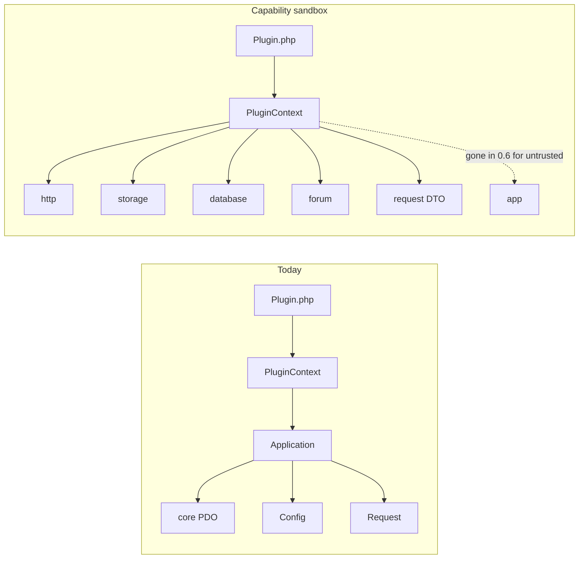
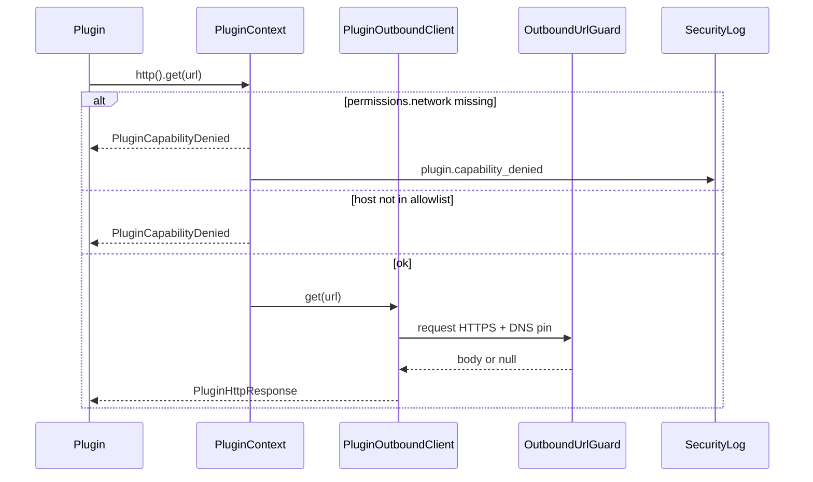
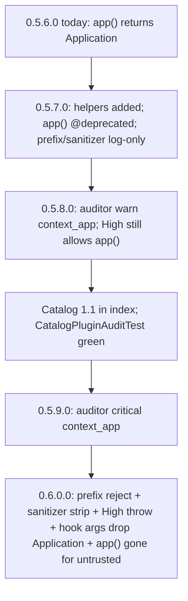

# Design: Plugin capability sandbox

| Field | Value |
|-------|-------|
| **Status** | **Draft** |
| **Authors** | Systems architecture |
| **Date** | 2026-09-01 |
| **Scope** | `app/Core/Plugins/`, `PluginContext` capability APIs, runtime fences, catalog migration off `$context->app()` |
| **Related** | `docs/PLUGINS.md`, `docs/ARCHITECTURE.md`, `docs/SECURITY.md`, `docs/CLI.md`, Latch-plugins v1.0.16 |
| **Core version at writing** | 0.5.6.0 |

Target path in tree: [`source/docs/design/plugin-sandbox.md`](plugin-sandbox.md).

---

## Overview

Latch plugins are ordinary PHP that boots in the same process as the forum kernel. Today `PluginContext::app()` returns the full `Application` object, so an enabled plugin can reach core PDO, session, mail, and config. `PluginAuditor` is a static regex gate run at install/enable — it is not a sandbox. `ARCHITECTURE.md` says so explicitly: *"Plugins are high trust: `plugin-audit` is a static gate, not a sandbox."*

This design keeps plugins as PHP 8.2 (no new language, no extra daemon) and turns `PluginContext` into a **capability sandbox**. Catalog plugins keep calling `$context->hooks()`, but network, disk, settings, plugin SQLite, forum reads, request input, assets, and routes go through typed helpers that **refuse** undeclared or out-of-scope work at runtime. `$context->app()` is deprecated in 0.5.7.0. Fail-closed route prefixes, High-mode `app()` refusal, and dropping `Application` from hook arguments land **together after Latch-plugins 1.1** (0.6.0.0). Until then, official catalog plugins on Standard **and** High keep booting. Enabling a plugin remains a high-trust operator action; the leftover is CPU and the plugin's own SQLite, not the core database or `config/local.php`.



---

## Background & Motivation

### Current boot path

`Application` constructs `PluginLoader`, registers core routes, then boots enabled plugins (`source/app/Core/Application.php`):

1. `PluginLoader::boot()` discovers `plugins/{slug}/`, skips `min_latch_version` newer than core, migrates plugin SQLite, `require_once` `src/Plugin.php`, autoloads `Latch\Plugins\{Studly}\` with a realpath fence, and calls `Plugin::register(PluginContext)`.
2. Failures on plugins that declare `user.before_register` are **fail-closed** (`registrationGateFailed()`), so signup cannot bypass invite-only.
3. `HookRegistry::dispatch(ROUTE_REGISTER, $router, $this)` then `BOOTSTRAP` with the full kernel.
4. Collect HTML for layout/home/admin/editor goes through `PluginCacheCoordinator::collect($this, $hook)` (`Application` **is** `PluginCollectContext` — line 99). Per-page HTML (`auth.register_form`, `topic.actions`, `profile.form`) uses `HookRegistry::collect(...)` **directly** with `$this` as the first argument. Twig prints those strings with `|raw`.

`PluginContext` today (`source/app/Core/Plugins/PluginContext.php`):

| Method | What it actually grants |
|--------|-------------------------|
| `app()` | Entire `Application` — repositories, `config()`, `session()`, `mail()`, core `Database` |
| `hooks()` | `PluginHookRegistrar` — already refuses undeclared hook names |
| `path()` / `slug()` | Plugin code directory |
| `database()` | `PluginDatabase` wrapping **plugin** SQLite — but `pdo()` and `database()` leak raw PDO / `Latch\Core\Database` |
| `manifest()` | Parsed `plugin.json` |

Manifest fields `permissions.filesystem`, `permissions.network`, `permissions.config`, `database.enabled`, `settings_schema`, `secrets_schema`, `hooks`, and `cache` are **declarations**. `PluginAuditor` checks them. Nothing at runtime stops `curl_exec`, `file_put_contents('/etc/passwd')`, or `$context->app()->config()`.

### Catalog reality (Latch-plugins v1.0.16)

Almost every catalog plugin calls `$context->app()` (only `board-icon-pack` does not). Concrete needs:

| Plugin | Kernel use |
|--------|------------|
| `forum-stats` | `assetVersion()`, `request()->path()`, `posts()/topics()/users()->countAll()`; HTML: `<article>`, `<header>`, `<link rel="stylesheet">`, SVG `viewBox`/`stroke`/`fill` |
| `link-preview` | plugin SQLite via `pdo()`, custom `HttpTransport` (OutboundUrlGuard + curl), `GET /plugin/link-preview/image/:hash`, thumbs under `storage/plugins/link-preview/thumbs` (mkdir, unlink, `file_put_contents`, **2 MiB** GET). `ImageHandler::serveFile()` emits `Content-Type` image/webp\|png\|jpeg\|gif, immutable cache, ETag, `readfile`, 304. Cards: `data-embed-src`, `data-url`, `noscript`, **no** `<iframe>` in PHP (embed.js mounts it) |
| `spam-bridge` | Akismet/SFS HTTP, `request()->userAgent()` + `header('Referer')` + `ip()`, `siteUrl()`, plugin DB log, `users()->ban()`, secrets via `PluginConfig::fromApp()` |
| `image-upload` | `auth()->requireLogin()` (members, not admin), `csrf()->validate`, `user()['id']`, `POST /plugin/image-upload/presign`, R2 keys via `config()->get('plugins.image_upload')`. Compose button: `data-action="image-upload"`, SVG `rect x/rx`, `circle cx/r`. `post.format.after` **mid-HTML** wrap: `PostImageFormatter` `preg_replace`s `` with `<figure class="post-image-figure"><button data-full-src>…` (not a suffix) |
| `invite-only` | `auth()->requireAdmin()`, `requirePluginAdminPost()`, request input, plugin DB, `render('admin/plugin_panel.html.twig')`, `registrationGuard()->logBlocked()` |
| `git-release` | storage cache dir + purge (delete files), `Response::json` with max-age, `POST /admin/plugins/git-release/purge-cache` (**outside** `/plugin/{slug}/`), `auth()->requireAdmin()` + CSRF **without** staff step-up, `session()->flash` + `Response::redirect` back to `/admin/plugins/git-release/settings` |
| `word-filter` | `config()->get('paths.storage')` + `PluginSettingsStore` |
| `fediverse-share` | `siteName()`, `siteUrl()`, topic row; HTML: `<details>`, `<summary>`, `<datalist>`, `data-fedi-action`, `hidden` |
| `privacy-analytics` | `auth()->check()`, `cspNonce()`. Plausible: `<script defer src nonce data-domain>`. Matomo: **inline** `<script nonce>` plus `<script defer src nonce>` |
| `slack-notify` | webhook URL secret, HTTP POST, `siteUrl()`. Curl path **does** `CURLOPT_RESOLVE` via `OutboundUrlGuard::resolvedPublicIp`; `file_get_contents` fallback does **not** |
| `avatar-url` | `users()->findByEmail()`, `auth()->isMod()`, profile hooks |
| `member-signature` | request input, plugin DB `INSERT … ON CONFLICT`, `invalidateCacheTags([Cache::tagUser($id), Cache::tagSite()])` |
| `board-icon-pack` | `$context->path()` only — already sandbox-shaped |

Core operator plugin `source/plugins/md-import` registers **`/admin/md-import`** and uses `app()`. It is not in the public catalog. Its `plugin.json` has neither `"trust"` nor `"bundled": true`.

### Why not a process sandbox

PHP cannot isolate an in-process plugin like a VM. Rejected for v1:

- Separate PHP-FPM / subprocess per hook — collect/filter hooks return HTML in the same request; extra daemons break the one-PHP-app story.
- WASM / Lua / a new plugin language — would rewrite Latch-plugins.
- `disable_functions` / `open_basedir` per plugin — process-wide, would break core.

The honest leftover after this design: an enabled plugin still runs as the web user. It can burn CPU and fill `storage/plugins/{slug}/plugin.sqlite`. It must not shell out, read `config/local.php`, touch core SQLite, talk to the network undeclared, or write outside its storage directory. Until 0.6.0.0, hook callbacks still receive `Application` even if `$context->app()` is later removed.

---

## Goals & Non-Goals

### Goals

1. **`PluginContext` is the only door** for untrusted plugins. New typed helpers cover every catalog need listed above (including member CSRF/login, Akismet UA/Referer, `:param` routes, 2 MiB thumbs + `sendStorageFile`, storage mkdir/delete, flash/redirect, `tagUser`).
2. **Runtime fences**, not only lint: undeclared `http()`, path escape on `storage()`, bound SQL only, route prefix, HTML allowlist on **collect-hook fragments** before Twig `|raw`.
3. **Additive first.** Catalog plugins keep working on 0.5.7.x / 0.5.8.x **in both Standard and High** while core grows APIs beside `app()`. Fail-closed prefix / High `app()` throw wait until catalog 1.1 is in the index.
4. **After catalog 1.1 (0.6.0.0):** untrusted plugins lose `app()`, lose `Application` hook arguments, and lose out-of-prefix routes — in **one** release, so High is not a false sandbox switch.
5. **Auditor stays defense in depth** (`curl_exec`, `eval`, `ReflectionMethod`, writes to `latch.sqlite`).
6. **Operator plugin `md-import`** remains usable via a **core PHP slug allowlist** that catalog zips cannot join.
7. **Tests** in PHPUnit security suite (`phpunit-security.xml.dist`) + existing `CatalogPluginAuditTest` / `plugin-audit` release gate.

### Non-Goals (v1)

| Item | Reason |
|------|--------|
| Per-plugin process / WASM / Lua | Breaks in-request HTML hooks; catalog rewrite |
| `disable_functions` / `open_basedir` | Process-wide |
| Stopping CPU / disk DoS inside plugin SQLite | Accepted leftover; operator enable is still high trust |
| Untrusted-zip worker (parse zip in a throwaway user) | Optional later; out of v1 |
| Weakening CSRF, founder protection, CF IP trust, staff step-up | Non-negotiable. Member POST does **not** gain step-up. git-release purge stays CSRF + admin, no new step-up. |
| Redis, Node, extra daemon | Ops story stays one PHP process, one core SQLite |
| Plugin writes to core schema (except the narrow `forum()` methods below) | Core migrations stay core |
| Letting catalog plugins declare themselves trusted | Trust is a **core PHP allowlist**, not `plugin.json` |
| Re-sanitizing full `PostFormatter` HTML | Would mangle core markup (code, mentions, smileys) |
| Core SQLite schema / `enabled_plugins` migration for provenance | Not needed if trust is a PHP allowlist |
| Flipping `asset_markup_*` to enable-blocking | Would fail privacy-analytics snippets; v1 enable policy unchanged |
| DOM-allowlisting mid-tree `post.format.after` mutations | Cannot preserve `PostFormatter` output and walk the plugin's `<figure>` wrap. v1: suffix sanitize; non-suffix log + pass-through |

---

## Key Decisions

1. **Capability sandbox, not a VM.** Plugins remain PHP implementing `PluginInterface`. Isolation is "you do not get `Application`," enforced by API shape plus runtime checks plus auditor.
2. **Two kernel doors must both close in the same fail-closed release (0.6.0.0).** `$context->app()` *and* hook callbacks that receive `Application` (`route.register` is `($router, $app)`; `PluginCacheCoordinator` passes `Application` because it **is** `PluginCollectContext`; several `HookRegistry` call sites pass `$this`). Context helpers ship first (0.5.7). Until 0.6, hook `$app` **is** the kernel even if `app()` is deprecated.
3. **`PluginHttpClient` stays catalog-only.** It is the GitHub release downloader (`User-Agent: Latch-PluginCatalog/1.0`, 32 MiB). Plugin runtime HTTP is a new `PluginOutboundClient` on `$context->http()`, always via `OutboundUrlGuard`. Default 512 KiB / 8s; per-call max **2 MiB** / **15s** for link-preview thumbs.
4. **Storage root is `storage/plugins/{slug}/` only.** Manifest `permissions.filesystem` extra roots are auditor hints, not a runtime grant. Relative entries like `"thumbs"` mean subdirs of that tree. Runtime ignores extra roots (including today's absolute-path grants). Auditor: `storage/plugins/{slug}` aliases allowed; paths starting with `/` become critical (behavior change vs 0.5.6.0).
5. **Prepared statements only on plugin SQLite.** `PluginDatabase::pdo()` / `database()` are deprecated; new `fetchAll` / `execute` reject `ATTACH` and DDL. `INSERT … ON CONFLICT` / `INSERT OR REPLACE` stay legal (member-signature, link-preview). Migrations remain the only `CREATE` path (`PluginMigrator`).
6. **`forum()` is an allowlist of methods, not a repository pass-through.** Counts, current user DTO, CSRF, site URL, asset version, admin panel render, cache bust (`tagPlugin`, `tagSite`, `tagUser`), registration-block log, founder-safe `banMember()`, member `requireLogin` / `validateCsrf`, flash/redirect. No core PDO.
7. **Trusted operator plugins: core PHP slug allowlist, not `plugin.json`.** v1 list is `md-import` only (`PluginOperatorTrust::SLUGS`). Catalog extract **strips** `trust` and `bundled` in both `installFromSource` and `upgradeFromSource`. `bundled` already means "shipped in the tarball, stay disabled on fresh install" (`PluginRegistry`) — a different meaning; catalog zips must not set it.
8. **Decided: after catalog 1.1, remove `app()` for untrusted in 0.6.0.0** (same release as hook-arg wrapping). Not High-only. High does **not** throw `app()` in 0.5.8 (that would fail-closed invite-only for High operators still on catalog 1.0.16). Prefix reject lands in the same 0.6 cut.
9. **HTML sanitizer is profiled, collect-fragment only, log-only until catalog HTML is a fixture.** Never run the allowlist on the full `PostFormatter` tree. `post.format.link` sanitizes the **replacement fragment** (one link/card). `post.format.after` **suffix** (member-signature) is sanitized; **mid-tree mutations** (image-upload `PostImageFormatter` `<figure>` wrap) cannot be DOM-allowlisted without mangling core markup — v1 logs them and **passes the plugin return through** even in 0.6 (do not revert to `$originalHtml`). Body collect cannot emit `<script>`. `layout.head` allows nonce'd **inline** script (Matomo) and `script[src]` whose host is in **that plugin's** `csp.script_src` (`HookRegistry::entries()` + `plugin_slug`, not flattened `collect()`). Sanitize fragment HTML on **cache miss** only; hits only `rewriteHtmlNonces`. No new Composer dependency — `DOMDocument` allowlist. `SvgSafety` is an extra denylist on `<svg>` subtrees, not the allowlist. `enableAllowed()` does **not** cover `asset_markup_*`.
10. **Decided: `permissions.network: true` stays valid** (link-preview arbitrary public HTTPS through the guard). A list (git-release `["api.github.com"]`) is an allowlist that tightens git-release/slack. Empty/absent = `http()` throws.

---

## Proposed Design

### Threat model

| Asset | Attacker | Must not happen |
|-------|----------|-----------------|
| Core SQLite `latch.sqlite` | Malicious or buggy enabled plugin | `ATTACH`, raw core PDO, repository writes except `forum()` allowlist |
| `config/local.php` | Same | `config()` dump, `file_get_contents` of config, secrets except `secrets_schema` keys |
| Other plugins' storage | Same | Writes outside `storage/plugins/{slug}/` |
| SSRF to metadata/LAN | Plugin fetching user URLs | Bypass of `OutboundUrlGuard`. Today: link-preview uses the guard; slack **curl** pins DNS; slack fopen fallback and **spam-bridge** do not. |
| Stored XSS via `\|raw` | Plugin returning hook HTML | Script / event handlers / `javascript:` in **collect** HTML. Core post HTML is not re-sanitized. |
| Route hijack | Plugin registering `/login` or `/admin/users` | Untrusted routes outside `/plugin/{slug}/` (fail-closed in 0.6, after git-release purge moves) |
| Founder / CSRF / CF IP | Plugin calling `users()->ban(1)` or reading `$_SERVER` | `forum()->banMember()` refuses id 1 and staff; request DTO has no cookie/`Authorization` bag; `ip()` stays `TrustedClientIp` |
| Trust confusion | Catalog zip or web-writable `plugin.json` | PHP allowlist only; JSON `trust`/`bundled` stripped on install |

**Until 0.6.0.0 leftover (explicit):** hook `$app` arguments and `$context->app()` still return the kernel on Standard **and** High. New helpers exist; old doors are open. Do not describe High as the sandbox switch before PR-8.

Enabling a plugin is still operator-trusted. The sandbox limits *what PHP we hand the plugin*, not what a compromised web user can do to the OS.

### Component map

New types live next to the existing plugin classes:

| Class | Path | Role |
|-------|------|------|
| `PluginContext` | `app/Core/Plugins/PluginContext.php` | Facade; constructs helpers from `Application` **internally** without exposing it |
| `PluginOperatorTrust` | `app/Core/Plugins/PluginOperatorTrust.php` | Core PHP slug allowlist (`md-import`) |
| `PluginOutboundClient` | `app/Core/Plugins/PluginOutboundClient.php` | `$context->http()` — Guard + timeout/size limits |
| `PluginHttpResponse` | `app/Core/Plugins/PluginHttpResponse.php` | `status`, `body`, `contentType` |
| `PluginStorage` | `app/Core/Plugins/PluginStorage.php` | `$context->storage()` — realpath jail |
| `PluginSettingsAccess` | `app/Core/Plugins/PluginSettingsAccess.php` | `$context->settings()` — schema keys, read-only from plugins |
| `PluginSecretsAccess` | `app/Core/Plugins/PluginSecretsAccess.php` | `$context->secrets()` — `secrets_schema` keys from `Config` |
| `PluginForum` | `app/Core/Plugins/PluginForum.php` | `$context->forum()` |
| `PluginRequest` | `app/Core/Plugins/PluginRequest.php` | `$context->request()` DTO |
| `PluginAssets` | `app/Core/Plugins/PluginAssets.php` | `$context->assets()` URL builder |
| `PluginRouter` | `app/Core/Plugins/PluginRouter.php` | `$context->routes()` prefix + `:param` |
| `PluginHtmlSanitizer` | `app/Core/Plugins/PluginHtmlSanitizer.php` | Allowlist on collect fragments |
| `PluginCapabilityDenied` | `app/Core/Plugins/PluginCapabilityDenied.php` | Thrown on fence hit |
| `PluginDatabase` | existing | Add bound API; deprecate `pdo()` |

`PluginLoader` keeps constructing `PluginContext($app, $manifest, $hooks)` — the kernel stays inside the context object. `PluginOperatorTrust::isOperator(string $slug): bool` is `in_array($slug, self::SLUGS, true)` with `SLUGS = ['md-import']`. Directory location is **not** the trust signal (`paths.plugins` holds both catalog and operator trees after install).



### Capability table

| Capability | What it may do | Gated by | Refuses |
|------------|----------------|----------|---------|
| `hooks()` | Existing `PluginHookRegistrar::add` | Declared `hooks` (already) | Undeclared hook names (already ignored) |
| `http()` | HTTPS GET/POST via `OutboundUrlGuard` | `permissions.network` | HTTP, private IPs, undeclared, host not in list, body > cap |
| `storage()` | Read/write/list/delete under `storage/plugins/{slug}/` | `permissions.filesystem` truthy or non-empty | `..`, symlinks out, core paths; quota on **write** only |
| `settings()` | Manifest `settings_schema` keys (read) | schema present | Unknown keys; no plugin `set()` (admin UI writes `settings.json`) |
| `secrets()` | Manifest `secrets_schema` keys | schema present | Unknown keys; never `config()` |
| `database()` | Plugin SQLite, bound SQL only | `database.enabled` | `pdo()` (deprecated), `ATTACH`, DDL, core DB. Returns `null` when disabled (same as today) |
| `forum()` | Narrow forum operations (below) | Always (methods are the gate) | Repositories, core PDO, mail, raw session |
| `request()` | Path + input DTO + `userAgent()` / `referrer()` | Always | `cookie()`, generic `header()`, `Authorization`, session cookie |
| `assets()` | URLs for `plugins/{slug}/assets/` | Path prefix | `..`, files outside `assets/` |
| `routes()` | Register `GET`/`POST` `/plugin/{slug}/…` including `:param` | `route.register` declared | `/admin/…`, `/login`, other slugs, PUT/DELETE (untrusted). Log-only until 0.6 |
| `app()` | Full kernel | **Deprecated 0.5.7.** Untrusted: removed 0.6. Operator allowlist keeps it | Catalog / untrusted after 0.6 |

### Error policy (one line)

`PluginCapabilityDenied` during `register()`: skip that plugin (existing `PluginLoader` catch); if it declared `user.before_register`, `registrationGateFailed()`. During an HTTP handler: `PluginRouter` catches it, emits `Response::json(['error' => 'denied'], 403)` for POST/JSON routes or empty 404 for GET, **never** leaks paths. `forum()->json()` / `redirect()` / `notFound()` / `sendStorageFile()` **exit** like `Latch\Core\Response` (do not return). Collect-hook denials: skip that plugin's HTML, log, page still renders.

### `forum()` method allowlist

Sized to the current catalog, not a generic ORM. Full PR-1 signature:

```php
final class PluginForumCounts
{
    public function __construct(
        public readonly int $posts,
        public readonly int $topics,
        public readonly int $members,
    ) {
    }
}

final class PluginUser
{
    public function __construct(
        public readonly int $id,
        public readonly string $username,
        public readonly string $role, // member|mod|admin
    ) {
    }
}

final class PluginPublicProfile
{
    public function __construct(
        public readonly int $id,
        public readonly string $username,
        public readonly ?string $avatarUrl,
    ) {
    }
}

final class PluginForum
{
    public function assetVersion(): string;
    public function siteUrl(): string;
    public function siteName(): string;
    public function cspNonce(): string;
    public function latchVersion(): string;

    public function counts(): PluginForumCounts; // posts/topics/users countAll() only

    public function currentUser(): ?PluginUser; // never password_hash, email, totp
    public function isLoggedIn(): bool;
    public function isAdmin(): bool;
    public function isMod(): bool;

    public function csrfToken(): string;
    public function csrfField(): string;              // Csrf::field()
    public function validateCsrf(): bool;            // hash_equals on request input _csrf
    public function requireLogin(): void;            // Auth::requireLogin() — members (image-upload)
    public function requireLoginPost(): void;        // requireLogin + CSRF; 403 on fail; NO staff step-up
    public function requireAdmin(): void;            // Auth::requireAdmin()
    public function requireAdminPost(): void;        // requirePluginAdminPost() — admin + CSRF + step-up

    public function renderAdminPanel(string $title, string $html): void;
    // admin/plugin_panel.html.twig; $html runs snippet sanitizer (fail-closed 0.6)

    public function json(array $data, int $status = 200, ?int $publicMaxAge = null): void;
    // Latch\Core\Response::json — null/≤0 => Cache-Control: no-store; >0 => public max-age. Exits.

    public function notFound(string $message = 'Not found'): void; // Response::notFound; exits
    public function sendStorageFile(string $relative, string $contentType, int $maxAgeSeconds = 31536000): void;
    // Jail via storage(); MIME allowlist image/webp|png|jpeg|gif only (link-preview thumbs).
    // Headers match ImageHandler::serveFile: ETag (path+mtime), 304, Cache-Control public max-age immutable.
    // Unknown MIME / missing file → notFound(). Exits. Do not header/echo/exit yourself.
    public function flash(string $type, string $message): void;   // Session::flash; types success|error
    public function redirect(string $path): void;
    // Same-origin path only (Request::safeRedirectPath). Also allow
    // `/admin/plugins/{this-slug}/settings` (core settings UI, git-release PRG). Exits.

    public function invalidateOwnCache(): void;       // Cache::tagPlugin($slug)
    public function invalidateSiteCache(): void;      // Cache::tagSite()
    public function invalidateUserCache(int $userId): void;
    // Cache::tagUser($userId). Allowed if $userId === currentUser()->id OR isMod()/isAdmin().
    // member-signature profile save uses the user being edited (current user).

    public function logRegistrationBlocked(string $reason): void; // RegistrationGuard::logBlocked
    public function banMember(int $userId, string $reason): void;
    // founder (id 1), admin, mod: no-op + security log plugin.founder_block.
    // UserRepository::ban() does not check founder — this facade must.

    public function publicProfileByEmail(string $email): ?PluginPublicProfile;
    // id, username, avatar_url only — avatar-url
}
```

**git-release purge:** keep **admin + CSRF, no staff step-up** (today's `CachePurgeHandler`). Use `requireAdmin()` + `validateCsrf()` (or a documented `requireAdmin()` then `validateCsrf()`), `storage()->delete`/`list`, `flash()`, `redirect('/admin/plugins/git-release/settings')`. Do **not** switch that handler to `requireAdminPost()` (behavior change). Do **not** rewrite it as JSON+JS in v1.

### `request()` DTO

Wraps `Latch\Core\Request` without exposing it:

```php
final class PluginRequest
{
    public function method(): string;
    public function path(): string;
    public function isPost(): bool;
    public function isHttps(): bool;

    /** Scalars only; strings truncated at 8 KiB; arrays of scalars for multi-fields. */
    public function input(string $key, mixed $default = null): mixed;
    public function query(string $key, mixed $default = null): mixed;

    /** Delegates to Request::ip() — Cloudflare / TrustedClientIp. Do not reimplement. */
    public function ip(): string;

    /** Request::userAgent(); truncated at 512 bytes. Akismet. */
    public function userAgent(): string;

    /** Referer header only (Request::header('Referer')); truncated at 2 KiB. Not a generic header bag. */
    public function referrer(): string;
}
```

Not exposed: `cookie()`, generic `header()`, `bearerToken()`, `jsonBody()`, raw `$_SERVER`. CF-Connecting-IP stays on `ip()`.

### `http()`

```php
final class PluginHttpResponse
{
    public function __construct(
        public readonly int $status,
        public readonly string $body,
        public readonly ?string $contentType = null,
    ) {
    }
}

final class PluginOutboundClient
{
    public const DEFAULT_MAX_BYTES = 524288;   // 512 KiB — metadata (link-preview HttpTransport)
    public const CEILING_MAX_BYTES = 2097152;  // 2 MiB — ImageHandler::MAX_IMAGE_BYTES
    public const DEFAULT_TIMEOUT = 8;
    public const CEILING_TIMEOUT = 15;         // settings fetch_timeout max

    /**
     * @param list<string> $headers
     */
    public function get(
        string $url,
        array $headers = [],
        int $maxBytes = self::DEFAULT_MAX_BYTES,
        int $timeoutSeconds = self::DEFAULT_TIMEOUT,
    ): ?PluginHttpResponse;

    /**
     * @param list<string> $headers
     */
    public function post(
        string $url,
        ?string $body,
        array $headers = [],
        int $maxBytes = self::DEFAULT_MAX_BYTES,
        int $timeoutSeconds = self::DEFAULT_TIMEOUT,
    ): ?PluginHttpResponse;
}
```

`$maxBytes` / `$timeoutSeconds` are clamped to the ceilings (no silent 512 KiB thumbs). Implementation: `OutboundUrlGuard::request()` (DNS-pin, HTTPS only). Redirects re-validated. Catalog `PluginHttpClient` unchanged (32 MiB, `User-Agent: Latch-PluginCatalog/1.0`).

Host policy from `permissions.network`:

- missing / `false` / `[]` → throw `PluginCapabilityDenied` (`network_undeclared`)
- `true` → any public HTTPS
- `["api.github.com", …]` → host must match (exact, case-insensitive)

Catalog plugins delete local `HttpTransport` in PR-7.

### `storage()`

Root: `{paths.storage}/plugins/{slug}/` — same directory `PluginDatabaseManager::storageDir()` and `PluginSettingsStore` already use.

```php
final class PluginStorage
{
    public function exists(string $relative): bool;
    public function read(string $relative): ?string;
    public function write(string $relative, string $contents): void; // 50 MiB tree quota; throws if over
    public function delete(string $relative): void;                  // always allowed (purge over quota)
    public function makeDirectory(string $relative): void;           // 02770, recursive
    /** @return list<string> Basenames only; no recursion; max 500 entries. */
    public function list(string $relative = ''): array;

    /**
     * Absolute path after jail. Do not persist across requests.
     * Do not concatenate untrusted segments — prefer read/write/delete/list.
     * Still realpath-checked; tests cover `path('x').'/../../…'`.
     */
    public function path(string $relative = ''): string;
}
```

Every relative path: reject `\0`, `..`, absolute input; `realpath` after create and require `str_starts_with($real, $root . DIRECTORY_SEPARATOR)`. Same pattern as `PluginLoader::registerAutoloader` and `PluginAssetServer::resolveFile`.

Quota (v1, **decided**): refuse **writes** that would take the slug tree over **50 MiB**. Raise later via setting if operators hit it. `delete` / `list` / `read` always work (git-release purge, stale thumbs).

### `database()` — bound SQL

Keep `PluginDatabaseManager` + `PluginMigrator`. Plugin-facing object:

```php
final class PluginDatabase
{
    public function fetchAll(string $sql, array $params = []): array;
    public function fetchOne(string $sql, array $params = []): ?array;
    public function fetchColumn(string $sql, array $params = []): mixed;
    public function execute(string $sql, array $params = []): int;
    public function begin(): void;
    public function commit(): void;
    public function rollBack(): void;

    /** @deprecated 0.5.7; removed for untrusted in 0.6 */
    public function pdo(): \PDO;
    /** @deprecated 0.5.7; removed for untrusted in 0.6 */
    public function database(): \Latch\Core\Database;
}
```

`$context->database()` returns `?PluginDatabase` — **`null` when `database.enabled` is false or the file is not migrated yet** (today's contract). Do not throw.

`assertSafeSql($sql)` before `prepare`:

1. Quote-aware scan strips `--` and `/* */` comments; `--` **inside string literals is allowed**.
2. Single statement (no `;` except optional trailing).
3. First keyword `SELECT` | `INSERT` | `UPDATE` | `DELETE`. `INSERT OR REPLACE` / `INSERT OR IGNORE` / `INSERT … ON CONFLICT` are `INSERT` (member-signature, PreviewCache).
4. Forbidden keywords anywhere outside strings: `ATTACH`, `DETACH`, `PRAGMA`, `VACUUM`, `REINDEX`, `ALTER`, `DROP`, `CREATE`.

DDL stays in `plugins/{slug}/migrations/*.sql`. Catalog stores swap `$this->database->pdo()->prepare` for `$this->database->execute` / `fetchAll`.

**ATTACH risk (high):** raw PDO can `ATTACH` core SQLite. Bound API + auditor `\bATTACH\b` close this.

### `routes()` and `route.register`

Today (`Application` constructor):

```php
$this->hookRegistry->dispatch(HookName::ROUTE_REGISTER, $this->router, $this);
```

```php
final class PluginRouter
{
    /**
     * $pattern is relative (`widget.json`, `image/:hash`) or absolute
     * starting with `/plugin/{slug}/`. Same `:name` grammar as Latch\Core\Router
     * (`[^/]+` per segment). Handler receives captured params only.
     *
     * @param Closure(array<string, string>):void $handler
     */
    public function get(string $pattern, \Closure $handler): void;
    public function post(string $pattern, \Closure $handler): void;
}
```

Untrusted: **GET and POST only**. Prefix is always `/plugin/{slug}/`. Example: `$context->routes()->get('image/:hash', function (array $params): void { … })` → `GET /plugin/link-preview/image/:hash`. `PluginAssetServer` does **not** serve hashed thumbs (kernel route stays).

**0.5.7–0.5.8 (log-only):** wrapping `Router` logs `plugin.route_prefix` when an untrusted plugin registers outside `/plugin/{slug}/`, **and still registers** (git-release purge keeps working). Operator plugins (`PluginOperatorTrust`) never log.

**0.6.0.0 (fail-closed, after catalog 1.1):** untrusted out-of-prefix `Router::add` throws and does not register. Catalog must have moved git-release to `POST /plugin/git-release/purge-cache` (JS + README). Core still owns `/admin/plugins/:slug/settings`. `md-import` `/admin/md-import` stays (allowlist).

Handlers close over `$context` from `register()`. Static CSS/JS: `PluginAssetServer` already serves `/plugin/{slug}/*.{css,js,…}` from `assets/` without the kernel. New plugins use `$context->assets()->url('stats.css')` only.

### `assets()`

```php
final class PluginAssets
{
    public function url(string $file): string; // /plugin/{slug}/{file}?v={assetVersion}
}
```

Resolves only under `plugins/{slug}/assets/` (same regex as `PluginAssetServer::FILE_PATTERN`).

### Settings and secrets

```php
final class PluginSettingsAccess
{
    public function get(string $key, mixed $default = null): mixed;
    /** Schema keys merged with stored writable values — PluginSettingsStore::all(). No set(). */
    public function all(): array;
}

final class PluginSecretsAccess
{
    /**
     * $key is the secrets_schema "key" (e.g. account_id, webhook_url), not the dotted config path.
     * Resolves PluginSecretField::$configPath through Config::get (nested
     * plugins.image_upload.account_id works). Unknown key → PluginCapabilityDenied.
     * Missing config → null. No all().
     */
    public function get(string $key): ?string;
}
```

Admin UI already writes `settings.json`. Plugins are read-heavy (`Settings::load` → `PluginSettingsStore::all()`). `permissions.config` remains an auditor declaration; runtime access is **only** `secrets_schema` / this helper.

Plugins must not read `paths.storage` from config — `storage()` / `settings()` already know the root.

### HTML sanitizer

Collect HTML is trusted today (`docs/PLUGINS.md`: escape yourself; Twig `|raw`). Runtime sanitizer is a second line. It is **not** covered by `enableAllowed()` for HTML files: PHP `markup_*` / `js_*` warnings block enable; HTML/Twig assets are stored as `asset_markup_*`, which does **not** match that prefix (privacy-analytics `assets/*.html` with `<script>` still passes `CatalogPluginAuditTest`). Do not promote `asset_markup_*` to enable-blocking in v1.

**Never re-sanitize full `PostFormatter` output.** `post.format.after` is documented: plugins may append trusted HTML; core does **not** re-escape the filter result (`PostFormatter.php`). `Application` wires `filter(POST_FORMAT_LINK|AFTER, $html, …)` on link fragments or the **entire** post body. Running a DOM allowlist on that return would strip code blocks, mentions, smileys, and images. `PostFormatter` is markup→HTML, not a fragment sanitizer — do not reuse it.

You **cannot** both preserve `PostFormatter` output and DOM-allowlist a mid-tree mutation of that output. `image-upload` `PostImageFormatter::format()` (`POST_FORMAT_AFTER`, priority 15) `preg_replace`s `` **in the middle** of already-formatted HTML with `<figure class="post-image-figure"><button data-full-src>…`. `str_starts_with($return, $originalHtml)` is false as soon as the first image is wrapped. Reverting to `$originalHtml` would disable the lightbox; sanitizing the full return is the original bug.

**Where it applies** (HTML string returns only):

| Path | Hooks | Profile |
|------|-------|---------|
| `PluginCacheCoordinator::invokeEntry` | `layout.footer`, `layout.head`, `home.before_boards`, `home.after_boards`, `editor.compose` | snippet or head |
| `HookRegistry::collect` **and** coordinator | `auth.register_form`, `topic.actions`, `profile.form` (today **direct** `collect($this, …)` in `Application` ~1572, 1581, 1610 — coordinator-only would miss them) | snippet |
| `forum()->renderAdminPanel` | invite-only panel HTML | snippet |
| `post.format.link` filter | **If** the callback return !== the incoming `$html`, sanitize the **return** as `embed` (one card/placeholder). Incoming core `<a>` is not re-processed. | embed |
| `post.format.after` filter | **Suffix:** if `str_starts_with($return, $originalHtml)`, sanitize `substr($return, strlen($originalHtml))` as snippet and concatenate (member-signature). **Non-suffix (mid-tree wrap):** log `plugin.html_mid_post` and **return the plugin string unchanged** — even in 0.6. Do **not** revert to `$originalHtml`. Do **not** run `DOMDocument` on the full post. Optional later: catalog moves the wrap to client JS; v1 keeps the PHP wrap. | snippet on suffix only |

**Do not run `DOMDocument` on:** `csp.*` (host strings), `admin.menu` (arrays — validate `href` separately), `theme.assets` / `theme.scripts` (URL strings — same-origin `/plugin/{slug}/` check, not HTML), `locale.translations`, `board.icons`, boolean/URL filters, full `post.format.after` trees.

**CSP before head (per plugin):** do **not** reuse the flattened `HookRegistry::collect(CSP_*)` lists passed to `SecurityHeaders::apply` (~412–415) — those merge **every** plugin and would let plugin A load a host only plugin B declared. Walk `HookRegistry::entries('csp.script_src')` (and `csp.frame_src` / `csp.connect_src` / `csp.img_src`) and keep results whose `$entry['plugin_slug']` matches the plugin whose `layout.head` / embed HTML is being sanitized. Collect those hosts **before** sanitizing that plugin's head HTML. Do not depend on Twig-global order (`layout.head` is collected later ~1958).

**Fragment cache vs nonce:** sanitize on **cache miss only**, after the plugin callback and **before** `storeFragmentOutput`. On **hit**, `cachedFragment()` already returns `SecurityHeaders::rewriteHtmlNonces($cached, $app->cspNonce())` (`PluginCacheCoordinator.php` ~186) — do **not** re-run the sanitizer (cached nonce ≠ current nonce would strip Matomo/Plausible `nonce` attrs). Full-page bake already rewrites at emit (`Application.php` ~728); do not double-strip. privacy-analytics is `guest_page: bake` today; this rule still applies if a future plugin fragment-caches `layout.head`.

**Core client placeholder** (`PluginCacheCoordinator::clientPlaceholder`): `<div class="plugin-client-slot" data-plugin-client data-src>` — allow those `data-*` names in snippet so a later sanitize of coordinator output does not strip git-release slots.

Profiles (v1, from Latch-plugins 1.0.16 HTML — fixture matrix in PR-2):

| Profile | Allow |
|---------|-------|
| `snippet` | Tags: `p,div,span,a,button,label,input,textarea,select,option,datalist,details,summary,article,header,footer,aside,section,nav,h1–h6,ul,ol,li,code,pre,strong,em,small,br,hr,img,svg,path,circle,rect,line,polyline,polygon,g,use,table,tr,td,th,thead,tbody,form,fieldset,legend,time,link,noscript,figure,figcaption`. `link` only `rel=stylesheet` and `href` same-origin `/plugin/{slug}/…`. Attributes: `class,id,role,hidden,type,name,value,placeholder,maxlength,min,max,rows,cols,required,readonly,disabled,checked,selected,method,action,for,title,alt,rel,target,href,src,width,height,viewBox,viewbox,d,fill,stroke,stroke-width,stroke-linecap,stroke-linejoin,x,y,cx,cy,r,rx,ry,aria-*,focusable,xmlns,decoding,loading,fetchpriority`. `href`/`action`/`src` = `https:` or same-origin path starting `/`. `target` only `_blank` and then `rel` must include `noopener` or `nofollow`. **`data-*`:** allow `data-action`, `data-full-src`, `data-fedi-action`, `data-share-text`, `data-latch-fedi-share`, `data-embed-src`, `data-embed-poster`, `data-embed-title`, `data-url`, `data-plugin-client`, `data-src`, plus `data-[a-z0-9-]+` that does not start with `data-on` / `data-js`. No `on*`. No `javascript:`. No `<script>` / `<iframe>` / `<object>` / `<embed>`. |
| `head` | `meta,link,script,style`. `script`: `src` (https host ∈ that plugin's `csp.script_src`), **or** inline body when `nonce` equals `forum()->cspNonce()` (Matomo). Attrs: `defer,async,nonce,src,type,data-domain,data-*` as above. |
| `embed` | snippet + `iframe` with `src` host ∈ that plugin's `csp.frame_src` (catalog 1.0.16 PHP does not emit iframe; embed.js does). `img src` https or `/plugin/{slug}/`. |

Implementation: `DOMDocument` allowlists. On `<svg>`, also run `SvgSafety::containsDisallowedMarkup` (denylist needles — **not** sufficient alone; `viewBox`, `stroke`, `fill`, `aria-hidden`, `path d` must be in the allowlist). Failed parse → empty string + security log; do not fail-open to raw HTML.

**Ship sequence:** PR-2 log/warn (`plugin.html_sanitized` when it *would* strip) with a fixture matrix of current catalog HTML, including `PostImageFormatter` output (assert 0.6 still **passes the wrap through**). Collect-hook fail-closed strip in **0.6.0.0** after PR-7, once fixtures are green. `post.format.after` non-suffix stays log-only in 0.6. Do not fail-closed-strip collect HTML in 0.5.7 and break forum-stats/fediverse/privacy-analytics.

`admin.menu` `href`: untrusted must be `/plugin/{slug}/…` (invite-only). Operator allowlist may use `/admin/…`. Log-only until 0.6.

### `$context->app()` lifecycle



Operator slugs (`PluginOperatorTrust`) keep `app()` and `/admin/…` routes after 0.6.

### Auditor (defense in depth)

New / promoted rules in `PluginAuditor`:

| Code | Severity path | Pattern / check |
|------|---------------|-----------------|
| `context_app` | warn 0.5.8 → **critical 0.5.9 after catalog 1.1** | `\$context\s*->\s*app\s*\(` |
| `kernel_typehint` | warn → critical with `context_app` | `use Latch\\Core\\Application` in untrusted `src/` |
| `raw_pdo` | warn → critical with catalog bound-API migration | `->pdo\s*\(` / `new\s+PDO` |
| `network_curl` | already critical if network undeclared; if declared, **warn** "use `$context->http()`" until PR-7 deletes `HttpTransport`, then critical | existing `NETWORK_PATTERNS` |
| `filesystem_write` | **warn** if not `$context->storage()`; **do not** go critical until PR-7 thumbs/purge use helpers (ImageHandler `file_put_contents($this->thumbsDir…)` would false-positive if `path()` is used) | existing `WRITE_PATTERNS`; allow `$context->storage()` |
| `sql_attach` | critical immediately | `\bATTACH\b` |
| `absolute_fs_permission` | **critical immediately** (tightening vs 0.5.6.0 `allowedWriteRoots`, which grants `/…`) | `permissions.filesystem` entry starting with `/`. `storage/plugins/{slug}` **without** a leading `/` is an allowed alias, not this code |
| `trust_in_catalog` | critical on zip install | `"trust"` or `"bundled"` in extracted `plugin.json` after strip should be absent; finding if present post-strip failure |

Runtime vs auditor on filesystem: **runtime ignores extra roots** (Key Decision 4). **Auditor** still treats `storage/plugins/{slug}` and relative subdirs (`thumbs`) as allowed write literals so git-release 1.0.16 keeps passing until migration. Absolute `/var/…` / `/etc/…` become critical now.

`docs/plugins/badexample` / `warnexample` fixtures gain a sandbox trap. `CatalogPluginAuditTest` is the gate for flipping `context_app` to critical.

### Trusted operator plugins

| Rule | Detail |
|------|--------|
| Who | `PluginOperatorTrust::SLUGS` = `['md-import']` in core PHP. Not `plugin.json`. Not "lives under `plugins/`". |
| Installer | `PluginInstaller::installFromSource` **and** `upgradeFromSource` rewrite `plugin.json` to drop `trust` and `bundled`. `PluginCatalogInstaller` uses those methods (or the same strip helper). |
| Capabilities | May call `app()`, register `/admin/…` routes, skip HTML sanitizer for admin pages they fully control |
| High / 0.6 | Still allowed |
| Not | Any zip from GitHub releases, even if JSON says operator or bundled |

On-disk provenance (install source in SQLite) is a future schema change and is **out of v1**.

### Fail-closed behaviour

| Event | Behaviour |
|-------|-----------|
| `PluginCapabilityDenied` in `user.before_register` | Treat as boot/gate failure — refuse registration |
| Denied in collect hook | Skip that plugin's HTML; log; page still renders |
| Denied in `route.register` (0.6) | Route not added; log. Before 0.6: log only, still added |
| Denied `http()` / `storage()` in a handler | 403 JSON or empty 404; do not leak paths |

---

## API / Interface Changes

### `PluginContext` after 0.5.7.0 (additive)

```php
namespace Latch\Core\Plugins;

final class PluginContext
{
    public function hooks(): PluginHookRegistrar;
    public function path(): string;
    public function slug(): string;
    public function manifest(): PluginManifest;

    public function http(): PluginOutboundClient;
    public function storage(): PluginStorage;
    public function settings(): PluginSettingsAccess;
    public function secrets(): PluginSecretsAccess;
    public function database(): ?PluginDatabase; // null if disabled
    public function forum(): PluginForum;
    public function request(): PluginRequest;
    public function assets(): PluginAssets;
    public function routes(): PluginRouter;

    /** @deprecated 0.5.7. Removed for untrusted in 0.6. Operator allowlist keeps it. */
    public function app(): Application;
}
```

`PluginInterface::register(PluginContext $context): void` is unchanged.

### Hook argument migration — every `HookName` that sees `Application` today

Call sites: `Application.php` dispatch/collect/filter + `PluginCacheCoordinator::invokeEntry` (`($entry['callback'])($app)` with `Application` as `PluginCollectContext`) + `Translator.php` (`locale.translations`).

| Hook | Today | Dual-run 0.5.7–0.5.9 | 0.6 untrusted cutoff |
|------|-------|----------------------|----------------------|
| `route.register` | `(Router, Application)` | same; prefix **log-only** | `(PluginRouter)` or no args; prefix **reject** |
| `bootstrap` | `(Application)` | same | no args |
| `board.icons` | `(BoardIconRegistry)` | unchanged | unchanged |
| `post.before_save` / `post.after_save` | `(PostSaveContext)` | unchanged | unchanged |
| `profile.before_save` | `(ProfileSaveContext)` | unchanged | unchanged |
| `post.delete` | `(array $post, array $topic, Application)` | same | drop `Application` |
| `topic.delete` | `(array $topic, array $board, Application)` | same | drop `Application` |
| `post.vote` | `(int $postId, int $userId, ?string $vote, Application)` | same | drop `Application` |
| `user.register` | `(array $user, Application)` | same | `(array $user)` |
| `user.before_register` | `(RegisterContext, Application)` | same | `(RegisterContext)` |
| `auth.register_form` | `collect(Application)` | same | no `Application`; close over `$context` |
| `topic.actions` | `collect(Application, $topic, $board)` | same | keep topic/board arrays; drop `Application` |
| `profile.form` | `collect(Application, $user)` | same | keep `$user`; drop `Application` |
| `theme.assets` / `theme.scripts` / `layout.head` / `layout.footer` / `home.before_boards` / `home.after_boards` / `admin.menu` / `editor.compose` | coordinator `callback(Application as PluginCollectContext)` | same | **no collect argument** for untrusted plugins. Coordinator keeps using `Application` internally (`cache()`, locale, nonce). Do **not** pass `PluginCollectContext` to plugins — `cache()` is still `Latch\Core\Cache`. Catalog 1.1 closes over `$context`. |
| `csp.img_src` / `connect_src` / `frame_src` / `script_src` | `collect()` **no** `$app` | unchanged | unchanged |
| `post.format.link` | filter `(string $html, $url, $label, bool $standalone)` | unchanged | unchanged (no `$app`) |
| `post.format.after` | filter `(string $html, $raw, array $context)` | unchanged | unchanged |
| `post.format.image_host` | filter `(bool, string $host)` | unchanged | unchanged |
| `avatar.resolve` | filter `(string $url, string $email, int $size)` | unchanged | unchanged |
| `locale.translations` | filter `(array $strings, string $locale)` in `Translator` | unchanged | unchanged |

Core can pass both during dual-run while plugins ignore `$app`. Breaking the signature is the 0.6 cutoff, documented in `PLUGINS.md`. **High is not the sandbox switch until this table's last column ships.**

### Example: forum-stats after migration

```php
public function register(PluginContext $context): void
{
    $css = $context->assets()->url('stats.css');
    $version = $context->manifest()->version;

    $context->hooks()->add(HookName::HOME_AFTER_BOARDS, static function () use ($context, $css, $version): string {
        if ($context->request()->path() !== '/') {
            return '';
        }
        $c = $context->forum()->counts();
        return (new StatsPanel($css, $version))->render($c->posts, $c->topics, $c->members);
    });
}
```

### Example: image-upload presign (member POST)

```php
$context->routes()->post('presign', static function () use ($context, $config): void {
    $context->forum()->requireLoginPost();
    $user = $context->forum()->currentUser();
    $contentType = strtolower(trim((string) $context->request()->input('content_type', '')));
    // …
    $context->forum()->json(['upload_url' => $uploadUrl, /* … */]);
});
```

### Example: link-preview thumb route + 2 MiB GET

```php
$context->routes()->get('image/:hash', static function (array $params) use ($context): void {
    $hash = (string) ($params['hash'] ?? '');
    $relative = 'thumbs/' . $hash . '.webp';
    if (!$context->storage()->exists($relative)) {
        $bytes = $context->http()->get($imageUrl, [], PluginOutboundClient::CEILING_MAX_BYTES, 15);
        if ($bytes === null || $bytes->body === '') {
            $context->forum()->notFound();
        }
        $context->storage()->makeDirectory('thumbs');
        $context->storage()->write($relative, $processedWebp);
    }
    $context->forum()->sendStorageFile($relative, 'image/webp');
});
```

---

## Data Model Changes

No core SQLite schema change. Plugin SQLite layout unchanged (`storage/plugins/{slug}/plugin.sqlite`, `plugin_migrations`, `plugin_meta`).

No new `plugin.json` `trust` field. `permissions.network` already exists (`true` vs host list).

Installers strip `trust` and `bundled` from extracted JSON (both `installFromSource` and `upgradeFromSource`). That is a file rewrite, not a schema migration.

No migration of `enabled_plugins`. Incompatible catalog rows already hidden by `PluginCatalog::availableEntries()` when `min_latch_version` is newer than core. Catalog 1.1 sets `min_latch_version` to `0.5.7.0`.

Settings files stay `storage/plugins/{slug}/settings.json`. Secrets stay in `config/local.php` behind `secrets_schema` paths.

---

## Alternatives Considered

### 1. Separate PHP-FPM pool / subprocess per hook

**Pros:** Real process isolation, `open_basedir` per pool.  
**Cons:** Collect/filter hooks return HTML in the current request. Extra daemon. **Rejected.**

### 2. WASM / Lua / JS plugin runtime

**Pros:** Memory-safe guest.  
**Cons:** Rewrites Latch-plugins. **Rejected.**

### 3. Keep `app()` forever; auditor-only

**Pros:** Zero catalog work.  
**Cons:** Status quo. **Rejected** as the end state; remains layer 3 (lint).

### 4. Capability APIs (chosen)

**Pros:** Catalog stays PHP; runtime refuses undeclared network/FS; incremental PRs.  
**Cons:** In-process leftover. Mitigation: auditor + 0.6 door close.

### 5. `plugin.json` `"trust": "operator"` plus "must live under `plugins/`"

**Pros:** No PHP allowlist to edit when adding an operator plugin.  
**Cons:** After install, catalog and `md-import` are the same shape under `paths.plugins`. `plugins/` is web-writable. `PluginManifest::fromDirectory` re-reads JSON every boot. Installer strip is a one-time zip transform, not a runtime gate. A plugin (or confused unzip) can write `"trust":"operator"`. **Rejected.** Core PHP allowlist instead.

### 6. Reuse `bundled: true` as trust

**Pros:** Field already on `PluginManifest`.  
**Cons:** `bundled` means "shipped in the tarball, stay **disabled** on fresh install" (`PluginRegistry`). Catalog zips could set it unless stripped. Different meaning from "may call `app()`". **Rejected** as a trust signal; still **strip** `bundled` on catalog extract so it cannot be faked.

### 7. Reuse / extend `PostFormatter` as the plugin HTML sanitizer

**Pros:** One HTML pipeline.  
**Cons:** `PostFormatter` turns Latch markup into HTML and explicitly does **not** re-escape `post.format.after`. It is not a DOM fragment allowlist. Running it on collect HTML would not understand `data-*` widgets. Running a new allowlist **on its output** mangles core posts. **Rejected.** Separate `PluginHtmlSanitizer` on collect fragments + link **replacements** + after **suffixes** only. Mid-tree `post.format.after` mutations (image-upload `<figure>` wrap) stay log-only even in 0.6 — you cannot allowlist them without walking the core post tree.

### 8. Wrap `PluginHttpClient` with a smaller budget

**Pros:** One HTTP class.  
**Cons:** Catalog UA `Latch-PluginCatalog/1.0`, 32 MiB zip budget, 15s, used by `PluginReleaseDownloader`. Mixing plugin SSRF policy with release downloads invites a "just raise the limit" footgun. **Rejected.** New `PluginOutboundClient` (2 MiB ceiling, plugin UA). Share `OutboundUrlGuard::request()` only.

---

## Security & Privacy Considerations

| Topic | Rule |
|-------|------|
| CSRF | `requireAdminPost()` = admin + step-up + CSRF (invite-only). `requireLoginPost()` = login + CSRF, **no** step-up (image-upload). git-release purge: `requireAdmin()` + `validateCsrf()`, **no** new step-up. |
| Founder | `banMember(1)` refused; security log `plugin.founder_block`. |
| CF IP trust | `PluginRequest::ip()` delegates to `Request::ip()`. |
| Secrets | `secrets()->get` only schema keys. |
| PII | `currentUser()` / `publicProfileByEmail()` omit `password_hash`, TOTP, session ids. `userAgent()` / `referrer()` are the two Akismet fields; no generic header bag. |
| SSRF | All plugin HTTP through `OutboundUrlGuard`. Today: link-preview uses the guard; slack curl pins DNS; slack fopen fallback and spam-bridge do not. PR-7 deletes both local clients. |
| XSS | Collect-fragment sanitizer (fail-closed 0.6). Enable-gate `markup_*` on PHP only — **not** `asset_markup_*`. |
| SQLi | Bound params on plugin DB; no core DB. |
| Path escape | realpath jail. Prefer `read`/`write` over `path()`. |
| Trust confusion | PHP allowlist; strip `trust`/`bundled` on install **and** upgrade. |

**Risks**

| Severity | Risk | Mitigation |
|----------|------|------------|
| **High** | In-process PHP can still `file_get_contents` / `curl_exec` if auditor misses obfuscation | Auditor + 0.6 no `app()`; not a VM |
| **High** | `ATTACH` on plugin PDO to core SQLite | Bound API forbids ATTACH; auditor `\bATTACH\b`; 0.6 removes `pdo()` |
| **High** | Collect HTML XSS via `\|raw` | Profiles sized to catalog; log-only until fixtures green; collect-hook fail-closed 0.6. Do not re-sanitize posts. |
| **Medium** | `post.format.after` mid-tree wrap (image-upload) is not runtime-sanitized | Suffix still sanitized; non-suffix log-only + pass-through in 0.6. Auditor still scans PHP. Optional later: client-JS wrap. |
| **High** | Dual-door until 0.6: hook `$app` is still the kernel | Document leftover; do not call High the sandbox switch; close both doors in PR-8 |
| **Medium** | git-release `POST /admin/plugins/…/purge-cache` 404 if prefix fail-closes early | Prefix **log-only** until catalog 1.1 moves the route |
| **Medium** | High `app()` throw before catalog 1.1 fail-closes invite-only | No High throw until 0.6 |
| **Medium** | privacy-analytics Matomo inline script vs sanitizer | `head` profile allows nonce'd inline matching `cspNonce()` |
| **Low** | Plugin fills SQLite / 50 MiB storage | Quota on write; delete always works; `--purge-storage` |
| **Low** | CPU busy-loop in a hook | Accepted leftover |

---

## Observability

| Signal | Where |
|--------|-------|
| `plugin.capability_denied` | `SecurityLog`: `slug`, `capability`, `code` (`network_undeclared`, `storage_escape`, `route_prefix`, `sql_forbidden`, `app_refused`), request path |
| `plugin.route_prefix` | Log-only 0.5.7–0.5.8 when untrusted registers outside `/plugin/{slug}/` |
| `plugin.html_sanitized` | When sanitizer would strip (rate-limit). Fail-closed 0.6 actually strips |
| `plugin.html_mid_post` | `post.format.after` return is not a suffix (image-upload wrap). Pass-through; do not strip |
| `plugin.http_blocked` | SSRF / host-allowlist miss — host only, not full URL |
| Admin **Plugins** | Show "sandbox: capability" vs "operator allowlist (`md-import`)". Do **not** badge High as "sandbox on" before 0.6 |
| `error_log` | Unexpected fence exceptions (same channel as `PluginAuditService` cache failures) |

Do not log secret values, webhook URLs, or R2 keys.

Alerting: no new pager.

---

## Rollout Plan

Versions are 4-part. Fail-closed behavior that would break Latch-plugins 1.0.16 **waits for catalog 1.1**.

| Latch | What operators get |
|-------|--------------------|
| **0.5.6.0** | Current: auditor only |
| **0.5.7.0** | Additive context APIs; `app()` `@deprecated`; prefix **log-only** (still registers git-release purge); sanitizer **log-only**; `http()`/`storage()`/`database()` fences apply when those helpers are used |
| **0.5.8.0** | Auditor **warn** `context_app` / raw curl / `pdo()`. High still allows `app()`. Prefix still log-only |
| **Catalog 1.1** | Sibling repo; `min_latch_version` `0.5.7.0`; no `$context->app()`; git-release purge under `/plugin/git-release/`; `CatalogPluginAuditTest` green |
| **0.5.9.0** | Auditor **critical** `context_app` / raw curl / writes outside helpers (index already has 1.1) |
| **0.6.0.0** | Prefix **reject**; sanitizer **strips**; High throw + untrusted `app()` **removed**; hook args drop `Application`; `pdo()` gone for untrusted. Operator allowlist unchanged |

**Feature flags:** There is **no** `plugin_sandbox` setting. Security mode High is **not** the sandbox switch until 0.6.0.0. Standard keeps `app()` until 0.6 so a lagging third-party zip still boots.

**Rollback:** Revert the core PR; APIs are additive until 0.6. Catalog 1.1 rows stay hidden on older cores. Disable a misbehaving plugin; `restore --core-only` if needed.

**Docs (later PRs):** `PLUGINS.md`, `ARCHITECTURE.md` (replace "not a sandbox"), `SECURITY.md`, `CLI.md`.

**Tests:** PR-1 cases join `phpunit-security.xml.dist` (not only the default Latch suite). Keep `CatalogPluginAuditTest` as the catalog gate.

---

## Open Questions

All four product forks below are **Decided (operator, 2026-09-01)**. Table kept for history. Sanitizer/`data-*`/Matomo inline/member POST/`http()` 2 MiB/trust allowlist were already closed in Key Decisions.

| # | Question | Decision |
|---|----------|----------|
| 1 | After catalog 1.1, **remove** `app()` for untrusted or keep it on Standard and refuse only in High? | **Decided (operator, 2026-09-01):** **Remove** `$context->app()` for untrusted plugins in **0.6.0.0**, same release as hook-arg wrapping. Not High-only. High throw without wrapping hook `$app` is a false sandbox — do not do that in 0.5.8. |
| 2 | Should `permissions.network: true` stay valid, or require an explicit host list? | **Decided (operator, 2026-09-01):** **Keep `true`** for link-preview (arbitrary post URLs). Host lists still tighten git-release/slack. |
| 3 | Storage quota 50 MiB per slug — too small for link-preview thumbs? | **Decided (operator, 2026-09-01):** **50 MiB v1**. Raise later via setting if needed. |
| 4 | May untrusted plugins keep `/admin/plugins/{slug}/…` as a second prefix? | **Decided (operator, 2026-09-01):** **No.** Only `/plugin/{slug}/` after 0.6. git-release purge moves. `redirect()` may still target core `/admin/plugins/{slug}/settings`. |

---

## References

| Path | Relevance |
|------|-----------|
| `source/app/Core/Plugins/PluginContext.php` | Current kernel door |
| `source/app/Core/Plugins/PluginLoader.php` | Boot, autoload realpath fence, registration fail-closed |
| `source/app/Core/Plugins/PluginAuditor.php` | Static gate; `asset_markup_*` vs `markup_*` |
| `source/app/Core/Plugins/PluginAuditReport.php` | `enableAllowed()` prefixes |
| `source/app/Core/Plugins/PluginHttpClient.php` | Catalog downloads — 32 MiB, `Latch-PluginCatalog/1.0` |
| `source/app/Core/Plugins/PluginDatabase.php` | `pdo()` leak |
| `source/app/Core/Plugins/PluginRegistry.php` | `bundled` = disabled on fresh install |
| `source/app/Core/Plugins/HookRegistry.php` / `PluginCacheCoordinator.php` | Collect; `Application` is `PluginCollectContext`; `clientPlaceholder` |
| `source/app/Core/PluginAssetServer.php` | Kernel-less static assets; thumbs stay on kernel |
| `source/app/Core/PostFormatter.php` | Does not re-escape `post.format.after` |
| `source/app/Core/Application.php` | Hook `$this` args; `implements PluginCollectContext` |
| `source/app/Support/OutboundUrlGuard.php` | SSRF / DNS pin |
| `source/app/Core/SecurityPolicy.php` | `MODE_HIGH` / `MODE_STANDARD` |
| `source/app/Support/SvgSafety.php` | SVG **denylist** needles |
| `source/docs/PLUGINS.md` | Hook list, guest cache, `\|raw` contract |
| `source/docs/ARCHITECTURE.md` | "plugin-audit is a static gate, not a sandbox" |
| `source/phpunit-security.xml.dist` | Security suite membership |
| `source/tests/CatalogPluginAuditTest.php` | Catalog enable-gate |
| Latch-plugins v1.0.16 | Catalog to migrate |

---

## PR Plan

Each PR is independently reviewable and mergeable. **Fail-closed prefix / High `app()` throw / sanitizer strip are not in PR-3.** They wait for catalog 1.1 (PR-7) and land in PR-8 (0.6.0.0).

### PR-1 — Additive `PluginContext` helpers (no catalog break)

- **Title:** Plugin capability APIs beside `app()`
- **Files:** `app/Core/Plugins/PluginContext.php`; new `PluginOperatorTrust.php`, `PluginOutboundClient.php`, `PluginHttpResponse.php`, `PluginStorage.php`, `PluginSettingsAccess.php`, `PluginSecretsAccess.php`, `PluginForum.php`, `PluginForumCounts.php`, `PluginUser.php`, `PluginPublicProfile.php`, `PluginRequest.php`, `PluginAssets.php`, `PluginRouter.php`, `PluginCapabilityDenied.php`; `PluginLoader.php` (pass storage root / config into context); `PluginDatabase.php` add `fetchAll`/`execute` (keep `pdo()`); `PluginInstaller.php` strip `trust`/`bundled` on install **and** upgrade; tests `tests/PluginContextCapabilitiesTest.php`, `tests/PluginOutboundClientTest.php`, `tests/PluginStorageTest.php`, `tests/PluginDatabaseBoundSqlTest.php`, `tests/PluginForumAuthTest.php`, `tests/PluginRouterParamTest.php`; **`phpunit-security.xml.dist` membership for all of the above**
- **Dependencies:** none
- **Description:** Implement the signatures in this doc. `http()` refuses undeclared network, uses `OutboundUrlGuard`, default 512 KiB, ceiling 2 MiB / 15s. `storage()` jails paths; `exists`/`delete`/`makeDirectory`/`list`; quota on write only. `routes()->get('image/:hash', …)` registers `/plugin/{slug}/image/:hash` with `(array $params)`. `forum()->sendStorageFile()` serves jailed thumbs (MIME allowlist, ETag/304). `forum()->requireLogin()` / `validateCsrf()` / `requireLoginPost()` cover image-upload presign (PHPUnit: member POST, not admin step-up). `request()->userAgent()` / `referrer()`. `forum()->json(..., ?int $publicMaxAge = null)` matches `Response::json`. `forum()->flash` / `redirect` (same-origin + `/admin/plugins/{slug}/settings`). `invalidateUserCache`. `app()` unchanged at runtime (`@deprecated` phpdoc). Target **0.5.7.0**.

### PR-2 — HTML sanitizer (log-only)

- **Title:** Plugin HTML sanitizer (log-only) with catalog fixture matrix
- **Files:** `app/Core/Plugins/PluginHtmlSanitizer.php`; `PluginCacheCoordinator.php` (sanitize on miss before `storeFragmentOutput`; hits only `rewriteHtmlNonces`); `HookRegistry.php` or a shared collect wrapper so **direct** `collect(AUTH_REGISTER_FORM|TOPIC_ACTIONS|PROFILE_FORM)` is covered; **not** a full-body wrap of `post.format.after`; `Application.php` for link-replacement / after-suffix / after mid-tree **log-only**; `tests/PluginHtmlSanitizerTest.php` fixtures from forum-stats, fediverse-share, image-upload compose **and `PostImageFormatter` figure wrap**, link-preview cards, privacy-analytics snippets, git-release client placeholder; `phpunit-security.xml.dist`
- **Dependencies:** PR-1
- **Description:** Profiles as specified (`figure`/`figcaption`, SVG `x,y,cx,cy,r,rx,ry`, `data-full-src`). Per-plugin CSP via `entries()` + `plugin_slug`. Do not strip in production yet — log `plugin.html_sanitized` / `plugin.html_mid_post`. Collect-hook fail-closed strip is PR-8; after non-suffix stays pass-through. Never pass whole `PostFormatter` HTML through the allowlist.

### PR-3 — Log-only route prefix wrapper

- **Title:** Log untrusted routes outside `/plugin/{slug}/`
- **Files:** `app/Core/Plugins/PluginPrefixedRouter.php`; `Application.php` `ROUTE_REGISTER` dispatch; `tests/PluginRoutePrefixTest.php`; `phpunit-security.xml.dist`
- **Dependencies:** PR-1
- **Description:** Untrusted `Router::add` outside `/plugin/{slug}/` **logs** `plugin.route_prefix` and **still registers** (git-release purge). Operator allowlist (`md-import`) does not log. **Does not throw. Does not High-throw `app()`.** Target 0.5.7.0 / 0.5.8.0.

### PR-4 — Auditor warnings (criticals later)

- **Title:** plugin-audit codes for `app()`, raw curl, ATTACH, absolute filesystem permissions
- **Files:** `app/Core/Plugins/PluginAuditor.php`; `tests/PluginAuditorTest.php`; `docs/plugins/badexample/` trap
- **Dependencies:** PR-1
- **Description:** `context_app` / `kernel_typehint` / `raw_pdo` / declared-network curl / `filesystem_write` as **warn**. `sql_attach` and `absolute_fs_permission` (`/` prefix) **critical** now (behavior change vs 0.5.6.0 `allowedWriteRoots`). Allow `storage/plugins/{slug}` aliases and `$context->storage()`. **Do not** flip `context_app` / curl / `file_put_contents` to critical until PR-7 (CatalogPluginAuditTest). Follow-up in 0.5.9.0 after 1.1 is the index.

### PR-5 — Docs (core)

- **Title:** Document capability sandbox in PLUGINS / ARCHITECTURE / SECURITY / CLI
- **Files:** `source/docs/PLUGINS.md`, `ARCHITECTURE.md`, `SECURITY.md`, `CLI.md`, this design doc as `source/docs/design/plugin-sandbox.md`
- **Dependencies:** PR-1–3 merged so the APIs exist
- **Description:** Capability table, leftover honesty (hook `$app` until 0.6), PHP allowlist, sanitizer profiles, `asset_markup_*` not enable-blocking. No secret values.

### PR-6 — Example / dbexample fixtures off `pdo()` and `app()`

- **Title:** Update bundled plugin fixtures to the capability API
- **Files:** `source/docs/plugins/example/src/Plugin.php`; `docs/plugins/dbexample/src/Plugin.php`; tests `PluginSystemTest.php`, `PluginDatabaseTest.php`
- **Dependencies:** PR-1
- **Description:** example uses `routes()` + `forum()->json` / `latchVersion()`. dbexample uses `fetchColumn`. **Do not** add `"trust"` to `md-import/plugin.json`. `md-import` is trusted because of `PluginOperatorTrust::SLUGS`.

### PR-7 — Latch-plugins catalog 1.1 (sibling repo)

- **Title:** Catalog 1.1: stop calling `$context->app()`
- **Files:** every Latch-plugins `src/Plugin.php` and helpers (`HttpTransport.php` deleted; stores on bound API; git-release purge → `POST /plugin/git-release/purge-cache` + `admin-tools.js` + flash/redirect to core settings URL; image-upload `secrets()` + `requireLoginPost`; spam-bridge `forum()->banMember` + `http()` + `userAgent()`/`referrer()`; forum-stats `forum()->counts()`; member-signature `invalidateUserCache`); each `plugin.json` `min_latch_version` → `0.5.7.0`; READMEs
- **Dependencies:** Core **PR-1** released (0.5.7.0). **Not** PR-3 fail-closed (there is none). Core already hides incompatible catalog rows.
- **Description:** Official index must ship before PR-8. `CatalogPluginAuditTest` + `*PluginTest.php` green. After this, PR-4 follow-up can promote `context_app` to critical (0.5.9.0).

### PR-8 — Close both kernel doors (0.6.0.0)

- **Title:** Fail-closed prefix, sanitizer strip, drop `app()` and hook `Application` for untrusted
- **Files:** `PluginContext.php`; `PluginDatabase.php`; `PluginPrefixedRouter.php`; `PluginHtmlSanitizer` callers (collect-hook strip instead of log; after non-suffix still pass-through); `HookRegistry` / `Application` / `PluginCacheCoordinator` stop passing `Application` **or** `PluginCollectContext` into untrusted callbacks (no `Cache`); `ARCHITECTURE.md` / `PLUGINS.md`; `tests/PluginHighModeSandboxTest.php`; `phpunit-security.xml.dist`
- **Dependencies:** **PR-7 catalog 1.1 published** and `CatalogPluginAuditTest` green on the migrated tree. PR-4 criticals for `context_app` already in 0.5.9 or land here.
- **Description:** Untrusted out-of-prefix routes **do not register**. Collect-hook sanitizer **strips**. `post.format.after` non-suffix still **pass-through**. Untrusted collect callbacks get **no** `PluginCollectContext` / `Cache` argument (close over `$context`). Untrusted `app()` / `pdo()` throw (High **and** Standard). Hook `$app` gone. `PluginOperatorTrust` slugs unchanged. This is the first release where High is a real sandbox posture for plugins — because the second door closes too.

### PR-9 — *(optional, not v1)* Untrusted-zip worker

- **Title:** Audit/extract catalog zips as a non-web user
- **Files:** TBD installer / systemd unit
- **Dependencies:** PR-8
- **Description:** Out of v1. Defense in depth for `plugin install` of a zip before it lands in `plugins/` owned by the web user.
